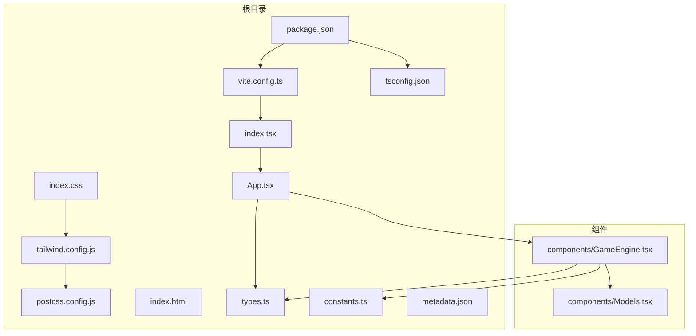
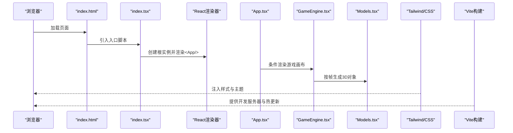
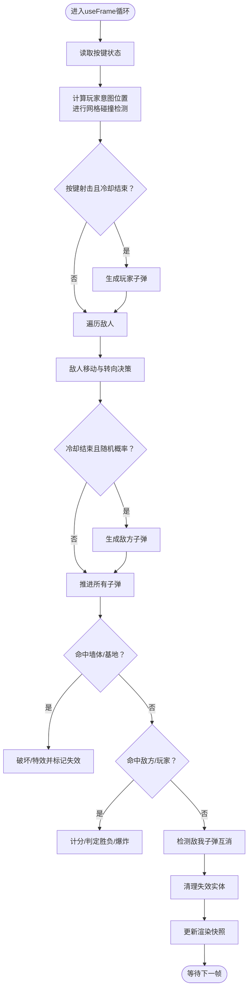
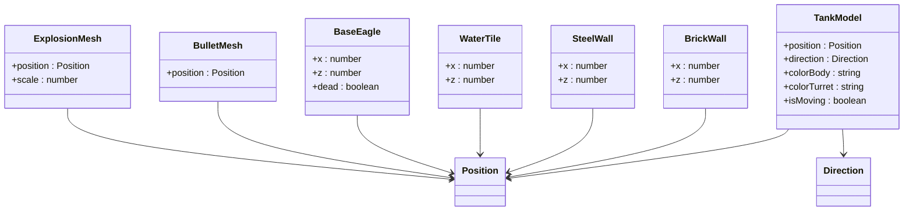
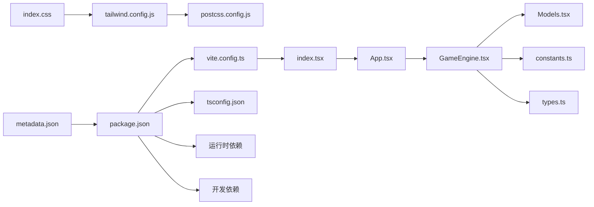

# 开发指南

<cite>
**本文档引用的文件**
- [package.json](file://package.json)
- [vite.config.ts](file://vite.config.ts)
- [tsconfig.json](file://tsconfig.json)
- [tailwind.config.js](file://tailwind.config.js)
- [postcss.config.js](file://postcss.config.js)
- [README.md](file://README.md)
- [App.tsx](file://App.tsx)
- [index.tsx](file://index.tsx)
- [index.css](file://index.css)
- [index.html](file://index.html)
- [constants.ts](file://constants.ts)
- [types.ts](file://types.ts)
- [components/GameEngine.tsx](file://components/GameEngine.tsx)
- [components/Models.tsx](file://components/Models.tsx)
- [metadata.json](file://metadata.json)
</cite>

## 目录
1. [简介](#简介)
2. [项目结构](#项目结构)
3. [核心组件](#核心组件)
4. [架构总览](#架构总览)
5. [详细组件分析](#详细组件分析)
6. [依赖关系分析](#依赖关系分析)
7. [性能考虑](#性能考虑)
8. [故障排查指南](#故障排查指南)
9. [结论](#结论)
10. [附录](#附录)

## 简介
本指南面向NeonTank项目的开发者，提供从环境搭建、构建与类型系统配置，到样式体系、代码规范、调试技巧、功能扩展、性能优化与协作流程的完整开发指引。项目采用React + TypeScript + Vite + Tailwind CSS + Three.js生态（@react-three/fiber、@react-three/drei）构建2.5D坦克射击游戏。

## 项目结构
项目采用按职责分层与特性模块结合的组织方式：
- 根目录：应用入口、全局样式、构建与样式配置、包管理与元数据
- components：游戏引擎与3D模型封装
- types与constants：类型定义与常量配置
- 文档与模板：README与HTML模板

**图表来源**
- [index.tsx](file://index.tsx#L1-L19)
- [App.tsx](file://App.tsx#L1-L199)
- [components/GameEngine.tsx](file://components/GameEngine.tsx#L1-L596)
- [components/Models.tsx](file://components/Models.tsx#L1-L152)
- [index.css](file://index.css#L1-L15)
- [tailwind.config.js](file://tailwind.config.js#L1-L14)
- [postcss.config.js](file://postcss.config.js#L1-L7)
- [vite.config.ts](file://vite.config.ts#L1-L25)
- [package.json](file://package.json#L1-L32)

**章节来源**
- [index.html](file://index.html#L1-L16)
- [index.css](file://index.css#L1-L15)
- [index.tsx](file://index.tsx#L1-L19)
- [App.tsx](file://App.tsx#L1-L199)
- [components/GameEngine.tsx](file://components/GameEngine.tsx#L1-L596)
- [components/Models.tsx](file://components/Models.tsx#L1-L152)
- [tsconfig.json](file://tsconfig.json#L1-L29)
- [tailwind.config.js](file://tailwind.config.js#L1-L14)
- [postcss.config.js](file://postcss.config.js#L1-L7)
- [vite.config.ts](file://vite.config.ts#L1-L25)
- [package.json](file://package.json#L1-L32)

## 核心组件
- 应用入口与挂载：在入口脚本中渲染根组件，并引入全局样式与字体资源。
- 游戏主界面：负责状态管理（分数、生命、关卡、胜负）、HUD展示、开始/重试遮罩与移动端控制提示。
- 游戏引擎：基于useFrame的60fps循环，处理玩家输入、AI敌人、子弹碰撞、地图破坏与爆炸效果。
- 3D模型库：封装坦克、墙体、水、基地与子弹、爆炸等几何体与材质。
- 常量与类型：统一的游戏参数、颜色、地图布局与接口类型定义。

**章节来源**
- [index.tsx](file://index.tsx#L1-L19)
- [App.tsx](file://App.tsx#L1-L199)
- [components/GameEngine.tsx](file://components/GameEngine.tsx#L1-L596)
- [components/Models.tsx](file://components/Models.tsx#L1-L152)
- [constants.ts](file://constants.ts#L1-L39)
- [types.ts](file://types.ts#L1-L50)

## 架构总览
下图展示了从浏览器加载到Three.js场景渲染的关键路径，以及样式与构建链路：

**图表来源**
- [index.html](file://index.html#L1-L16)
- [index.tsx](file://index.tsx#L1-L19)
- [App.tsx](file://App.tsx#L1-L199)
- [components/GameEngine.tsx](file://components/GameEngine.tsx#L1-L596)
- [components/Models.tsx](file://components/Models.tsx#L1-L152)
- [index.css](file://index.css#L1-L15)
- [tailwind.config.js](file://tailwind.config.js#L1-L14)
- [vite.config.ts](file://vite.config.ts#L1-L25)

## 详细组件分析

### 游戏引擎（GameEngine）
- 输入处理：通过键盘事件维护按键状态，驱动玩家移动与射击冷却。
- AI逻辑：敌人以较低速度移动，遇到障碍或随机概率改变方向；按概率开火。
- 碰撞检测：网格边界与墙体检测；子弹与墙体、坦克、基地的命中判定；敌我子弹互消。
- 地图破坏：砖墙可被摧毁，钢铁墙产生特效但不破坏；基地被摧毁判定失败。
- 渲染：使用useMemo缓存地图元素，仅在地图变更时重建；每帧更新坦克、子弹、爆炸状态并触发渲染快照。

**图表来源**
- [components/GameEngine.tsx](file://components/GameEngine.tsx#L210-L463)

**章节来源**
- [components/GameEngine.tsx](file://components/GameEngine.tsx#L1-L596)

### 3D模型库（Models）
- 坦克模型：包含车身、履带、炮塔与炮管，支持朝向旋转与移动时微动动画。
- 地图元素：砖墙（带细节线）、钢铁墙（高光）、水面（半透明）、基地（可损毁）。
- 子弹与爆炸：球形几何体配合自发光材质表现高亮效果。

**图表来源**
- [components/Models.tsx](file://components/Models.tsx#L15-L152)

**章节来源**
- [components/Models.tsx](file://components/Models.tsx#L1-L152)

### 类型与常量
- 类型系统：明确方向、地形类型、位置、游戏对象、子弹、坦克、爆炸与游戏状态。
- 常量：网格尺寸、瓦片大小、游戏速度、子弹速度、冷却帧数、视觉色彩、初始关卡布局。

**章节来源**
- [types.ts](file://types.ts#L1-L50)
- [constants.ts](file://constants.ts#L1-L39)

### 样式与主题（Tailwind）
- 内容扫描：覆盖根目录HTML与src/components等路径，确保按需生成类名。
- 主题扩展：当前未扩展默认主题，保持简洁；可通过extend字段新增字体、颜色、间距等。
- 字体：全局引入Inter作为正文字体，Press Start 2P用于复古风格HUD文本。

**章节来源**
- [tailwind.config.js](file://tailwind.config.js#L1-L14)
- [index.css](file://index.css#L1-L15)

### 构建与类型配置（Vite + TypeScript）
- Vite：本地端口、主机绑定、插件、别名与环境变量注入；基础路径相对化。
- TypeScript：目标与模块、库、解析策略、JSX、路径映射、严格模式与隔离模块。

**章节来源**
- [vite.config.ts](file://vite.config.ts#L1-L25)
- [tsconfig.json](file://tsconfig.json#L1-L29)

## 依赖关系分析
- 运行时依赖：React、ReactDOM、Three.js、@react-three/fiber、@react-three/drei、lucide-react、字体源。
- 开发依赖：Vite、React插件、Tailwind、PostCSS、Autoprefixer、TypeScript与Node类型。
- 元数据：应用名称、描述与权限声明。

**图表来源**
- [App.tsx](file://App.tsx#L1-L199)
- [components/GameEngine.tsx](file://components/GameEngine.tsx#L1-L596)
- [components/Models.tsx](file://components/Models.tsx#L1-L152)
- [index.tsx](file://index.tsx#L1-L19)
- [index.css](file://index.css#L1-L15)
- [tailwind.config.js](file://tailwind.config.js#L1-L14)
- [postcss.config.js](file://postcss.config.js#L1-L7)
- [vite.config.ts](file://vite.config.ts#L1-L25)
- [tsconfig.json](file://tsconfig.json#L1-L29)
- [package.json](file://package.json#L1-L32)
- [metadata.json](file://metadata.json#L1-L5)

**章节来源**
- [package.json](file://package.json#L1-L32)
- [metadata.json](file://metadata.json#L1-L5)

## 性能考虑
- 渲染优化
  - 使用useMemo缓存地图元素与减少不必要的子树重建。
  - 将高频状态写入ref，避免每次渲染都触发重算。
  - 仅在地图变化时更新地图元素，降低虚拟DOM与Three对象重建成本。
- 动画与帧循环
  - useFrame内仅做必要计算，避免在循环中创建临时对象。
  - 子弹与爆炸生命周期短，及时清理失效实体。
- 资源与光照
  - 合理设置阴影分辨率与相机裁剪面，平衡质量与性能。
  - 环境贴图与光源数量应适度，避免过度消耗GPU。
- 打包与体积
  - 利用Tailwind按需生成样式，避免无用类名。
  - 生产构建时启用压缩与Tree-shaking（由Vite/打包器处理）。

[本节为通用性能建议，无需特定文件引用]

## 故障排查指南
- 环境变量未生效
  - 确认在本地环境文件中设置所需密钥，并检查构建配置中的注入项。
  - 参考：[vite.config.ts](file://vite.config.ts#L14-L17)
- 3D场景不显示或黑屏
  - 检查Canvas初始化、光源与阴影设置是否合理。
  - 参考：[components/GameEngine.tsx](file://components/GameEngine.tsx#L542-L593)
- 键盘输入无响应
  - 确保事件监听在组件挂载时注册并在卸载时移除。
  - 参考：[components/GameEngine.tsx](file://components/GameEngine.tsx#L168-L182)
- Tailwind样式未生效
  - 确认内容扫描路径包含当前文件，且PostCSS链路正确。
  - 参考：[tailwind.config.js](file://tailwind.config.js#L3-L8)，[postcss.config.js](file://postcss.config.js#L1-L7)
- TypeScript编译错误
  - 对齐目标与模块解析策略，确保路径映射与类型声明有效。
  - 参考：[tsconfig.json](file://tsconfig.json#L2-L28)

**章节来源**
- [vite.config.ts](file://vite.config.ts#L14-L17)
- [components/GameEngine.tsx](file://components/GameEngine.tsx#L168-L182)
- [components/GameEngine.tsx](file://components/GameEngine.tsx#L542-L593)
- [tailwind.config.js](file://tailwind.config.js#L3-L8)
- [postcss.config.js](file://postcss.config.js#L1-L7)
- [tsconfig.json](file://tsconfig.json#L2-L28)

## 结论
本指南提供了NeonTank项目的开发全栈路径：从环境与构建配置，到样式与类型系统，再到核心游戏引擎与3D模型的实现要点。遵循本文档的规范与建议，可高效完成功能扩展、性能优化与团队协作。

[本节为总结性内容，无需特定文件引用]

## 附录

### 开发环境配置与优化
- 安装与启动
  - 安装依赖后设置必要的环境变量，运行开发服务器。
  - 参考：[README.md](file://README.md#L16-L20)
- Vite配置要点
  - 端口与主机、插件、别名与环境变量注入、基础路径。
  - 参考：[vite.config.ts](file://vite.config.ts#L5-L24)
- TypeScript编译设置
  - 目标、模块、库、路径映射、JSX与严格模式。
  - 参考：[tsconfig.json](file://tsconfig.json#L2-L28)
- Tailwind定制化
  - 内容扫描范围、主题扩展点、插件链路。
  - 参考：[tailwind.config.js](file://tailwind.config.js#L3-L12)，[postcss.config.js](file://postcss.config.js#L1-L7)

**章节来源**
- [README.md](file://README.md#L16-L20)
- [vite.config.ts](file://vite.config.ts#L5-L24)
- [tsconfig.json](file://tsconfig.json#L2-L28)
- [tailwind.config.js](file://tailwind.config.js#L3-L12)
- [postcss.config.js](file://postcss.config.js#L1-L7)

### 代码规范与最佳实践
- 组件拆分：将渲染与逻辑分离，使用useMemo稳定昂贵计算。
- 状态管理：优先使用ref承载高频状态，通过React状态触发渲染。
- 类型安全：充分利用枚举与接口约束，减少运行时错误。
- 样式组织：使用Tailwind原子类，避免深层嵌套；必要时在主题中集中管理变量。
- 可访问性：为按钮与交互元素提供语义化标签与键盘支持。

[本节为通用规范建议，无需特定文件引用]

### 调试技巧与开发工具
- 浏览器开发者工具：检查Three.js场景、材质与阴影设置。
- React DevTools：定位渲染热点与状态更新路径。
- Vite热更新：利用快速刷新提升迭代效率。
- 控制台日志：在关键帧逻辑处输出状态快照，辅助定位问题。

[本节为通用调试建议，无需特定文件引用]

### 添加新功能与扩展现有功能
- 新增地图元素
  - 在常量中定义新的地形类型与颜色，扩展地图生成逻辑与渲染分支。
  - 参考：[constants.ts](file://constants.ts#L8-L21)，[components/Models.tsx](file://components/Models.tsx#L77-L132)
- 新增游戏对象
  - 定义接口与状态，加入碰撞检测与渲染分支。
  - 参考：[types.ts](file://types.ts#L21-L43)，[components/GameEngine.tsx](file://components/GameEngine.tsx#L315-L407)
- UI与交互
  - 在App中新增状态与控件，结合Tailwind快速实现界面。
  - 参考：[App.tsx](file://App.tsx#L14-L86)

**章节来源**
- [constants.ts](file://constants.ts#L8-L21)
- [components/Models.tsx](file://components/Models.tsx#L77-L132)
- [types.ts](file://types.ts#L21-L43)
- [components/GameEngine.tsx](file://components/GameEngine.tsx#L315-L407)
- [App.tsx](file://App.tsx#L14-L86)

### 版本控制与协作最佳实践
- 分支策略：主分支保护，功能开发在特性分支，合并前进行审查。
- 提交信息：采用清晰的类型前缀与简要描述，便于自动化与回溯。
- 冲突解决：小步提交、频繁同步、冲突优先讨论再修改。
- 元数据：在元数据文件中记录应用描述与权限，便于CI/CD集成。
  - 参考：[metadata.json](file://metadata.json#L1-L5)

**章节来源**
- [metadata.json](file://metadata.json#L1-L5)