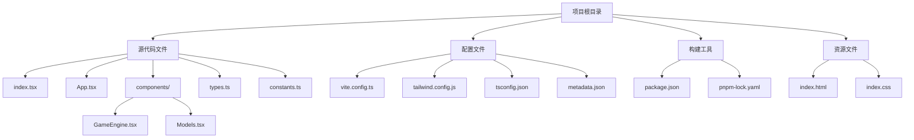

# 快速开始

<cite>
**本文档引用的文件**
- [README.md](file://README.md)
- [package.json](file://package.json)
- [vite.config.ts](file://vite.config.ts)
- [index.tsx](file://index.tsx)
- [App.tsx](file://App.tsx)
- [tsconfig.json](file://tsconfig.json)
- [tailwind.config.js](file://tailwind.config.js)
- [constants.ts](file://constants.ts)
- [types.ts](file://types.ts)
- [components/GameEngine.tsx](file://components/GameEngine.tsx)
- [metadata.json](file://metadata.json)
</cite>

## 目录
1. [简介](#简介)
2. [环境要求](#环境要求)
3. [安装步骤](#安装步骤)
4. [环境配置](#环境配置)
5. [本地开发服务器](#本地开发服务器)
6. [项目结构概览](#项目结构概览)
7. [核心组件分析](#核心组件分析)
8. [常见问题解决](#常见问题解决)
9. [故障排除指南](#故障排除指南)
10. [总结](#总结)

## 简介

NeonTank是一个现代化的2.5D坦克游戏项目，采用React Three Fiber和Tailwind CSS构建。这是一个基于经典街机游戏Battle City的重制版，使用现代Web技术实现了经典的街机体验。项目支持本地开发和部署到AI Studio平台。

## 环境要求

### 系统要求
- **操作系统**: Windows 10+ / macOS 10.15+ / Linux Ubuntu 18.04+
- **内存**: 至少 4GB RAM（推荐 8GB+）
- **存储空间**: 至少 500MB 可用空间

### Node.js 版本要求
根据项目配置，需要以下版本的Node.js：
- **Node.js**: 16.0.0 或更高版本
- **包管理器**: npm 8.0.0 或更高版本

### 系统依赖
- **图形驱动**: 支持WebGL的现代浏览器
- **网络连接**: 访问Gemini API需要稳定的互联网连接
- **浏览器**: Chrome 90+ / Firefox 95+ / Safari 15+

**章节来源**
- [package.json](file://package.json#L1-L32)
- [tsconfig.json](file://tsconfig.json#L1-L29)

## 安装步骤

### 步骤1：克隆项目
```bash
git clone https://github.com/user-attachments/NeonTank.git
cd NeonTank
```

### 步骤2：安装依赖
```bash
npm install
```

### 步骤3：验证安装
```bash
npm run dev
```

### 步骤4：访问应用
打开浏览器访问：`http://localhost:4300`

**章节来源**
- [README.md](file://README.md#L11-L20)
- [package.json](file://package.json#L6-L10)

## 环境配置

### 配置 GEMINI_API_KEY 环境变量

1. **获取API密钥**
   - 访问 [Google AI Studio](https://aistudio.google.com/)
   - 创建新的项目或选择现有项目
   - 在项目设置中生成API密钥

2. **创建环境配置文件**
   ```bash
   # 在项目根目录创建 .env.local 文件
   echo "GEMINI_API_KEY=your_actual_api_key_here" > .env.local
   ```

3. **验证配置**
   - 确保 `.env.local` 文件在项目根目录
   - 文件应包含 `GEMINI_API_KEY=your_key_here`
   - 不要将此文件提交到版本控制

### Vite 环境配置

项目使用Vite进行开发，配置了以下环境变量：
- `process.env.GEMINI_API_KEY`: 从 `.env.local` 文件加载
- `process.env.API_KEY`: 同步的API密钥变量
- 开发服务器端口: 4300
- 主机地址: 0.0.0.0（允许外部访问）

**章节来源**
- [vite.config.ts](file://vite.config.ts#L5-L24)
- [README.md](file://README.md#L18)

## 本地开发服务器

### 启动开发服务器
```bash
npm run dev
```

### 开发服务器配置
- **端口**: 4300
- **主机**: 0.0.0.0（允许局域网访问）
- **热重载**: 自动刷新功能已启用
- **代理**: 无额外代理配置

### 访问方式
- **本地访问**: `http://localhost:4300`
- **局域网访问**: `http://[你的IP地址]:4300`
- **默认浏览器**: Chrome 90+ / Firefox 95+ / Safari 15+

### 构建生产版本
```bash
npm run build
```

### 预览生产版本
```bash
npm run preview
```

**章节来源**
- [vite.config.ts](file://vite.config.ts#L9-L12)
- [package.json](file://package.json#L7-L9)

## 项目结构概览



**图表来源**
- [项目结构](file://.)

**章节来源**
- [index.tsx](file://index.tsx#L1-L19)
- [App.tsx](file://App.tsx#L1-L199)

## 核心组件分析

### 应用入口点

应用程序从 `index.tsx` 开始，负责：
- 初始化React应用
- 加载字体资源
- 渲染根元素
- 设置严格模式

### 主应用组件

`App.tsx` 是核心组件，包含：
- 游戏状态管理
- HUD界面显示
- 游戏循环控制
- 移动端触摸控制

### 游戏引擎

`components/GameEngine.tsx` 实现了完整的3D游戏逻辑：
- 60FPS游戏循环
- 物理碰撞检测
- AI敌人行为
- 粒子效果系统
- 地图渲染

### 类型定义

项目使用TypeScript定义了完整的游戏类型系统：
- `GameState`: 游戏状态枚举
- `GameObject`: 基础游戏对象接口
- `Tank`: 坦克实体接口
- `Bullet`: 子弹实体接口
- `Explosion`: 爆炸效果接口

**章节来源**
- [App.tsx](file://App.tsx#L14-L199)
- [components/GameEngine.tsx](file://components/GameEngine.tsx#L84-L596)
- [types.ts](file://types.ts#L1-L50)

## 常见问题解决

### Node.js 版本不兼容

**问题**: 安装时出现版本错误
**解决方案**:
```bash
# 检查Node.js版本
node --version
npm --version

# 升级到推荐版本
# 从 https://nodejs.org 下载最新LTS版本
```

### 依赖安装失败

**问题**: npm install 失败
**解决方案**:
```bash
# 清除缓存
npm cache clean --force

# 删除 node_modules 和锁定文件
rm -rf node_modules package-lock.json

# 重新安装
npm install

# 如果使用pnpm
pnpm install
```

### 端口被占用

**问题**: 端口4300被占用
**解决方案**:
```bash
# 更改Vite配置中的端口号
# 在 vite.config.ts 中修改 port: 4300 为其他端口
```

### API密钥配置错误

**问题**: 无法连接到Gemini API
**解决方案**:
```bash
# 验证 .env.local 文件格式
cat .env.local

# 确保文件内容格式正确
GEMINI_API_KEY=your_actual_api_key_here

# 重启开发服务器
npm run dev
```

### 浏览器兼容性问题

**问题**: 在某些浏览器中无法运行
**解决方案**:
- 确保使用支持WebGL的现代浏览器
- 更新浏览器到最新版本
- 禁用可能阻止WebGL的扩展程序

**章节来源**
- [vite.config.ts](file://vite.config.ts#L9-L12)
- [README.md](file://README.md#L18)

## 故障排除指南

### 开发服务器启动问题

1. **检查端口占用**
   ```bash
   # Windows
   netstat -ano | findstr :4300
   
   # macOS/Linux
   lsof -i :4300
   ```

2. **清理临时文件**
   ```bash
   # 删除构建缓存
   rm -rf node_modules/.vite
   
   # 重新启动
   npm run dev
   ```

### 性能优化建议

1. **开发环境优化**
   - 使用Chrome DevTools分析性能
   - 关闭不必要的浏览器标签页
   - 确保GPU加速已启用

2. **内存管理**
   - 定期重启开发服务器
   - 监控内存使用情况
   - 避免同时运行多个大型项目

### 调试技巧

1. **启用详细日志**
   ```javascript
   // 在浏览器控制台中添加调试信息
   console.log('Game State:', gameState);
   ```

2. **性能监控**
   - 使用浏览器性能面板
   - 监控帧率变化
   - 分析内存泄漏

### 部署相关问题

1. **AI Studio部署**
   - 确保API密钥安全存储
   - 验证静态资源路径
   - 测试不同设备兼容性

2. **生产构建优化**
   ```bash
   # 生成生产版本
   npm run build
   
   # 预览生产版本
   npm run preview
   ```

**章节来源**
- [package.json](file://package.json#L6-L10)
- [vite.config.ts](file://vite.config.ts#L5-L24)

## 总结

NeonTank项目提供了完整的2.5D坦克游戏开发环境，具有以下特点：

### 技术优势
- **现代Web技术栈**: React + Three.js + TypeScript
- **高性能渲染**: 基于React Three Fiber的3D渲染
- **响应式设计**: 支持桌面和移动端
- **模块化架构**: 清晰的组件分离

### 开发体验
- **快速启动**: 简单的安装和配置流程
- **热重载**: 开发时自动刷新
- **类型安全**: 完整的TypeScript支持
- **工具链完善**: Vite + Tailwind CSS + PostCSS

### 学习价值
- **游戏开发实践**: 3D游戏循环、物理系统、AI行为
- **现代前端技术**: React Hooks、Three.js、WebGL
- **工程化思维**: 项目结构、配置管理、性能优化

新开发者可以在30分钟内完成项目搭建和首次运行，通过这个项目深入理解现代Web游戏开发的核心概念和技术栈。