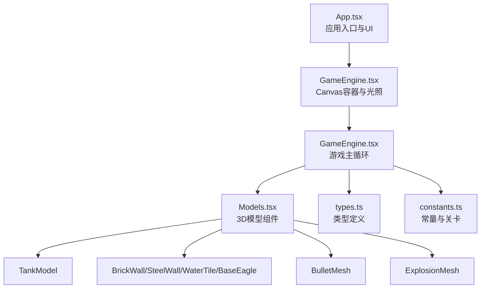
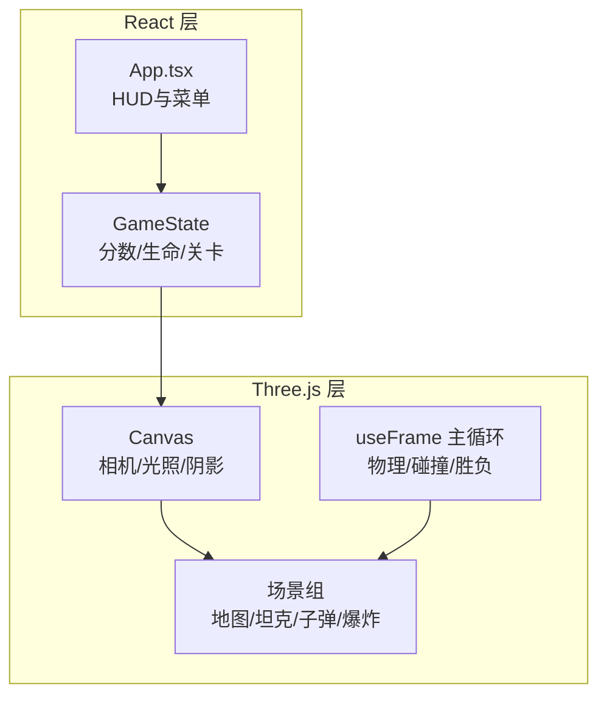
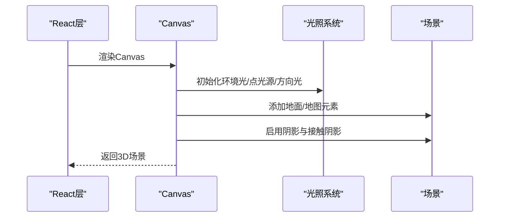
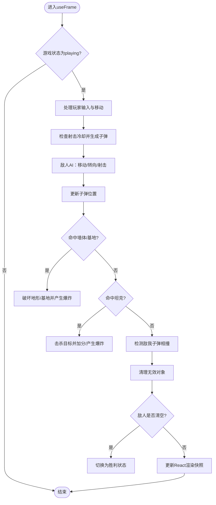
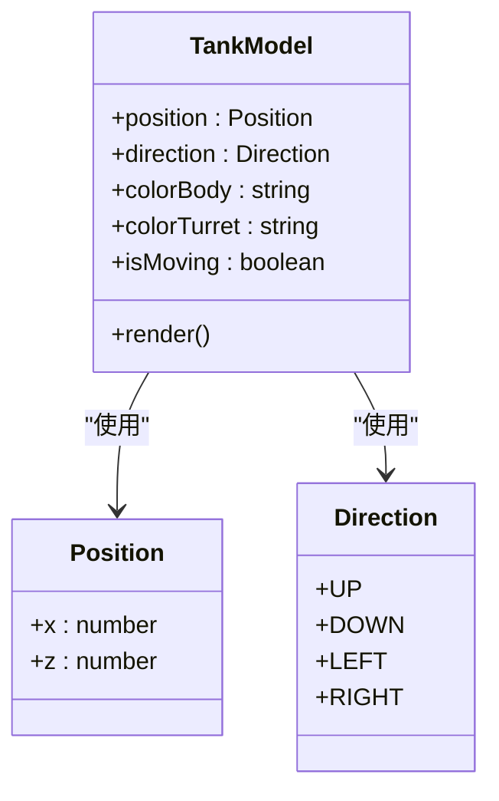
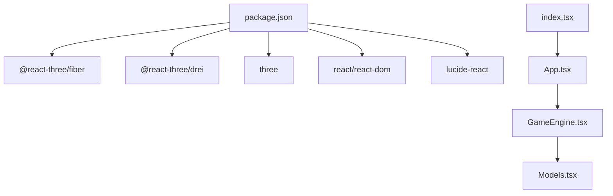

# 3D渲染系统

<cite>
**本文档引用的文件**
- [App.tsx](file://App.tsx)
- [GameEngine.tsx](file://components/GameEngine.tsx)
- [Models.tsx](file://components/Models.tsx)
- [types.ts](file://types.ts)
- [constants.ts](file://constants.ts)
- [package.json](file://package.json)
- [index.tsx](file://index.tsx)
- [README.md](file://README.md)
</cite>

## 目录
1. [简介](#简介)
2. [项目结构](#项目结构)
3. [核心组件](#核心组件)
4. [架构总览](#架构总览)
5. [详细组件分析](#详细组件分析)
6. [依赖关系分析](#依赖关系分析)
7. [性能考虑](#性能考虑)
8. [故障排除指南](#故障排除指南)
9. [结论](#结论)
10. [附录](#附录)

## 简介
本文件为 NeonTank 的 3D 渲染系统技术文档，重点阐述 Three.js 与 React 的集成架构（基于 @react-three/fiber），渲染管线设计，场景管理、材质系统与光影配置，以及坦克、子弹、爆炸等 3D 模型组件的实现方式。同时提供渲染性能优化策略、内存管理最佳实践与调试技巧，帮助开发者快速理解并扩展该 3D 游戏渲染框架。

## 项目结构
项目采用“功能模块化 + 组件化”的组织方式：
- 应用入口与 UI 层：App.tsx 负责状态管理与 UI 布局，包含 HUD、菜单与游戏画布容器。
- 3D 渲染层：components/GameEngine.tsx 提供 Canvas 容器、光照与阴影设置、游戏主循环与场景渲染；components/Models.tsx 提供各类 3D 模型组件（坦克、墙体、子弹、爆炸）。
- 类型与常量：types.ts 定义游戏对象类型；constants.ts 定义地图尺寸、速度、颜色与关卡布局。
- 依赖与构建：package.json 声明 @react-three/fiber、@react-three/drei、three 等依赖；index.tsx 作为应用入口挂载根组件。

图表来源
- [App.tsx](file://App.tsx#L45-L87)
- [GameEngine.tsx](file://components/GameEngine.tsx#L542-L593)
- [Models.tsx](file://components/Models.tsx#L15-L152)
- [types.ts](file://types.ts#L1-L50)
- [constants.ts](file://constants.ts#L1-L39)

章节来源
- [App.tsx](file://App.tsx#L1-L199)
- [GameEngine.tsx](file://components/GameEngine.tsx#L1-L596)
- [Models.tsx](file://components/Models.tsx#L1-L152)
- [types.ts](file://types.ts#L1-L50)
- [constants.ts](file://constants.ts#L1-L39)

## 核心组件
- 游戏画布与光照：GameEngine.tsx 中的 GameCanvas 使用 Canvas 包裹场景，配置环境贴图、环境光、点光源与方向光，并启用阴影与接触阴影。
- 游戏主循环：GameEngine.tsx 中的 GameLoop 在 useFrame 中执行 60fps 逻辑，处理玩家移动、敌人 AI、子弹运动与碰撞、爆炸效果与胜负判定，并通过 React 状态驱动渲染。
- 3D 模型组件：Models.tsx 提供坦克、墙体、水、基地、子弹与爆炸效果的几何体与材质封装，统一使用 useFrame 实现位置更新与动画。
- 类型与常量：types.ts 定义方向、地形类型、游戏对象接口；constants.ts 定义地图尺寸、速度、颜色与关卡布局。

章节来源
- [GameEngine.tsx](file://components/GameEngine.tsx#L542-L593)
- [GameEngine.tsx](file://components/GameEngine.tsx#L84-L540)
- [Models.tsx](file://components/Models.tsx#L15-L152)
- [types.ts](file://types.ts#L1-L50)
- [constants.ts](file://constants.ts#L1-L39)

## 架构总览
NeonTank 的 3D 渲染采用“React 状态 + Three.js 场景”的双层架构：
- React 层负责 UI 与游戏状态（分数、生命值、关卡状态），并通过 props 将状态传递给 3D 渲染层。
- Three.js 层负责场景构建与渲染，使用 @react-three/fiber 的 Canvas 与 useFrame 驱动每帧更新，useMemo 优化静态网格元素，useRef 存储可变的游戏状态以避免频繁重渲染。

图表来源
- [App.tsx](file://App.tsx#L14-L87)
- [GameEngine.tsx](file://components/GameEngine.tsx#L542-L593)
- [GameEngine.tsx](file://components/GameEngine.tsx#L84-L540)

## 详细组件分析

### 游戏画布与光照配置
- Canvas 设置：启用阴影、相机参数（位置、视野、近远裁剪），背景色设置为深灰。
- 光源体系：环境光 + 点光源 + 方向光，方向光开启阴影并配置阴影贴图分辨率与视锥范围。
- 环境与地面：Environment 加载 HDR 环境贴图；地面使用平面几何体与标准材质接收阴影。
- 控制器：OrbitControls 固定视角，禁用平移与缩放，限制极角范围。
- 接触阴影：ContactShadows 增强地面投影的真实感。

图表来源
- [GameEngine.tsx](file://components/GameEngine.tsx#L542-L593)

章节来源
- [GameEngine.tsx](file://components/GameEngine.tsx#L542-L593)

### 游戏主循环与场景管理
- 主循环：useFrame 每帧执行，根据游戏状态决定是否运行逻辑。
- 输入处理：键盘事件记录在 keys.ref 中，用于控制玩家移动与射击。
- 玩家与敌人：使用 ref 存储坦克状态，避免每次渲染都创建新对象；移动时进行网格碰撞检测；射击冷却时间控制。
- 子弹系统：按方向移动，检测墙体与基地破坏、坦克命中；支持敌我子弹相互抵消。
- 爆炸效果：按生命周期衰减缩放，透明度随时间变化。
- 胜负判定：敌人清空触发胜利，基地被摧毁或玩家被击中触发失败。

图表来源
- [GameEngine.tsx](file://components/GameEngine.tsx#L211-L463)

章节来源
- [GameEngine.tsx](file://components/GameEngine.tsx#L84-L540)

### 材质系统与光影配置
- 材质类型：统一使用 meshStandardMaterial，配合金属度与粗糙度参数控制外观。
- 发光材质：子弹与基地使用自发光材质增强视觉反馈。
- 阴影：所有可见几何体均开启 castShadow/receiveShadow，确保光照与阴影一致。
- 环境贴图：Environment 加载 HDR 图像，提升反射与全局光照质量。

章节来源
- [Models.tsx](file://components/Models.tsx#L52-L151)
- [GameEngine.tsx](file://components/GameEngine.tsx#L554-L567)

### 3D 模型组件实现

#### 坦克模型（TankModel）
- 几何体：车身使用圆角盒子，履带使用长方体，炮塔与炮管使用圆角盒子与圆柱体。
- 动画：useFrame 更新位置与朝向；移动时添加轻微上下摆动（Bobbing）。
- 参数：支持自定义车身与炮塔颜色，朝向由方向枚举转换为旋转角度。

图表来源
- [Models.tsx](file://components/Models.tsx#L15-L75)
- [types.ts](file://types.ts#L16-L19)

章节来源
- [Models.tsx](file://components/Models.tsx#L15-L75)

#### 地形与环境（BrickWall/SteelWall/WaterTile/BaseEagle）
- 砖墙：圆角盒子材质，附加边线细节模拟砖纹。
- 钢墙：高金属度与低粗糙度材质，呈现冷色调金属质感。
- 水面：半透明平面材质，降低不透明度表现水面效果。
- 基地：基地主体为圆角盒子，未损毁时使用自发光材质表现基地灯。

章节来源
- [Models.tsx](file://components/Models.tsx#L77-L132)

#### 子弹与爆炸（BulletMesh/ExplosionMesh）
- 子弹：球体几何体，使用高亮度自发光材质突出轨迹。
- 爆炸：球体几何体，随时间缩放与透明度衰减，表现冲击波扩散。

章节来源
- [Models.tsx](file://components/Models.tsx#L134-L152)

### 场景管理与渲染管线
- 地图渲染：通过 useMemo 缓存地图元素，仅在地形变更时重建网格，减少渲染开销。
- 动态对象：坦克、子弹、爆炸使用 React 组件直接渲染，位置与状态由主循环更新。
- 渲染顺序：先绘制静态地形，再绘制动态对象，确保阴影与光照一致性。

章节来源
- [GameEngine.tsx](file://components/GameEngine.tsx#L467-L508)
- [GameEngine.tsx](file://components/GameEngine.tsx#L510-L539)

## 依赖关系分析
- 运行时依赖：@react-three/fiber 提供 React-Three 渲染桥接；@react-three/drei 提供光照、环境与控制器等高级组件；three 提供底层图形 API。
- 构建工具：Vite + TailwindCSS + TypeScript，支持现代前端开发工作流。

图表来源
- [package.json](file://package.json#L11-L20)
- [index.tsx](file://index.tsx#L1-L19)
- [App.tsx](file://App.tsx#L1-L20)
- [GameEngine.tsx](file://components/GameEngine.tsx#L1-L31)
- [Models.tsx](file://components/Models.tsx#L1-L6)

章节来源
- [package.json](file://package.json#L1-L32)
- [index.tsx](file://index.tsx#L1-L19)

## 性能考虑
- 使用 useFrame 执行高频逻辑，避免在渲染函数中做重型计算。
- 使用 useMemo 缓存静态地图网格，仅在地形变更时重建。
- 使用 ref 存储可变状态（如坦克、子弹、爆炸数组），减少对象创建与 React 重渲染。
- 合理设置阴影贴图分辨率与视锥范围，平衡质量与性能。
- 控制渲染对象数量：限制敌人数量、及时清理无效子弹与爆炸。
- 使用透明度与缩放衰减替代复杂粒子系统，降低 GPU 负担。

## 故障排除指南
- 画面不显示或黑屏
  - 检查 Canvas 是否正确挂载，确认相机位置与近远裁剪范围。
  - 确认环境贴图路径有效，必要时使用本地资源。
- 坦克无法移动或穿墙
  - 检查网格碰撞函数与意图位置计算，确保半径与边界判断正确。
- 子弹不消失或穿透
  - 确认子弹生命周期与越界处理，检查碰撞阈值与命中检测逻辑。
- 性能抖动
  - 检查是否有不必要的对象创建与频繁 setState；减少阴影贴图分辨率或关闭部分阴影。
- 光影异常
  - 确认光源强度与阴影参数，检查 castShadow/receiveShadow 是否开启。

## 结论
NeonTank 的 3D 渲染系统通过 @react-three/fiber 将 React 的声明式 UI 与 Three.js 的高性能渲染结合，实现了清晰的架构分层与高效的渲染管线。通过合理的状态管理、材质与光影配置以及性能优化策略，系统在保持良好视觉效果的同时具备良好的可维护性与扩展性。建议后续可引入更精细的批处理与实例化渲染以进一步提升大规模场景下的性能表现。

## 附录
- 关键实现参考路径
  - 游戏画布与光照：[GameEngine.tsx](file://components/GameEngine.tsx#L542-L593)
  - 主循环与碰撞：[GameEngine.tsx](file://components/GameEngine.tsx#L211-L463)
  - 坦克模型与动画：[Models.tsx](file://components/Models.tsx#L23-L75)
  - 地形与环境：[Models.tsx](file://components/Models.tsx#L77-L132)
  - 子弹与爆炸：[Models.tsx](file://components/Models.tsx#L134-L152)
  - 类型定义：[types.ts](file://types.ts#L1-L50)
  - 常量与关卡：[constants.ts](file://constants.ts#L1-L39)
  - 应用入口：[index.tsx](file://index.tsx#L1-L19)
  - 依赖声明：[package.json](file://package.json#L11-L20)