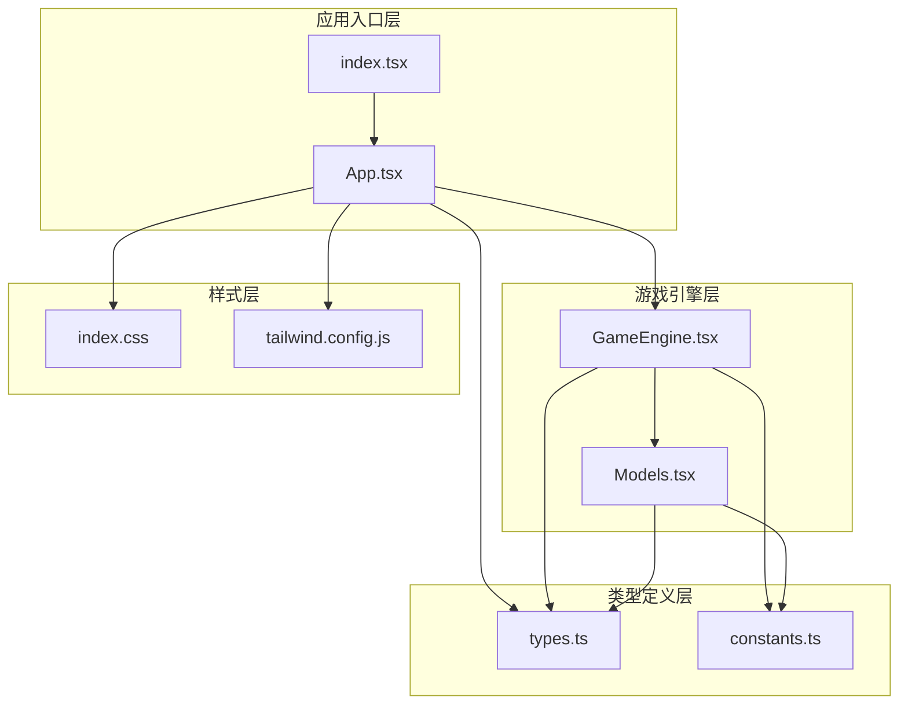
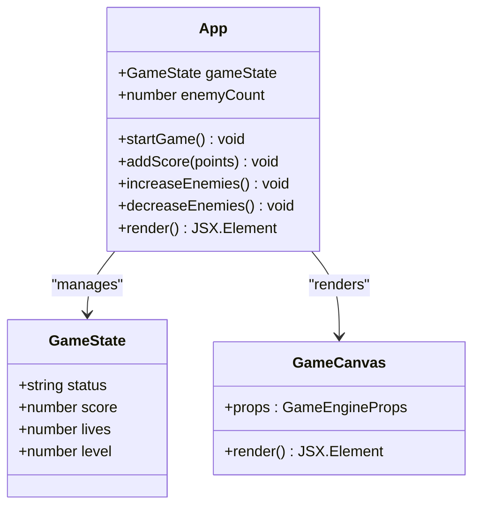
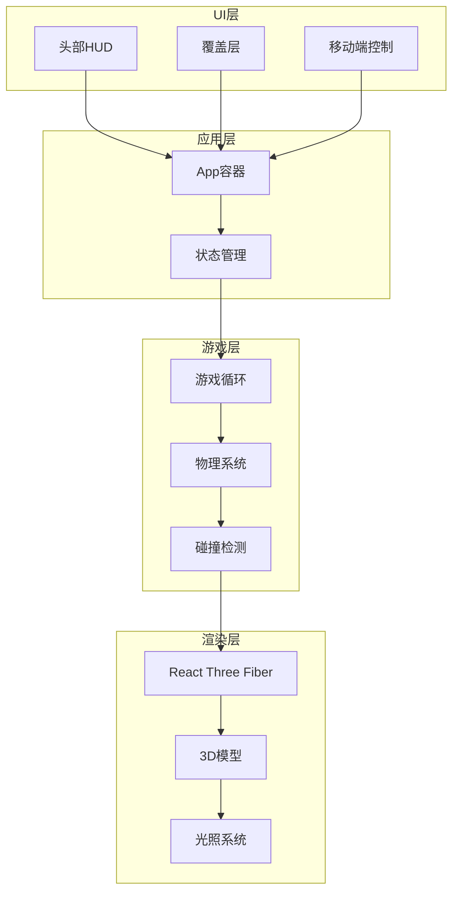
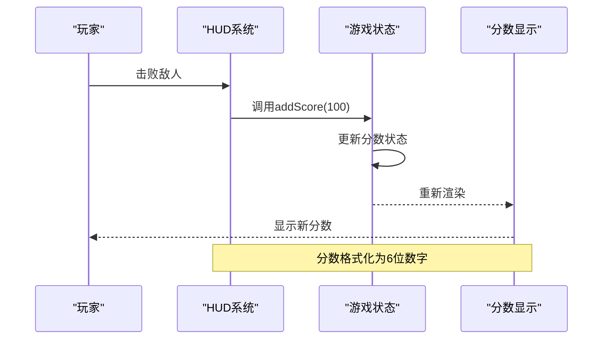
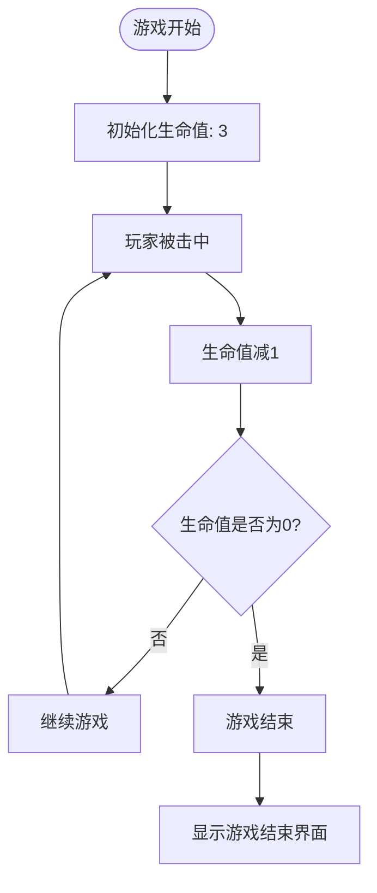
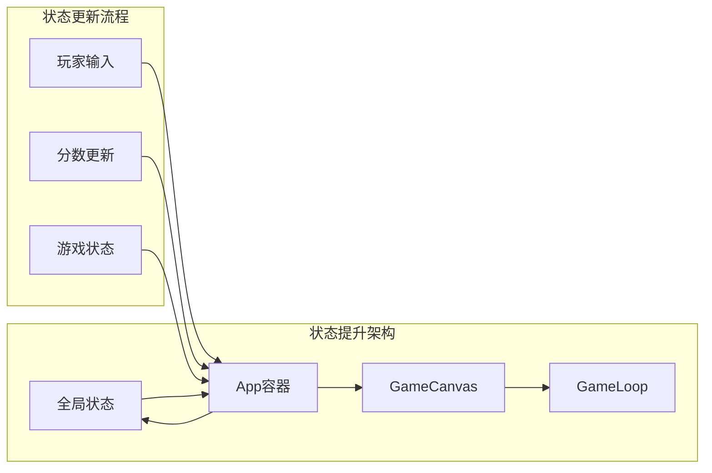
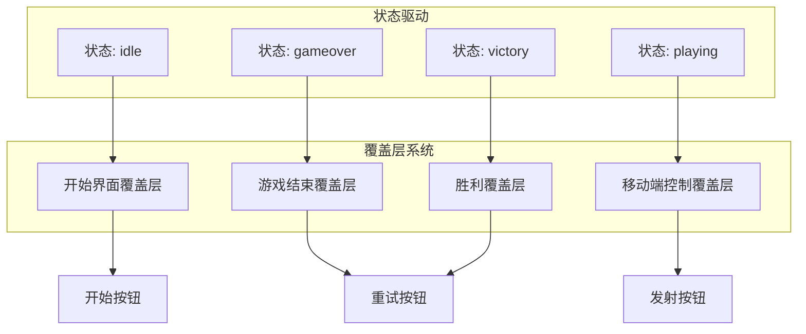
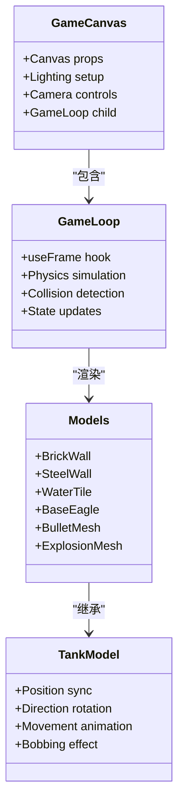
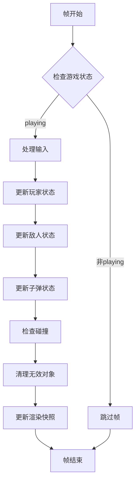

# UI组件架构

<cite>
**本文档中引用的文件**
- [App.tsx](file://App.tsx)
- [index.tsx](file://index.tsx)
- [GameEngine.tsx](file://components/GameEngine.tsx)
- [Models.tsx](file://components/Models.tsx)
- [types.ts](file://types.ts)
- [constants.ts](file://constants.ts)
- [index.css](file://index.css)
- [tailwind.config.js](file://tailwind.config.js)
- [package.json](file://package.json)
</cite>

## 目录
1. [简介](#简介)
2. [项目结构](#项目结构)
3. [核心组件](#核心组件)
4. [架构概览](#架构概览)
5. [详细组件分析](#详细组件分析)
6. [依赖关系分析](#依赖关系分析)
7. [性能考虑](#性能考虑)
8. [故障排除指南](#故障排除指南)
9. [结论](#结论)

## 简介

NeonTank是一个基于React和Three.js构建的2.5D坦克射击游戏，采用霓虹风格视觉设计。该项目展示了现代前端游戏开发中的UI组件架构最佳实践，包括状态管理、组件通信、响应式设计和移动端适配。

该应用的核心架构围绕三个主要层次构建：
- **应用容器层**：负责全局状态管理和UI布局
- **游戏引擎层**：处理3D渲染和游戏逻辑
- **UI覆盖层**：提供用户界面交互和状态反馈

## 项目结构

项目采用清晰的分层架构，每个模块都有明确的职责分工：



**图表来源**
- [index.tsx](file://index.tsx#L1-L19)
- [App.tsx](file://App.tsx#L1-L199)
- [GameEngine.tsx](file://components/GameEngine.tsx#L1-L596)
- [Models.tsx](file://components/Models.tsx#L1-L152)

**章节来源**
- [index.tsx](file://index.tsx#L1-L19)
- [package.json](file://package.json#L1-L32)

## 核心组件

### 应用容器组件（App）

App组件是整个应用的根容器，负责管理全局游戏状态和UI布局。它实现了状态提升模式，将所有游戏状态提升到顶层组件中，确保数据流的单一事实来源。



**图表来源**
- [App.tsx](file://App.tsx#L14-L199)
- [types.ts](file://types.ts#L45-L50)

### 游戏引擎组件（GameEngine）

GameEngine组件是3D游戏的核心，基于React Three Fiber构建。它实现了复杂的帧循环系统，处理游戏逻辑、物理碰撞和渲染更新。

**章节来源**
- [App.tsx](file://App.tsx#L14-L199)
- [GameEngine.tsx](file://components/GameEngine.tsx#L77-L596)

## 架构概览

NeonTank采用了经典的分层架构模式，结合了函数式编程和组件化设计的最佳实践：



**图表来源**
- [App.tsx](file://App.tsx#L45-L195)
- [GameEngine.tsx](file://components/GameEngine.tsx#L210-L463)

## 详细组件分析

### HUD系统设计

头部HUD系统实现了经典的街机游戏风格，包含分数显示、生命值管理和霓虹视觉效果。

#### 分数管理系统



**图表来源**
- [App.tsx](file://App.tsx#L41-L43)
- [App.tsx](file://App.tsx#L50-L53)

#### 生命值管理系统

生命值系统通过心形图标和数字显示，采用红色霓虹风格设计：



**图表来源**
- [App.tsx](file://App.tsx#L58-L61)
- [GameEngine.tsx](file://components/GameEngine.tsx#L394-L404)

### 状态提升模式

项目严格遵循React的状态提升原则，将所有游戏状态集中管理：



**图表来源**
- [App.tsx](file://App.tsx#L15-L43)
- [GameEngine.tsx](file://components/GameEngine.tsx#L84-L89)

### Props传递策略

组件间的数据传递采用单向数据流设计：

| 组件层级 | Props名称 | 类型 | 用途 | 来源 |
|---------|----------|------|------|------|
| App → GameCanvas | gameState | GameState | 游戏状态 | App |
| App → GameCanvas | setGameState | Function | 状态更新 | App |
| App → GameCanvas | onScore | Function | 分数回调 | App |
| App → GameCanvas | enemyCount | number | 敌人数量 | App |
| GameLoop → Models | position | Position | 位置信息 | GameLoop |
| GameLoop → Models | colorBody | string | 颜色配置 | GameLoop |

**章节来源**
- [App.tsx](file://App.tsx#L67-L76)
- [GameEngine.tsx](file://components/GameEngine.tsx#L542-L596)

### 覆盖层系统

应用包含多个覆盖层，每层都有特定的功能和视觉设计：



**图表来源**
- [App.tsx](file://App.tsx#L90-L195)

**章节来源**
- [App.tsx](file://App.tsx#L90-L195)

### 3D渲染架构

GameEngine组件基于React Three Fiber构建，实现了高效的3D渲染系统：



**图表来源**
- [GameEngine.tsx](file://components/GameEngine.tsx#L542-L596)
- [Models.tsx](file://components/Models.tsx#L15-L152)

**章节来源**
- [GameEngine.tsx](file://components/GameEngine.tsx#L1-L596)
- [Models.tsx](file://components/Models.tsx#L1-L152)

## 依赖关系分析

项目使用现代化的前端技术栈，各依赖项之间存在清晰的层次关系：

```mermaid
graph TD
subgraph "运行时依赖"
React[react ^19.2.0]
ReactDOM[react-dom ^19.2.0]
ThreeJS[three ^0.181.2]
Fiber[@react-three/fiber ^9.4.0]
Drei[@react-three/drei ^10.7.7]
end
subgraph "UI库"
Lucide[lucide-react ^0.554.0]
Tailwind[tailwindcss ^4.1.17]
end
subgraph "字体资源"
Inter[@fontsource/inter ^5.2.8]
PS2P[@fontsource/press-start-2p ^5.2.7]
end
subgraph "开发工具"
Vite[vite ^6.2.0]
TS[typescript ~5.8.2]
PostCSS[autoprefixer ^10.4.22]
end
React --> Fiber
Fiber --> ThreeJS
Fiber --> Drei
Drei --> ThreeJS
App --> Lucide
App --> Tailwind
App --> Inter
App --> PS2P
```

**图表来源**
- [package.json](file://package.json#L11-L30)

**章节来源**
- [package.json](file://package.json#L1-L32)

## 性能考虑

### 帧循环优化

GameEngine实现了高效的60fps帧循环系统，使用useFrame钩子进行性能优化：



**图表来源**
- [GameEngine.tsx](file://components/GameEngine.tsx#L210-L463)

### 内存管理策略

项目采用多种内存管理策略确保性能稳定：

1. **引用优化**：使用useRef存储游戏对象，避免不必要的重渲染
2. **状态分离**：将可变状态和渲染状态分离
3. **对象池模式**：复用爆炸效果和子弹对象
4. **条件渲染**：根据游戏状态动态渲染UI元素

**章节来源**
- [GameEngine.tsx](file://components/GameEngine.tsx#L90-L165)

## 故障排除指南

### 常见问题诊断

#### 渲染问题
- **症状**：3D场景不显示或显示异常
- **原因**：Three.js环境配置错误或依赖版本不兼容
- **解决方案**：检查@react-three/fiber和three版本兼容性

#### 输入响应问题
- **症状**：键盘输入无响应
- **原因**：事件监听器未正确绑定或焦点丢失
- **解决方案**：确保在组件挂载时注册事件监听器

#### 性能问题
- **症状**：帧率下降或卡顿
- **原因**：过多的DOM操作或频繁的状态更新
- **解决方案**：使用useMemo和useCallback优化性能

### 调试工具建议

1. **React DevTools**：监控组件渲染和状态变化
2. **Three.js DevTools**：调试3D场景和材质
3. **浏览器性能面板**：分析JavaScript执行时间

**章节来源**
- [GameEngine.tsx](file://components/GameEngine.tsx#L168-L182)

## 结论

NeonTank的UI组件架构展现了现代React应用开发的最佳实践。通过清晰的分层设计、严格的单向数据流和高效的性能优化，该项目成功地将传统街机游戏体验带入了现代Web平台。

### 主要优势

1. **架构清晰**：分层设计使代码易于理解和维护
2. **性能优秀**：useFrame钩子和引用优化确保流畅的游戏体验
3. **扩展性强**：模块化设计便于功能扩展和修改
4. **用户体验佳**：霓虹风格的视觉设计和响应式布局

### 技术亮点

- **状态提升模式**：确保数据流的单一事实来源
- **3D渲染集成**：React Three Fiber与传统UI的完美结合
- **响应式设计**：移动端友好的界面适配
- **性能优化**：多层优化策略保证流畅体验

这个项目为React游戏开发提供了优秀的参考模板，展示了如何在保持代码质量的同时实现复杂的游戏功能。