# 数据流模式

<cite>
**本文档引用的文件**
- [App.tsx](file://App.tsx)
- [GameEngine.tsx](file://components/GameEngine.tsx)
- [Models.tsx](file://components/Models.tsx)
- [constants.ts](file://constants.ts)
- [types.ts](file://types.ts)
- [README.md](file://README.md)
</cite>

## 目录
1. [简介](#简介)
2. [项目结构](#项目结构)
3. [核心组件](#核心组件)
4. [架构概览](#架构概览)
5. [详细组件分析](#详细组件分析)
6. [依赖关系分析](#依赖关系分析)
7. [性能考虑](#性能考虑)
8. [故障排除指南](#故障排除指南)
9. [结论](#结论)

## 简介

NeonTank是一个基于React和Three.js的街机坦克游戏，采用单向数据流架构设计。该项目展示了现代前端游戏开发中数据流管理的最佳实践，包括全局状态管理、局部状态处理和组件间数据传递的完整实现。

本项目的核心创新在于将传统的双向数据绑定转换为清晰的单向数据流，通过React的状态提升和回调函数实现组件间的通信，确保了数据的一致性和可预测性。

## 项目结构

NeonTank项目采用模块化的文件组织方式，主要分为以下几个核心部分：

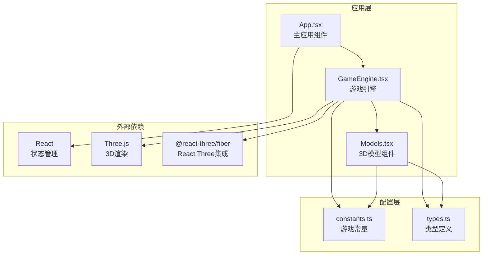

**图表来源**
- [App.tsx](file://App.tsx#L1-L199)
- [GameEngine.tsx](file://components/GameEngine.tsx#L1-L596)
- [Models.tsx](file://components/Models.tsx#L1-L152)

**章节来源**
- [App.tsx](file://App.tsx#L1-L199)
- [GameEngine.tsx](file://components/GameEngine.tsx#L1-L50)
- [Models.tsx](file://components/Models.tsx#L1-L152)

## 核心组件

### 全局状态管理器

App.tsx作为整个应用的全局状态管理器，负责维护游戏的核心状态：

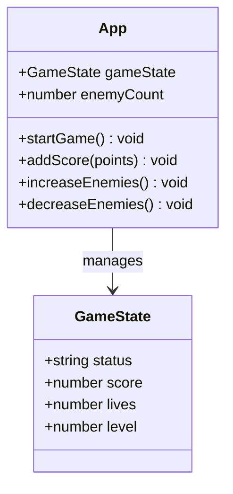

**图表来源**
- [App.tsx](file://App.tsx#L14-L43)
- [types.ts](file://types.ts#L45-L50)

### 游戏引擎组件

GameEngine.tsx实现了复杂的游戏逻辑，采用混合状态管理模式：

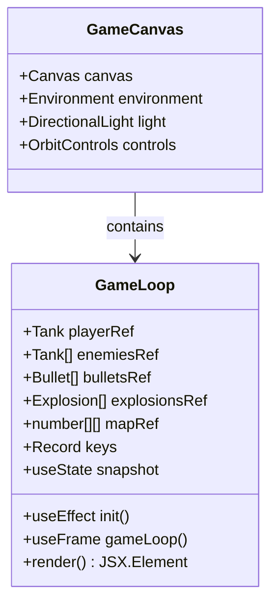

**图表来源**
- [GameEngine.tsx](file://components/GameEngine.tsx#L84-L540)

**章节来源**
- [App.tsx](file://App.tsx#L14-L87)
- [GameEngine.tsx](file://components/GameEngine.tsx#L77-L82)

## 架构概览

NeonTank采用了分层的单向数据流架构，确保数据流向的清晰性和可追踪性：

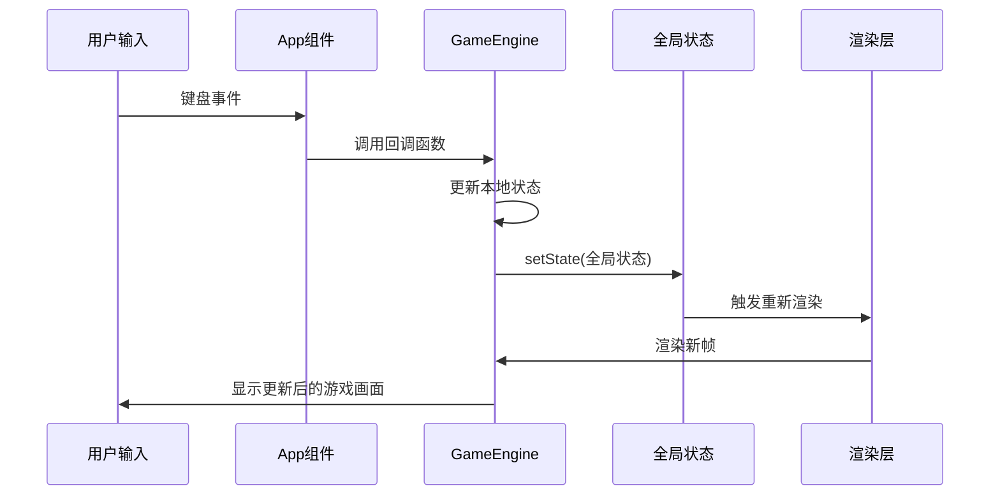

**图表来源**
- [App.tsx](file://App.tsx#L15-L43)
- [GameEngine.tsx](file://components/GameEngine.tsx#L211-L463)

### 数据流生命周期

游戏状态的完整生命周期从初始化到运行时更新：

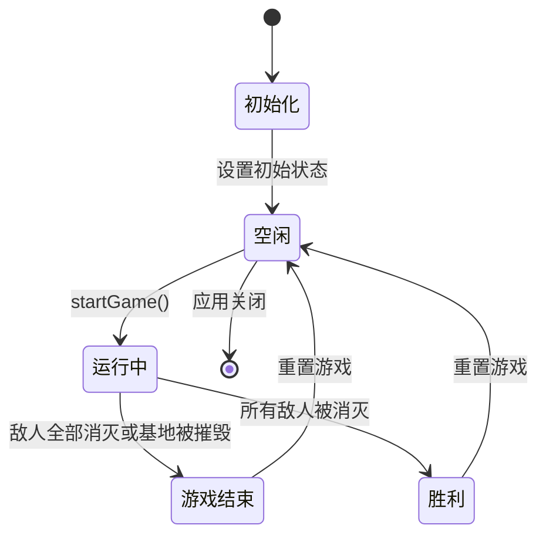

**图表来源**
- [App.tsx](file://App.tsx#L32-L39)
- [GameEngine.tsx](file://components/GameEngine.tsx#L451-L453)

## 详细组件分析

### 单向数据流实现

#### 全局状态管理

App.tsx实现了完整的全局状态管理，使用React的useState Hook维护游戏状态：

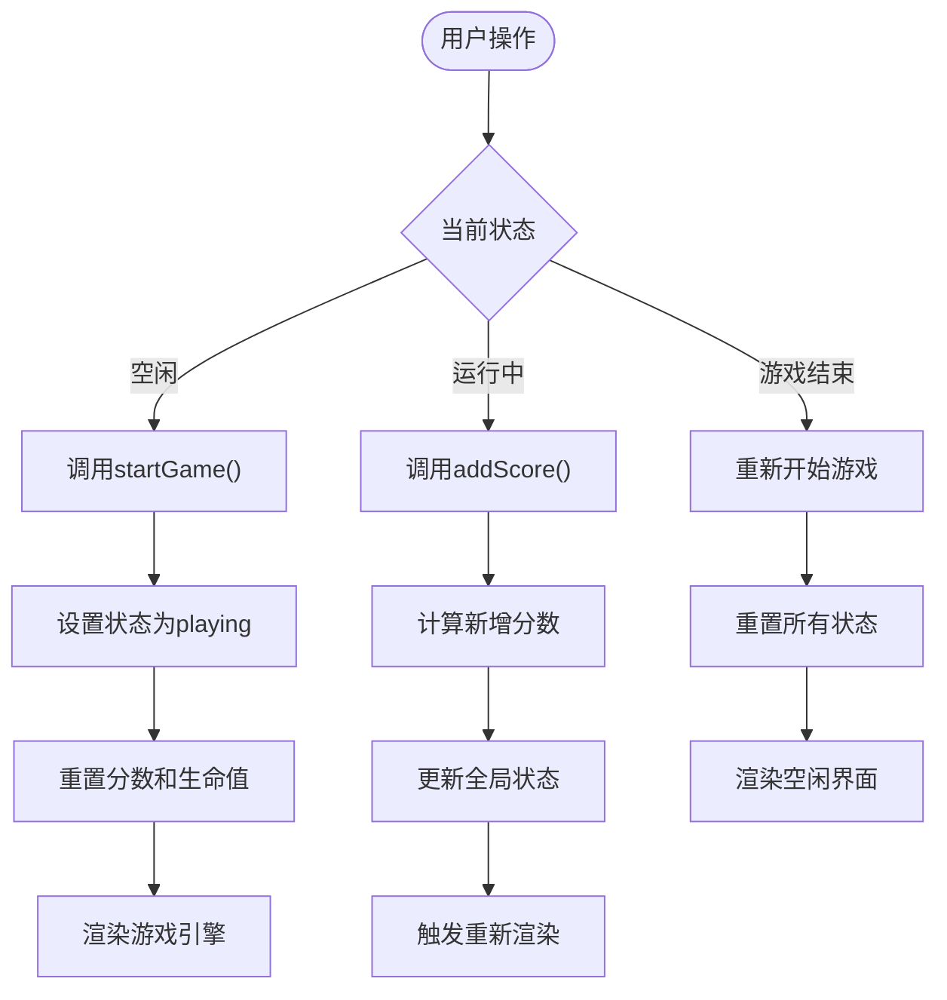

**图表来源**
- [App.tsx](file://App.tsx#L32-L43)

#### 局部状态处理

GameEngine.tsx采用混合状态管理模式，结合React状态和JavaScript引用：

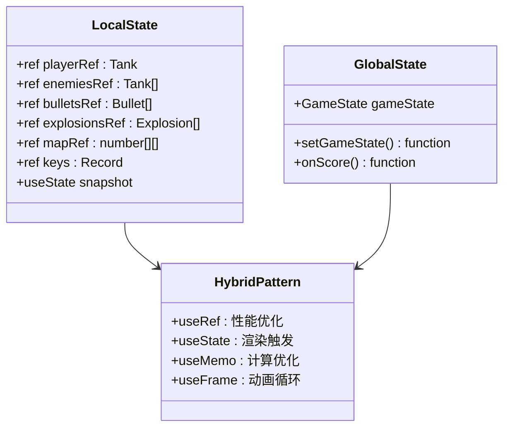

**图表来源**
- [GameEngine.tsx](file://components/GameEngine.tsx#L90-L165)

#### 组件间数据传递

游戏采用回调函数模式实现组件间通信：

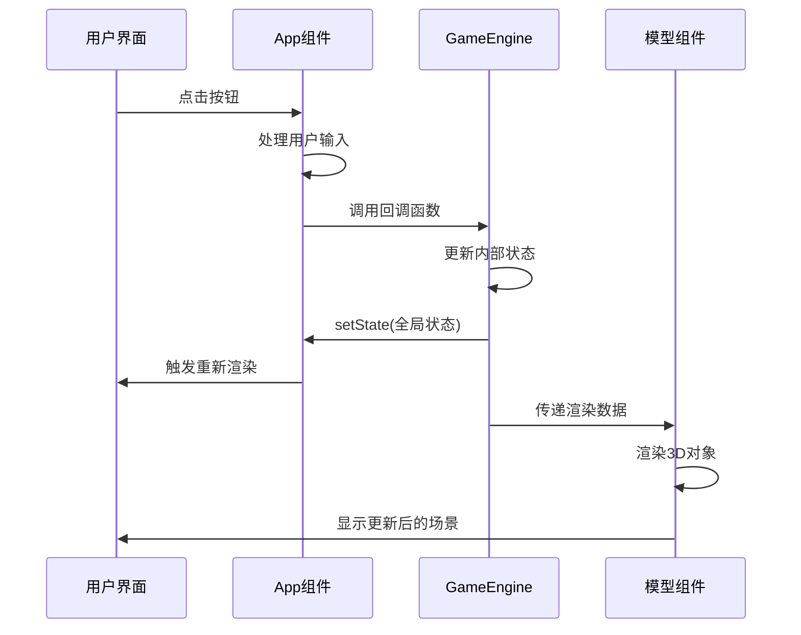

**图表来源**
- [App.tsx](file://App.tsx#L67-L76)
- [GameEngine.tsx](file://components/GameEngine.tsx#L542-L596)

**章节来源**
- [App.tsx](file://App.tsx#L14-L87)
- [GameEngine.tsx](file://components/GameEngine.tsx#L84-L165)

### 游戏状态生命周期管理

#### 初始化流程

游戏初始化过程确保所有组件正确设置：

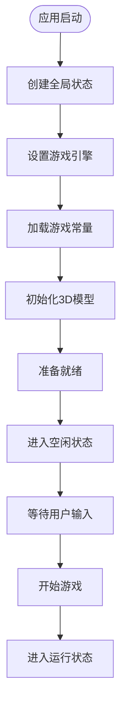

**图表来源**
- [App.tsx](file://App.tsx#L15-L20)
- [GameEngine.tsx](file://components/GameEngine.tsx#L185-L208)

#### 运行时更新流程

游戏运行时的状态更新遵循严格的单向数据流：

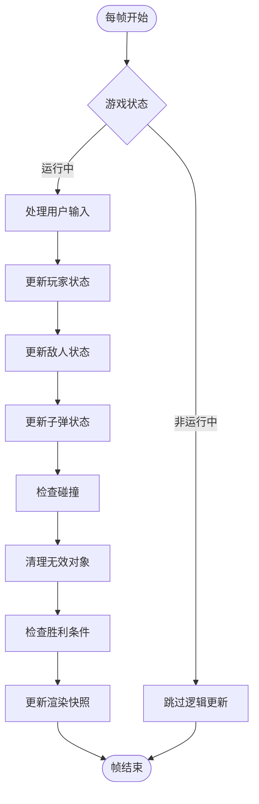

**图表来源**
- [GameEngine.tsx](file://components/GameEngine.tsx#L211-L463)

**章节来源**
- [GameEngine.tsx](file://components/GameEngine.tsx#L168-L208)
- [GameEngine.tsx](file://components/GameEngine.tsx#L211-L463)

### 用户输入到游戏逻辑的转换

#### 输入处理机制

用户输入通过多层转换最终影响游戏状态：

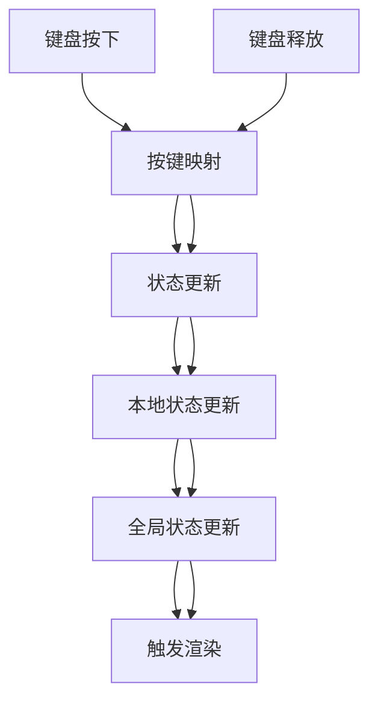

**图表来源**
- [GameEngine.tsx](file://components/GameEngine.tsx#L168-L182)
- [GameEngine.tsx](file://components/GameEngine.tsx#L218-L246)

#### 事件驱动的数据更新

游戏采用事件驱动的方式处理用户交互：

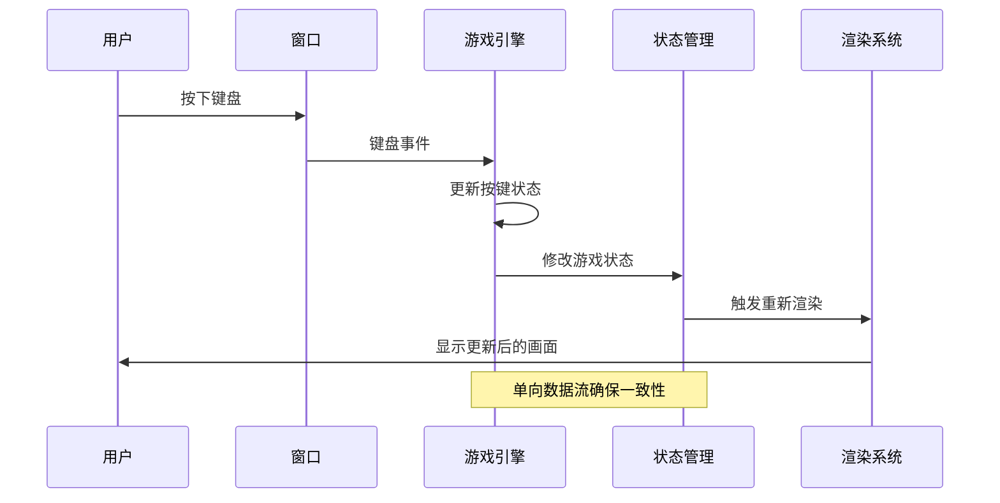

**图表来源**
- [GameEngine.tsx](file://components/GameEngine.tsx#L169-L181)

**章节来源**
- [GameEngine.tsx](file://components/GameEngine.tsx#L155-L182)
- [GameEngine.tsx](file://components/GameEngine.tsx#L211-L263)

### 状态持久化策略

虽然当前版本未实现持久化功能，但代码结构为未来的持久化提供了良好的基础：

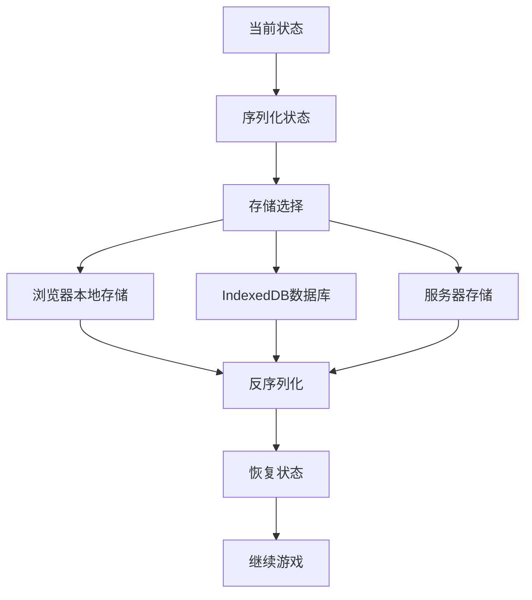

**图表来源**
- [App.tsx](file://App.tsx#L15-L20)

## 依赖关系分析

### 核心依赖关系

```mermaid
graph TB
subgraph "应用层依赖"
App[App.tsx] --> GameEngine[GameEngine.tsx]
GameEngine --> Models[Models.tsx]
end
subgraph "配置层依赖"
GameEngine --> Constants[constants.ts]
Models --> Constants
GameEngine --> Types[types.ts]
Models --> Types
end
subgraph "外部库依赖"
React[React] --> App
ThreeJS[Three.js] --> GameEngine
Fiber[@react-three/fiber] --> GameEngine
Drei[@react-three/drei] --> GameEngine
end
App -.-> React
GameEngine -.-> ThreeJS
GameEngine -.-> Fiber
GameEngine -.-> Drei
```

**图表来源**
- [App.tsx](file://App.tsx#L1-L3)
- [GameEngine.tsx](file://components/GameEngine.tsx#L1-L31)
- [Models.tsx](file://components/Models.tsx#L1-L4)

### 数据流依赖图

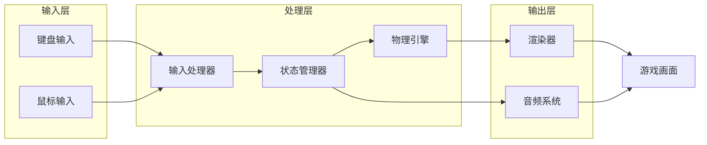

**图表来源**
- [GameEngine.tsx](file://components/GameEngine.tsx#L168-L182)
- [GameEngine.tsx](file://components/GameEngine.tsx#L211-L463)

**章节来源**
- [GameEngine.tsx](file://components/GameEngine.tsx#L1-L32)
- [types.ts](file://types.ts#L1-L50)

## 性能考虑

### 单向数据流的性能优势

NeonTank的单向数据流设计带来了显著的性能优势：

#### 1. 状态更新优化

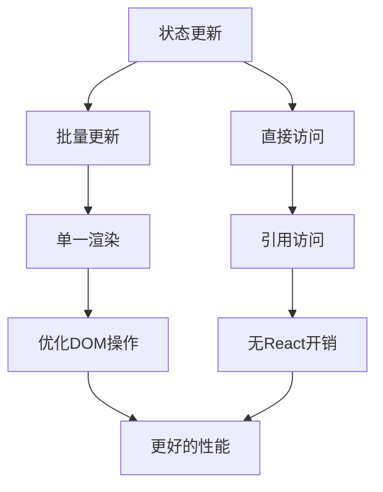

#### 2. 渲染性能优化

GameEngine.tsx采用了多种渲染优化技术：

- **useMemo缓存**: 避免不必要的组件重新渲染
- **useRef引用**: 减少状态更新频率
- **useFrame动画循环**: 利用requestAnimationFrame进行高效动画
- **条件渲染**: 只渲染活跃的游戏对象

#### 3. 内存管理策略

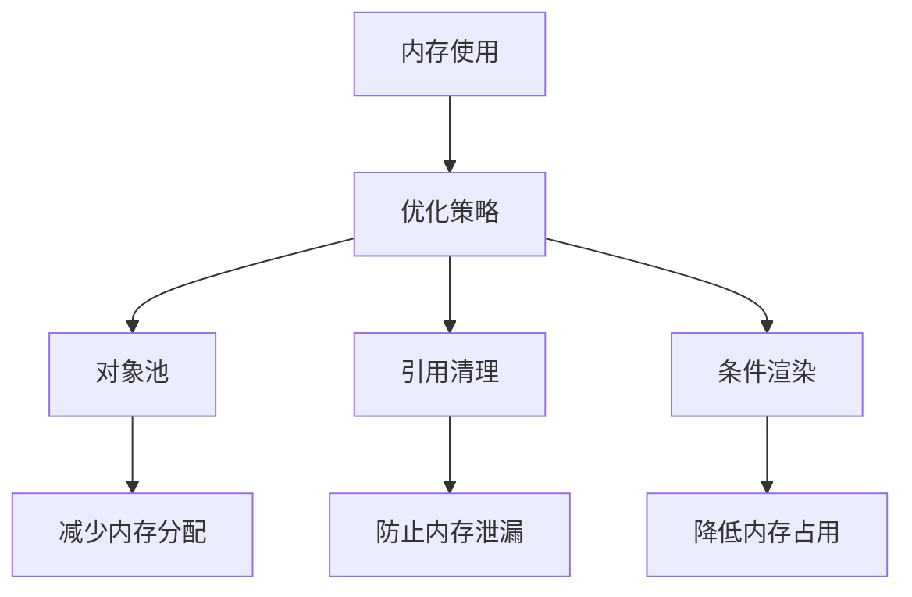

**章节来源**
- [GameEngine.tsx](file://components/GameEngine.tsx#L149-L165)
- [GameEngine.tsx](file://components/GameEngine.tsx#L467-L508)

## 故障排除指南

### 常见问题及解决方案

#### 1. 状态不一致问题

**问题**: 游戏状态与视觉显示不匹配

**解决方案**:
- 确保所有状态更新都通过回调函数进行
- 使用useRef存储高频更新的状态
- 验证状态更新的原子性

#### 2. 性能问题

**问题**: 游戏运行卡顿或帧率下降

**诊断步骤**:
1. 检查是否有过多的组件重新渲染
2. 验证useMemo的使用是否正确
3. 确认useRef的引用更新频率

#### 3. 输入响应延迟

**问题**: 键盘输入响应不及时

**解决方案**:
- 检查事件监听器的注册和移除
- 验证按键状态的更新时机
- 确认渲染循环的执行频率

**章节来源**
- [GameEngine.tsx](file://components/GameEngine.tsx#L168-L182)
- [GameEngine.tsx](file://components/GameEngine.tsx#L455-L463)

## 结论

NeonTank项目成功展示了单向数据流在游戏开发中的应用价值。通过精心设计的状态管理架构，项目实现了：

1. **清晰的数据流向**: 从用户输入到状态更新再到渲染的完整链路
2. **高性能的渲染系统**: 结合useRef和useMemo实现高效的渲染优化
3. **可维护的代码结构**: 模块化的组件设计便于扩展和维护
4. **良好的用户体验**: 流畅的游戏体验和响应式的用户交互

该实现为其他React游戏项目提供了优秀的参考模板，特别是在状态管理和性能优化方面。未来可以考虑添加状态持久化功能，进一步增强游戏的可玩性和用户粘性。