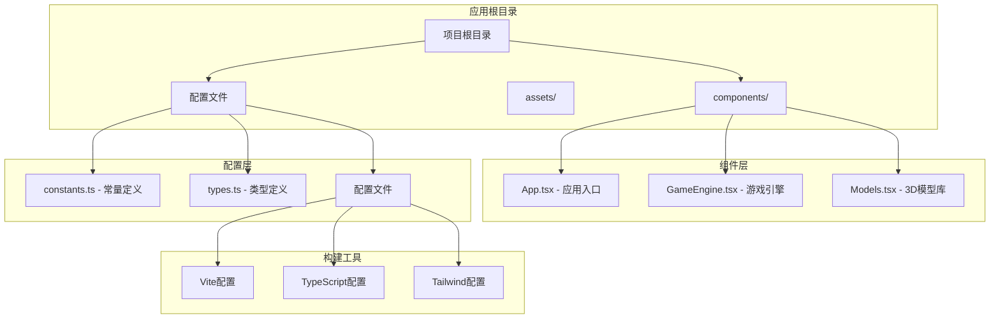
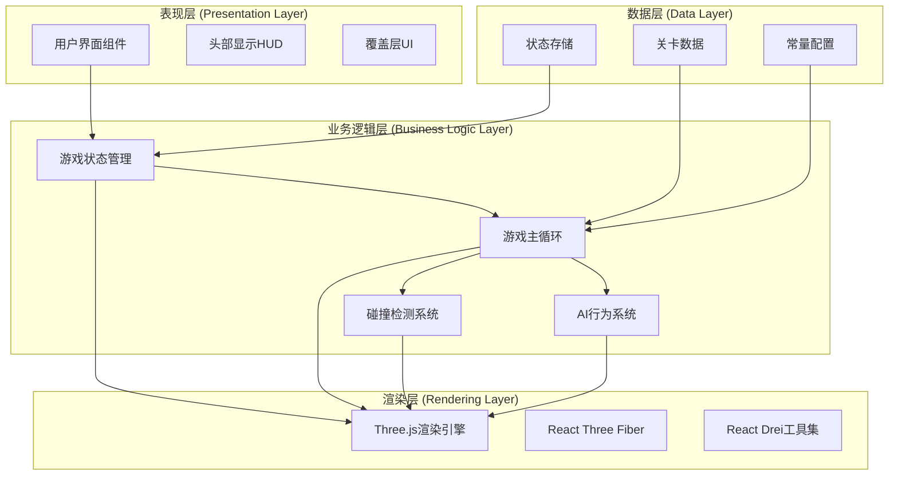
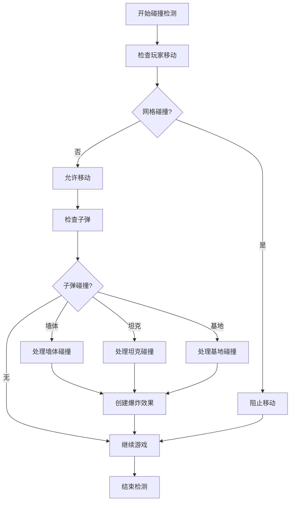
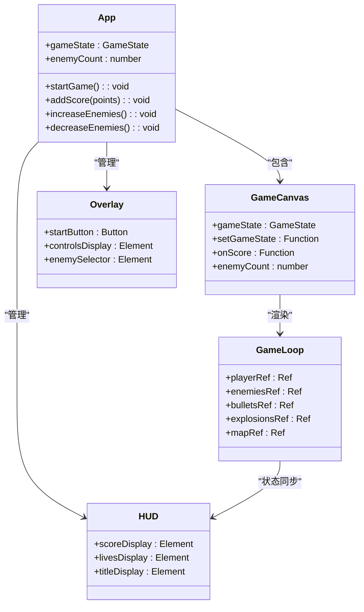
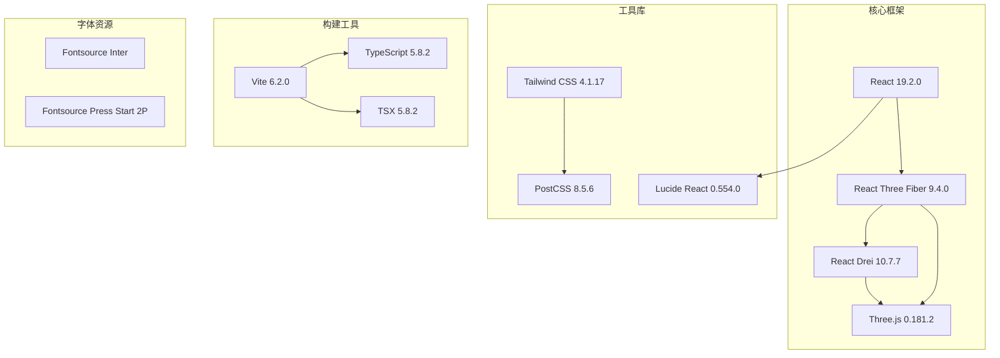
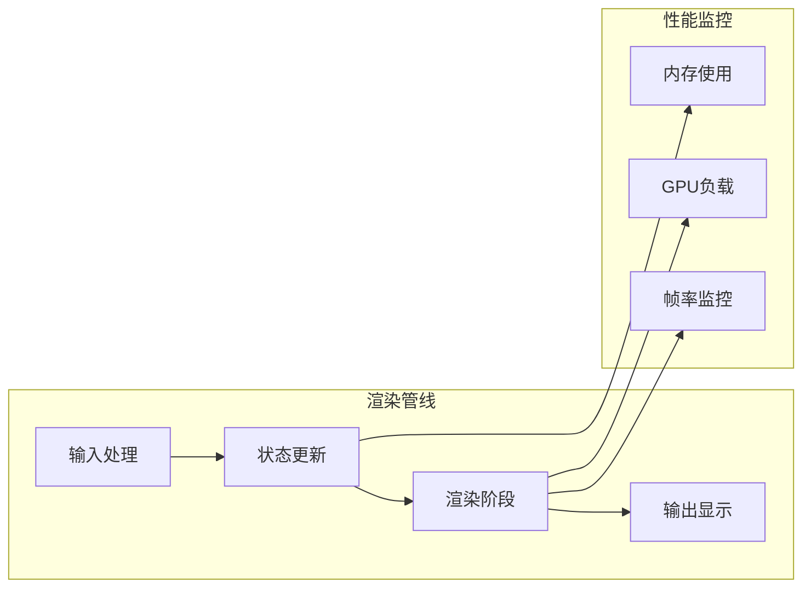

# 架构设计

<cite>
**本文档引用的文件**
- [App.tsx](file://App.tsx)
- [components/GameEngine.tsx](file://components/GameEngine.tsx)
- [components/Models.tsx](file://components/Models.tsx)
- [index.tsx](file://index.tsx)
- [constants.ts](file://constants.ts)
- [types.ts](file://types.ts)
- [package.json](file://package.json)
- [vite.config.ts](file://vite.config.ts)
- [tsconfig.json](file://tsconfig.json)
- [tailwind.config.js](file://tailwind.config.js)
</cite>

## 目录
1. [引言](#引言)
2. [项目结构](#项目结构)
3. [核心组件](#核心组件)
4. [架构概览](#架构概览)
5. [详细组件分析](#详细组件分析)
6. [依赖分析](#依赖分析)
7. [性能考虑](#性能考虑)
8. [故障排除指南](#故障排除指南)
9. [结论](#结论)

## 引言

NeonTank是一个基于React和Three.js的2.5D坦克对战游戏项目。该项目采用现代化的前端技术栈，实现了完整的游戏引擎、3D渲染管线和用户界面系统。项目的核心设计理念是组件化设计、状态管理模式和渲染分离原则，通过清晰的模块职责划分实现了高度可维护的游戏架构。

## 项目结构

项目采用功能驱动的模块化组织方式，主要分为以下几个核心目录：



**图表来源**
- [App.tsx](file://App.tsx#L1-L199)
- [components/GameEngine.tsx](file://components/GameEngine.tsx#L1-L596)
- [components/Models.tsx](file://components/Models.tsx#L1-L152)

**章节来源**
- [package.json](file://package.json#L1-L32)
- [vite.config.ts](file://vite.config.ts#L1-L25)
- [tsconfig.json](file://tsconfig.json#L1-L29)

## 核心组件

### 应用入口组件 (App.tsx)

App.tsx作为整个应用的根组件，负责管理全局游戏状态和用户界面布局。该组件实现了完整的状态管理模式，包括游戏状态管理、UI控制和事件处理。

**核心特性：**
- 全局游戏状态管理（分数、生命值、关卡）
- 动态UI状态切换（开始界面、游戏进行中、游戏结束）
- 敌人数量动态调节
- 响应式设计支持

### 游戏引擎组件 (GameEngine.tsx)

游戏引擎是项目的核心逻辑模块，实现了完整的60FPS游戏循环、物理碰撞检测和AI行为逻辑。该组件采用了高性能的渲染分离架构，将游戏逻辑与渲染完全分离。

**关键功能：**
- 实时游戏循环（useFrame钩子）
- 精确的碰撞检测算法
- 智能敌人AI系统
- 爆炸效果和粒子系统
- 地图编辑和破坏机制

### 3D模型组件库 (Models.tsx)

3D模型组件库提供了完整的3D场景元素渲染，包括坦克、墙体、子弹和爆炸效果。每个组件都经过优化以确保高效的渲染性能。

**组件类型：**
- TankModel - 可移动的坦克模型
- BrickWall - 可破坏的砖墙
- SteelWall - 不可破坏的钢铁墙
- WaterTile - 水域元素
- BaseEagle - 基地保护
- BulletMesh - 子弹渲染
- ExplosionMesh - 爆炸效果

**章节来源**
- [App.tsx](file://App.tsx#L14-L199)
- [components/GameEngine.tsx](file://components/GameEngine.tsx#L77-L596)
- [components/Models.tsx](file://components/Models.tsx#L15-L152)

## 架构概览

NeonTank采用了分层架构设计，实现了清晰的关注点分离：



**图表来源**
- [App.tsx](file://App.tsx#L45-L195)
- [components/GameEngine.tsx](file://components/GameEngine.tsx#L210-L463)
- [components/Models.tsx](file://components/Models.tsx#L23-L152)

### 核心设计理念

**组件化设计原则：**
- 单一职责原则：每个组件只负责特定的功能领域
- 可复用性：组件设计考虑跨模块使用
- 封装性：内部状态和逻辑对外部透明度最小化

**状态管理模式：**
- 集中式状态管理：通过React状态管理全局游戏状态
- 分离关注点：游戏逻辑状态与渲染状态分离
- 性能优化：使用useMemo和useRef优化渲染性能

**渲染分离原则：**
- 游戏循环独立于渲染：使用useFrame实现60FPS更新
- 状态驱动渲染：渲染完全由状态变化触发
- 最小化重绘：通过精确的状态更新减少不必要的渲染

## 详细组件分析

### 游戏引擎组件深度解析

游戏引擎组件是整个项目最复杂的部分，实现了完整的2.5D坦克对战游戏逻辑：

```mermaid
sequenceDiagram
participant Engine as 游戏引擎
participant Loop as 游戏循环
participant Physics as 物理系统
participant AI as AI系统
participant Renderer as 渲染器
Engine->>Loop : 初始化游戏状态
Loop->>Physics : 处理玩家输入
Physics->>AI : 更新敌人状态
AI->>Physics : 计算AI行为
Physics->>Renderer : 更新渲染状态
Loop->>Loop : 60FPS循环
Loop->>Engine : 触发状态更新
```

**图表来源**
- [components/GameEngine.tsx](file://components/GameEngine.tsx#L210-L463)

#### 游戏循环架构

游戏循环采用60FPS的固定时间步长更新，确保游戏逻辑的一致性和可预测性：

**更新流程：**
1. **输入处理** - 键盘事件监听和处理
2. **玩家移动** - 基于方向键的坦克移动
3. **敌人AI** - 简单的路径寻找和射击逻辑
4. **子弹物理** - 子弹运动和碰撞检测
5. **碰撞处理** - 墙壁、坦克、基地的碰撞
6. **状态清理** - 移除无效对象和效果
7. **渲染更新** - 同步状态到渲染层

#### 碰撞检测系统

项目实现了精确的网格碰撞检测系统，支持多种碰撞类型：



**图表来源**
- [components/GameEngine.tsx](file://components/GameEngine.tsx#L34-L75)
- [components/GameEngine.tsx](file://components/GameEngine.tsx#L315-L407)

**章节来源**
- [components/GameEngine.tsx](file://components/GameEngine.tsx#L34-L463)

### 3D模型组件库分析

3D模型组件库提供了完整的场景元素渲染解决方案，每个组件都经过精心设计以确保最佳性能：

#### 坦克模型组件

坦克模型组件实现了复杂的动画系统和材质渲染：

**核心特性：**
- **位置同步** - 使用useFrame实现精确的位置更新
- **旋转系统** - 基于方向枚举的实时旋转计算
- **移动动画** - 平滑的上下摆动动画效果
- **材质系统** - 可配置的颜色和材质属性

#### 地图元素组件

地图元素组件实现了完整的关卡渲染系统：

**组件类型及特性：**
- **BrickWall** - 可破坏的砖墙，带细节线条
- **SteelWall** - 不可破坏的钢铁墙，高反射材质
- **WaterTile** - 半透明水域，带波纹效果
- **BaseEagle** - 基地保护，可死亡状态切换

**章节来源**
- [components/Models.tsx](file://components/Models.tsx#L15-L152)

### 用户界面系统

用户界面系统实现了完整的响应式设计，支持桌面和移动端：



**图表来源**
- [App.tsx](file://App.tsx#L14-L199)
- [components/GameEngine.tsx](file://components/GameEngine.tsx#L542-L596)

**章节来源**
- [App.tsx](file://App.tsx#L45-L195)

## 依赖分析

项目的技术栈选择体现了现代前端开发的最佳实践：



**图表来源**
- [package.json](file://package.json#L11-L30)

### 关键依赖决策

**React Three Fiber选择原因：**
- 提供了声明式的Three.js API
- 与React生态系统无缝集成
- 支持React的并发特性和性能优化
- 开发体验优秀，调试友好

**Tailwind CSS选择原因：**
- 原子化CSS类名提高开发效率
- 响应式设计内置支持
- 自定义主题和变量系统
- 与TypeScript良好兼容

**Vite构建工具选择原因：**
- 极快的冷启动和热更新速度
- 内置TypeScript支持
- 优秀的开发体验
- 轻量级配置

**章节来源**
- [package.json](file://package.json#L11-L30)
- [vite.config.ts](file://vite.config.ts#L1-L25)

## 性能考虑

### 渲染性能优化

项目采用了多项性能优化策略：

**渲染分离优化：**
- 使用useFrame实现独立的游戏循环
- 状态驱动渲染，避免直接DOM操作
- useRef缓存频繁访问的对象

**内存管理优化：**
- 对象池模式管理子弹和爆炸效果
- 合理的垃圾回收策略
- 避免内存泄漏的事件监听器管理

**计算优化：**
- 网格碰撞检测的四角检测算法
- 爆炸效果的生命周期管理
- AI行为的随机性控制

### 渲染管线优化



**优化策略：**
- 60FPS固定时间步长更新
- 精确的状态同步机制
- 最小化的DOM操作
- 高效的3D对象管理

## 故障排除指南

### 常见问题及解决方案

**游戏不响应键盘输入：**
- 检查事件监听器是否正确绑定
- 确认游戏状态为playing
- 验证键盘事件处理函数

**渲染性能问题：**
- 检查是否有过多的组件重新渲染
- 验证useMemo和useRef的使用
- 监控帧率和内存使用情况

**3D渲染异常：**
- 确认Three.js版本兼容性
- 检查材质和纹理加载
- 验证光照设置

**章节来源**
- [components/GameEngine.tsx](file://components/GameEngine.tsx#L168-L182)
- [components/GameEngine.tsx](file://components/GameEngine.tsx#L210-L463)

## 结论

NeonTank项目展现了现代前端游戏开发的最佳实践，通过清晰的架构设计和合理的模块划分，实现了高性能、可维护的游戏系统。项目的核心优势包括：

**架构优势：**
- 清晰的分层设计和职责分离
- 高效的渲染分离架构
- 完善的状态管理模式
- 可扩展的组件系统

**技术优势：**
- 现代化的技术栈选择
- 优秀的开发体验
- 良好的性能表现
- 完善的工具链支持

**可维护性：**
- 模块化的设计便于维护
- 清晰的代码结构
- 完善的类型定义
- 良好的文档和注释

该项目为类似的游戏开发提供了优秀的参考模板，展示了如何在前端环境中实现复杂的游戏逻辑和高质量的3D渲染效果。