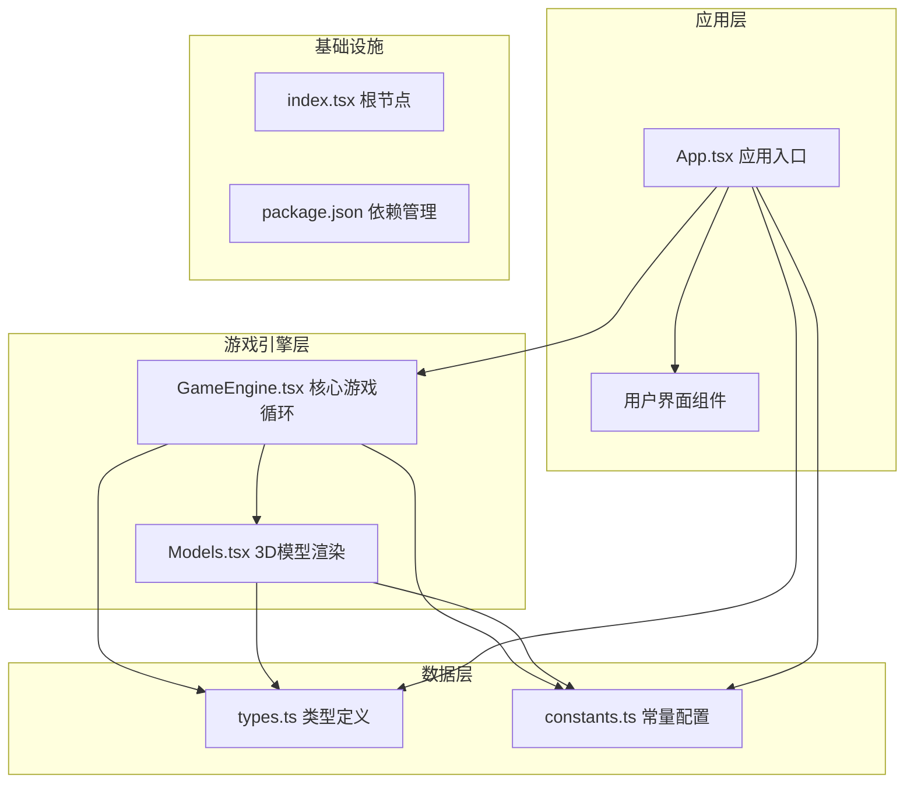
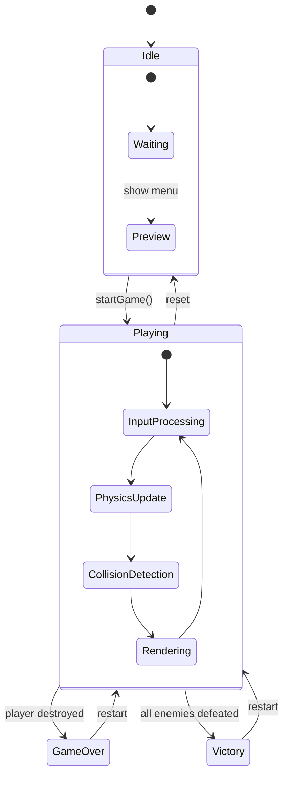
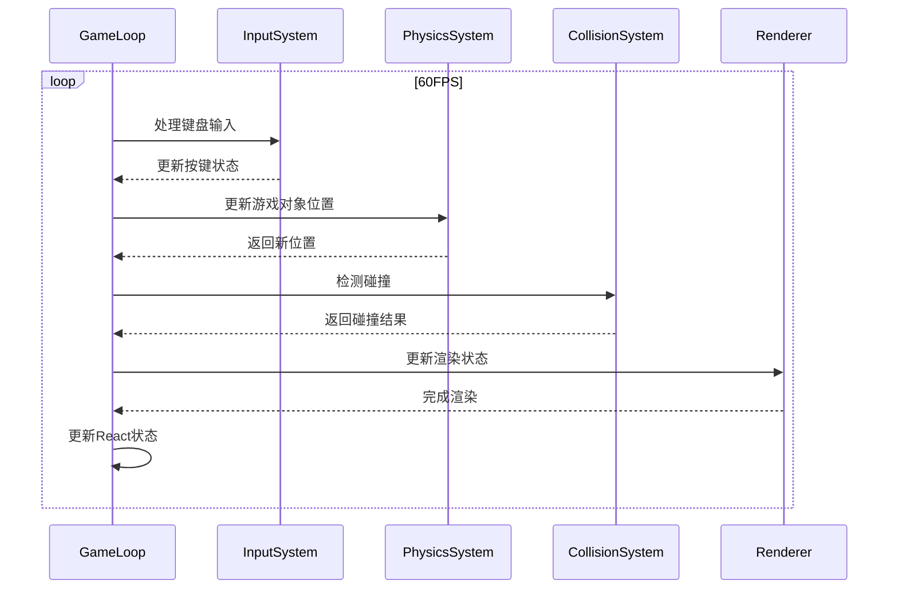
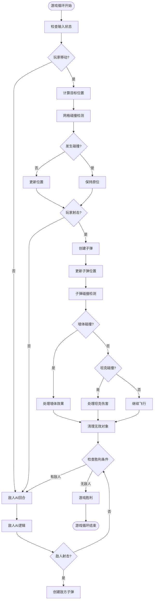
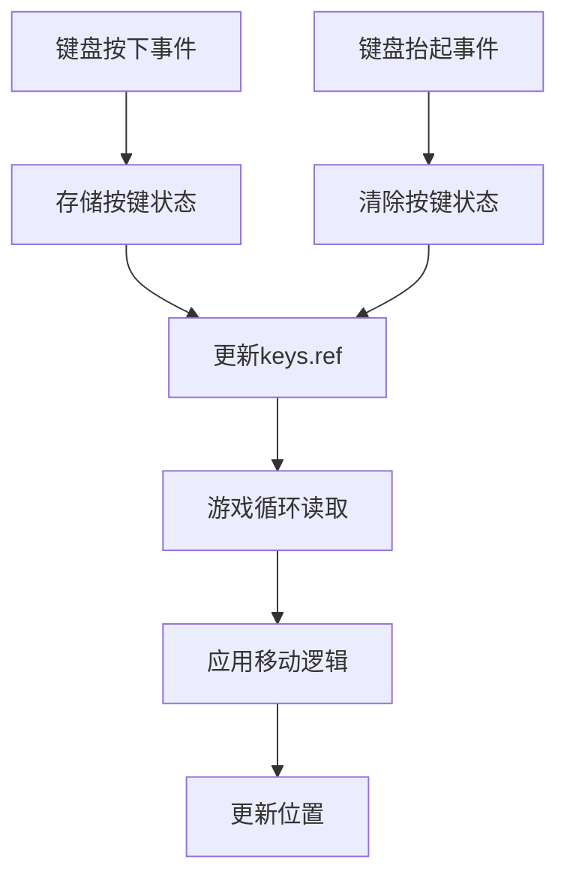
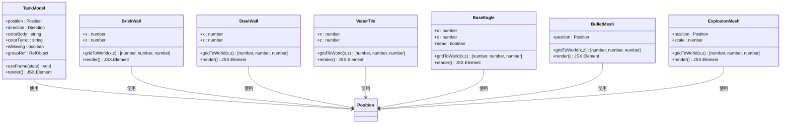
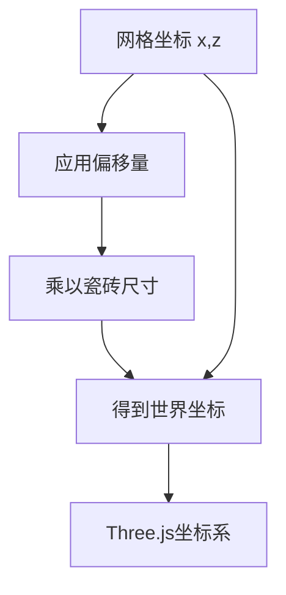
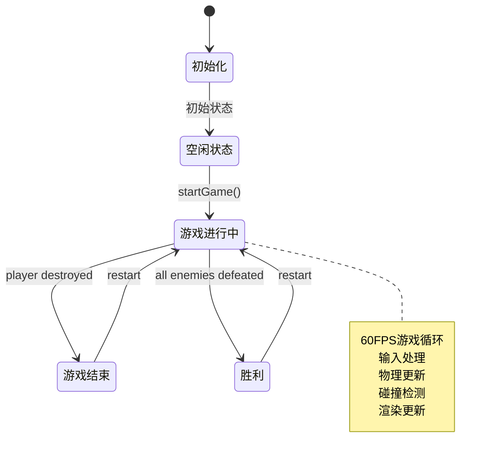
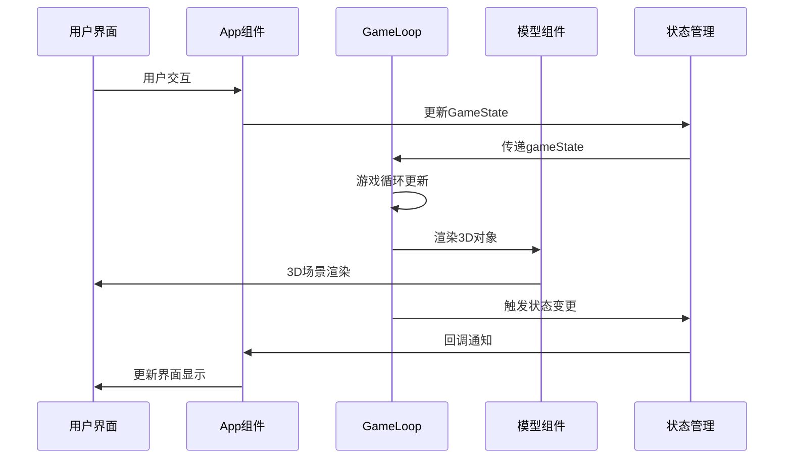
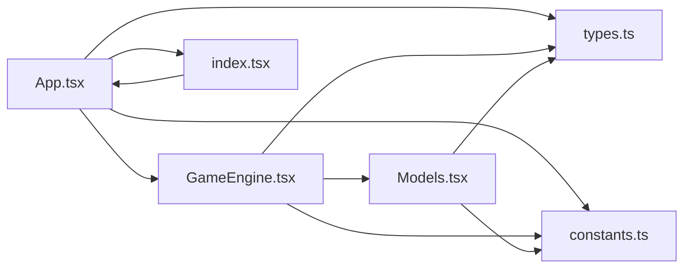

# 游戏引擎架构

<cite>
**本文档引用的文件**
- [App.tsx](file://App.tsx)
- [GameEngine.tsx](file://components/GameEngine.tsx)
- [Models.tsx](file://components/Models.tsx)
- [index.tsx](file://index.tsx)
- [types.ts](file://types.ts)
- [constants.ts](file://constants.ts)
- [package.json](file://package.json)
- [README.md](file://README.md)
</cite>

## 目录
1. [简介](#简介)
2. [项目结构](#项目结构)
3. [核心组件](#核心组件)
4. [架构概览](#架构概览)
5. [详细组件分析](#详细组件分析)
6. [依赖关系分析](#依赖关系分析)
7. [性能考虑](#性能考虑)
8. [故障排除指南](#故障排除指南)
9. [结论](#结论)

## 简介

NeonTank是一个基于React Three Fiber构建的2.5D坦克对战游戏引擎。该引擎实现了经典的街机游戏玩法，具有60FPS游戏循环、状态管理模式、物理系统和AI集成。游戏采用网格化的地图系统，支持玩家控制的坦克与敌方AI坦克进行对战，同时具备完整的碰撞检测、弹道物理和爆炸效果系统。

## 项目结构

项目采用模块化架构设计，主要分为以下几个核心模块：



**图表来源**
- [App.tsx](file://App.tsx#L1-L199)
- [GameEngine.tsx](file://components/GameEngine.tsx#L1-L596)
- [Models.tsx](file://components/Models.tsx#L1-L152)

**章节来源**
- [App.tsx](file://App.tsx#L1-L199)
- [GameEngine.tsx](file://components/GameEngine.tsx#L1-L596)
- [Models.tsx](file://components/Models.tsx#L1-L152)
- [index.tsx](file://index.tsx#L1-L19)

## 核心组件

### 游戏引擎核心架构

游戏引擎的核心是`GameLoop`组件，它实现了完整的60FPS游戏循环，包含以下关键功能模块：

```mermaid
classDiagram
class GameLoop {
+playerRef : RefObject~Tank~
+enemiesRef : RefObject~Tank[]~
+bulletsRef : RefObject~Bullet[]~
+explosionsRef : RefObject~Explosion[]~
+mapRef : RefObject~number[][]~
+keys : RefObject~{[key : string] : boolean}~
+snapshot : State~GameState~
+useFrame(delta) void
+checkGridCollision(pos, map) boolean
+isColliding(p1, p2, threshold) boolean
}
class Tank {
+id : string
+position : Position
+direction : Direction
+active : boolean
+type : 'player' | 'enemy'
+cooldown : number
+hp : number
}
class Bullet {
+id : string
+position : Position
+direction : Direction
+active : boolean
+owner : 'player' | 'enemy'
}
class Explosion {
+id : string
+position : Position
+scale : number
+createdAt : number
}
GameLoop --> Tank : manages
GameLoop --> Bullet : creates
GameLoop --> Explosion : generates
Tank --> Position : contains
Bullet --> Position : contains
Explosion --> Position : contains
```

**图表来源**
- [GameEngine.tsx](file://components/GameEngine.tsx#L84-L540)
- [types.ts](file://types.ts#L21-L43)

### 状态管理模式

游戏采用React的状态管理模式，通过`useState`和`useRef`实现高效的状态管理：



**图表来源**
- [App.tsx](file://App.tsx#L15-L43)
- [GameEngine.tsx](file://components/GameEngine.tsx#L211-L463)

**章节来源**
- [GameEngine.tsx](file://components/GameEngine.tsx#L84-L540)
- [types.ts](file://types.ts#L45-L50)

## 架构概览

### 60FPS游戏循环实现

游戏引擎实现了精确的60FPS游戏循环，通过`@react-three/fiber`的`useFrame`钩子确保每帧更新的一致性：



**图表来源**
- [GameEngine.tsx](file://components/GameEngine.tsx#L211-L463)

### 物理系统设计

物理系统采用简化但有效的2D网格物理模型：



**图表来源**
- [GameEngine.tsx](file://components/GameEngine.tsx#L211-L463)
- [constants.ts](file://constants.ts#L5-L7)

**章节来源**
- [GameEngine.tsx](file://components/GameEngine.tsx#L33-L75)
- [constants.ts](file://constants.ts#L5-L7)

## 详细组件分析

### GameLoop组件架构

GameLoop组件是整个游戏引擎的核心，负责协调所有游戏逻辑：

#### 组件结构

```mermaid
classDiagram
class GameLoop {
+props : GameEngineProps
+playerRef : RefObject~Tank~
+enemiesRef : RefObject~Tank[]~
+bulletsRef : RefObject~Bullet[]~
+explosionsRef : RefObject~Explosion[]~
+mapRef : RefObject~number[][]~
+keys : RefObject~{[key : string] : boolean}~
+snapshot : State~GameState~
+useEffect(windowEvents) void
+useEffect(resetGame) void
+useFrame(gameLoop) void
+render() JSX.Element
}
class GameEngineProps {
+gameState : GameState
+setGameState : Function
+onScore : Function
+enemyCount : number
}
class TankModel {
+position : Position
+direction : Direction
+colorBody : string
+colorTurret : string
+isMoving : boolean
+useFrame() void
+render() JSX.Element
}
GameLoop --> GameEngineProps : 接收
GameLoop --> TankModel : 渲染
GameLoop --> TankModel : 渲染
GameLoop --> BulletMesh : 渲染
GameLoop --> ExplosionMesh : 渲染
```

**图表来源**
- [GameEngine.tsx](file://components/GameEngine.tsx#L77-L82)
- [GameEngine.tsx](file://components/GameEngine.tsx#L23-L31)

#### 输入处理系统

输入系统使用键盘事件监听器，通过`useRef`存储按键状态：



**图表来源**
- [GameEngine.tsx](file://components/GameEngine.tsx#L168-L182)

#### 碰撞检测系统

碰撞检测系统包含多种类型的碰撞：

1. **网格碰撞检测**：检查坦克与墙体的碰撞
2. **子弹碰撞检测**：检查子弹与墙体、坦克的碰撞
3. **弹对弹碰撞**：检查玩家子弹与敌方子弹的相互抵消

**章节来源**
- [GameEngine.tsx](file://components/GameEngine.tsx#L33-L75)
- [GameEngine.tsx](file://components/GameEngine.tsx#L211-L463)

### 3D模型渲染系统

模型渲染系统基于Three.js和React Three Fiber构建：

#### 模型组件架构



**图表来源**
- [Models.tsx](file://components/Models.tsx#L15-L75)
- [Models.tsx](file://components/Models.tsx#L77-L152)

#### 网格到世界坐标转换



**图表来源**
- [Models.tsx](file://components/Models.tsx#L9-L13)

**章节来源**
- [Models.tsx](file://components/Models.tsx#L1-L152)

### 状态管理与生命周期

#### 生命周期管理



**图表来源**
- [App.tsx](file://App.tsx#L32-L43)
- [GameEngine.tsx](file://components/GameEngine.tsx#L185-L208)

#### 数据流向



**图表来源**
- [App.tsx](file://App.tsx#L14-L86)
- [GameEngine.tsx](file://components/GameEngine.tsx#L542-L596)

**章节来源**
- [App.tsx](file://App.tsx#L14-L86)
- [GameEngine.tsx](file://components/GameEngine.tsx#L185-L208)

## 依赖关系分析

### 外部依赖架构

```mermaid
graph TB
subgraph "React生态系统"
React[React 19.2.0]
ReactDOM[React DOM 19.2.0]
R3F[@react-three/fiber 9.4.0]
Drei[@react-three/drei 10.7.7]
end
subgraph "3D图形库"
ThreeJS[Three.js 0.181.2]
end
subgraph "UI库"
Lucide[lucide-react 0.554.0]
end
subgraph "样式系统"
Tailwind[Tailwind CSS 4.1.17]
PostCSS[PostCSS 8.5.6]
end
subgraph "开发工具"
Vite[Vite 6.2.0]
TS[TypeScript ~5.8.2]
end
React --> R3F
R3F --> ThreeJS
R3F --> Drei
Drei --> ThreeJS
React --> ReactDOM
React --> Lucide
Tailwind --> PostCSS
Vite --> TS
```

**图表来源**
- [package.json](file://package.json#L11-L30)

### 内部模块依赖



**图表来源**
- [App.tsx](file://App.tsx#L1-L2)
- [GameEngine.tsx](file://components/GameEngine.tsx#L1-L31)
- [Models.tsx](file://components/Models.tsx#L1-L6)

**章节来源**
- [package.json](file://package.json#L1-L32)

## 性能考虑

### 游戏循环优化

1. **使用useRef避免不必要的重渲染**
   - 所有游戏状态变量都使用`useRef`存储
   - React状态仅在需要渲染时更新

2. **批量更新策略**
   - 每帧只进行一次状态更新
   - 合并多个状态变更到单次渲染

3. **内存管理**
   - 对象池模式：重用子弹和爆炸效果
   - 及时清理失效对象

### 渲染性能优化

1. **几何体复用**
   - 使用`useMemo`缓存地图元素
   - 避免重复创建相同的几何体

2. **阴影优化**
   - 合理设置阴影参数
   - 控制阴影质量以平衡性能

3. **动画优化**
   - 使用`useFrame`进行高效动画
   - 减少不必要的DOM操作

### 物理系统优化

1. **简化碰撞检测**
   - 使用四点包围盒检测
   - 减少计算复杂度

2. **增量更新**
   - 仅在地图变化时重新渲染
   - 使用版本号跟踪变更

**章节来源**
- [GameEngine.tsx](file://components/GameEngine.tsx#L155-L165)
- [GameEngine.tsx](file://components/GameEngine.tsx#L467-L508)

## 故障排除指南

### 常见问题诊断

1. **游戏不响应输入**
   - 检查键盘事件监听器是否正确绑定
   - 验证`keys`引用对象的状态更新

2. **坦克无法移动**
   - 检查网格碰撞检测逻辑
   - 验证`GAME_SPEED`常量设置

3. **子弹不显示或不消失**
   - 检查`bulletsRef`数组的状态管理
   - 验证子弹生命周期逻辑

4. **AI行为异常**
   - 检查随机数生成和方向切换逻辑
   - 验证冷却时间设置

### 调试技巧

1. **启用严格模式**
   ```javascript
   // 在index.tsx中启用
   <React.StrictMode>
     <App />
   </React.StrictMode>
   ```

2. **性能监控**
   - 使用浏览器开发者工具的性能面板
   - 监控帧率和内存使用情况

3. **日志输出**
   - 在关键位置添加console.log
   - 监控状态变化和对象生命周期

**章节来源**
- [index.tsx](file://index.tsx#L13-L18)
- [GameEngine.tsx](file://components/GameEngine.tsx#L168-L182)

## 结论

NeonTank游戏引擎展现了现代Web游戏开发的最佳实践，通过精心设计的架构实现了高性能的60FPS游戏体验。该引擎的主要优势包括：

1. **清晰的架构分离**：游戏逻辑、渲染系统和状态管理完全解耦
2. **高效的性能优化**：通过useRef和useMemo实现最小化重渲染
3. **可扩展的设计**：模块化组件便于功能扩展和维护
4. **优秀的用户体验**：流畅的游戏循环和即时反馈

该引擎为学习现代Web游戏开发提供了优秀的参考案例，展示了如何在Web环境中实现复杂的实时游戏系统。通过合理的架构设计和性能优化策略，即使在浏览器环境中也能提供接近原生应用的游戏体验。