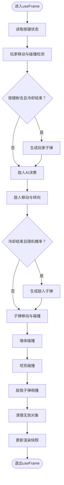

# 核心模块

<cite>
**本文引用的文件**
- [components/GameEngine.tsx](file://components/GameEngine.tsx)
- [components/Models.tsx](file://components/Models.tsx)
- [App.tsx](file://App.tsx)
- [constants.ts](file://constants.ts)
- [types.ts](file://types.ts)
- [index.tsx](file://index.tsx)
- [package.json](file://package.json)
</cite>

## 目录
1. [简介](#简介)
2. [项目结构](#项目结构)
3. [核心组件](#核心组件)
4. [架构总览](#架构总览)
5. [详细组件分析](#详细组件分析)
6. [依赖关系分析](#依赖关系分析)
7. [性能考量](#性能考量)
8. [故障排查指南](#故障排查指南)
9. [结论](#结论)
10. [附录](#附录)

## 简介
本文件聚焦于NeonTank的核心模块，系统性解析以下方面：
- 游戏引擎模块：游戏循环、输入处理、物理与碰撞检测、AI行为、状态管理与渲染集成
- 3D模型组件库：坦克、子弹、爆炸效果等的几何构建与材质表现
- 类型系统与常量配置：枚举、接口、地图布局与全局参数
- 模块间依赖与数据流：从应用入口到引擎与模型层的数据传递路径
- 常见问题与性能优化建议：碰撞精度、帧更新策略、内存与渲染开销控制

## 项目结构
项目采用基于功能分层的组织方式：
- 应用入口负责UI与状态管理，调度游戏画布
- 游戏引擎负责60fps主循环、输入、AI、碰撞与状态变更
- 模型库负责3D几何与材质渲染
- 类型与常量定义贯穿各层，确保一致性与可维护性

图表来源
- [index.tsx](file://index.tsx#L1-L19)
- [App.tsx](file://App.tsx#L1-L199)
- [components/GameEngine.tsx](file://components/GameEngine.tsx#L1-L596)
- [components/Models.tsx](file://components/Models.tsx#L1-L152)
- [constants.ts](file://constants.ts#L1-L39)
- [types.ts](file://types.ts#L1-L50)

章节来源
- [index.tsx](file://index.tsx#L1-L19)
- [package.json](file://package.json#L1-L32)

## 核心组件
- 游戏引擎（GameLoop）：封装60fps主循环、输入处理、移动与射击、敌人AI、子弹逻辑与碰撞、爆炸效果、胜负判定与渲染快照
- 3D模型组件库（Models）：坦克、砖墙、钢铁墙、水、基地、子弹、爆炸的几何与材质
- 类型系统（types）：方向、地形类型、位置、对象基类、坦克、子弹、爆炸、游戏状态
- 常量配置（constants）：网格尺寸、瓦片尺寸、移动速度、子弹速度、冷却帧数、颜色、关卡地图

章节来源
- [components/GameEngine.tsx](file://components/GameEngine.tsx#L77-L596)
- [components/Models.tsx](file://components/Models.tsx#L1-L152)
- [types.ts](file://types.ts#L1-L50)
- [constants.ts](file://constants.ts#L1-L39)

## 架构总览
整体架构以React + Three Fiber为核心，通过useFrame驱动每帧更新，结合useMemo与ref进行高效渲染与状态管理。

图表来源
- [App.tsx](file://App.tsx#L14-L76)
- [components/GameEngine.tsx](file://components/GameEngine.tsx#L84-L596)
- [components/Models.tsx](file://components/Models.tsx#L1-L152)
- [constants.ts](file://constants.ts#L1-L39)
- [types.ts](file://types.ts#L1-L50)

## 详细组件分析

### 游戏引擎（GameLoop）
- 输入与状态
  - 使用键盘事件记录按键状态，通过useEffect绑定/解绑
  - 通过ref持有玩家、敌人、子弹、爆炸与地图的可变状态，避免每次渲染都触发重算
- 主循环（useFrame）
  - 玩家移动：根据方向键计算意图位置，调用网格碰撞检测，无碰撞则更新位置
  - 射击：冷却计时器归零且按键按下时生成子弹，设置冷却
  - 敌人AI：按固定速度移动；遇到障碍或随机概率改变方向；随机射击
  - 子弹逻辑：按方向移动；与墙体、坦克、敌我子弹相互作用；命中后产生爆炸
  - 清理与胜负：移除非活跃对象；清空过期爆炸；若敌人清空则胜利；基地被摧毁则失败
- 渲染快照
  - 使用useState保存当前帧的玩家、敌人、子弹、爆炸与地图版本号
  - useFrame结束后统一setSnapshot，驱动子树重渲染
- 地图渲染
  - 通过useMemo缓存地图元素，仅在地图版本变化时重建
  - 地面平面、墙体、水、基地分别渲染

图表来源
- [components/GameEngine.tsx](file://components/GameEngine.tsx#L211-L463)

章节来源
- [components/GameEngine.tsx](file://components/GameEngine.tsx#L155-L463)

### 物理系统与碰撞检测
- 网格碰撞（坦克）
  - 使用四角包围盒近似，半径约0.35，避免卡墙
  - 对四个检查点映射到整数网格，越界或命中不可穿越地形即判定碰撞
- 子弹碰撞
  - 与墙体：按四舍五入后的网格坐标判断地形，命中后销毁子弹并生成爆炸
  - 与坦克：使用半径阈值近似距离判断，命中后双方销毁并加分/失败
  - 与子弹：敌我子弹接近即互相抵消，产生小爆炸
- 爆炸生命周期
  - 创建后按时间衰减缩放，超过阈值移除

图表来源
- [components/GameEngine.tsx](file://components/GameEngine.tsx#L35-L68)
- [components/GameEngine.tsx](file://components/GameEngine.tsx#L315-L407)

章节来源
- [components/GameEngine.tsx](file://components/GameEngine.tsx#L35-L68)
- [components/GameEngine.tsx](file://components/GameEngine.tsx#L70-L75)
- [components/GameEngine.tsx](file://components/GameEngine.tsx#L315-L407)

### 3D模型组件库
- 坦克模型（TankModel）
  - 几何：主体、履带、炮塔、炮管
  - 材质：金属度/粗糙度参数，发射光增强视觉
  - 动画：按方向旋转；移动时轻微上下摆动
- 地图构件
  - 砖墙：圆角立方体，带细节线条
  - 钢墙：高反射材质
  - 水面：透明材质
  - 基地：可显示“存活/死亡”状态
- 弹药与爆炸
  - 子弹：发光球体
  - 爆炸：随时间缩放与透明度衰减

图表来源
- [components/Models.tsx](file://components/Models.tsx#L15-L152)
- [constants.ts](file://constants.ts#L8-L21)

章节来源
- [components/Models.tsx](file://components/Models.tsx#L15-L152)

### 类型系统与常量配置
- 方向与地形类型：统一枚举，保证跨模块一致性
- 接口：GameObject、Tank、Bullet、Explosion、GameState，明确字段与职责
- 常量：网格尺寸、瓦片尺寸、移动/子弹速度、冷却帧数、颜色、地图布局

章节来源
- [types.ts](file://types.ts#L1-L50)
- [constants.ts](file://constants.ts#L1-L39)

### 数据流与模块交互
- App.tsx
  - 维护游戏状态（状态、分数、生命、等级），传递给GameCanvas
  - 提供开始/重试按钮与敌人数量调节
- GameEngine.tsx
  - 作为Canvas子组件，接收状态回调，内部通过ref与useState管理可变状态
  - 将地图、坦克、子弹、爆炸渲染到Three场景
- Models.tsx
  - 以函数组件形式渲染具体几何，依赖常量与类型
- constants.ts / types.ts
  - 被引擎与模型共同引用，确保行为与外观一致

图表来源
- [App.tsx](file://App.tsx#L14-L76)
- [components/GameEngine.tsx](file://components/GameEngine.tsx#L1-L50)
- [components/Models.tsx](file://components/Models.tsx#L1-L10)
- [constants.ts](file://constants.ts#L1-L39)
- [types.ts](file://types.ts#L1-L50)

章节来源
- [App.tsx](file://App.tsx#L14-L76)
- [components/GameEngine.tsx](file://components/GameEngine.tsx#L1-L50)
- [components/Models.tsx](file://components/Models.tsx#L1-L10)

## 依赖关系分析
- 运行时依赖
  - @react-three/fiber：驱动Three场景与useFrame
  - @react-three/drei：环境、阴影、控制器等辅助组件
  - three：核心3D库
  - lucide-react：UI图标
- 开发依赖
  - vite、tailwindcss、typescript等

图表来源
- [package.json](file://package.json#L11-L29)
- [components/GameEngine.tsx](file://components/GameEngine.tsx#L1-L4)
- [components/Models.tsx](file://components/Models.tsx#L1-L4)

章节来源
- [package.json](file://package.json#L11-L29)

## 性能考量
- 使用ref持有可变状态，避免每次渲染都触发重算
- useFrame中批量更新，最后统一setSnapshot，减少多次重渲染
- useFrame内仅做必要计算，如碰撞检测与对象清理
- useFrame外使用useMemo缓存地图元素，仅在地图版本变化时重建
- 子弹与爆炸按帧衰减，及时清理，避免无限增长
- 建议
  - 可将碰撞检测从四角扩展为更精细的轴对齐包围盒或圆柱体
  - 对大量敌人时，考虑空间分割（如四叉树）降低碰撞复杂度
  - 控制爆炸与子弹数量上限，避免帧率抖动
  - 合理设置阴影分辨率与相机参数，平衡质量与性能

## 故障排查指南
- 坦克无法移动
  - 检查按键事件是否正确绑定与解绑
  - 确认网格碰撞检测逻辑未误判
- 子弹不消失或穿透
  - 校验墙体命中与销毁逻辑
  - 检查isColliding阈值是否合适
- 基地未被摧毁
  - 确认基地命中后地图修改与状态切换逻辑
- 爆炸不消失
  - 检查createdAt与时间差判断
- 渲染闪烁或卡顿
  - 确认useFrame内只做必要更新
  - 检查useMemo缓存是否生效

章节来源
- [components/GameEngine.tsx](file://components/GameEngine.tsx#L168-L182)
- [components/GameEngine.tsx](file://components/GameEngine.tsx#L315-L407)
- [components/GameEngine.tsx](file://components/GameEngine.tsx#L441-L448)

## 结论
该核心模块以清晰的分层设计实现了2.5D坦克对战的基础玩法：稳定的60fps主循环、可靠的网格与球体碰撞、直观的3D模型渲染以及可扩展的类型与常量体系。通过ref与useMemo的合理运用，兼顾了性能与可维护性。后续可在碰撞精度、空间索引与渲染优化上进一步提升。

## 附录
- 关键实现路径参考
  - 游戏循环与碰撞：[components/GameEngine.tsx](file://components/GameEngine.tsx#L211-L463)
  - 坦克模型与动画：[components/Models.tsx](file://components/Models.tsx#L23-L75)
  - 地图与构件渲染：[components/Models.tsx](file://components/Models.tsx#L77-L132)
  - 类型与常量：[types.ts](file://types.ts#L1-L50)、[constants.ts](file://constants.ts#L1-L39)
  - 应用入口与状态：[App.tsx](file://App.tsx#L14-L76)、[index.tsx](file://index.tsx#L1-L19)