# 敌方AI系统

<cite>
**本文档引用的文件**
- [GameEngine.tsx](file://components/GameEngine.tsx)
- [Models.tsx](file://components/Models.tsx)
- [constants.ts](file://constants.ts)
- [types.ts](file://types.ts)
- [App.tsx](file://App.tsx)
- [README.md](file://README.md)
- [package.json](file://package.json)
</cite>

## 目录
1. [简介](#简介)
2. [项目结构](#项目结构)
3. [核心组件](#核心组件)
4. [架构概览](#架构概览)
5. [详细组件分析](#详细组件分析)
6. [寻路算法实现](#寻路算法实现)
7. [智能决策机制](#智能决策机制)
8. [状态机设计](#状态机设计)
9. [性能优化策略](#性能优化策略)
10. [可视化图表](#可视化图表)
11. [差异化设计](#差异化设计)
12. [故障排除指南](#故障排除指南)
13. [结论](#结论)

## 简介

Neon Tank 是一个基于 React Three Fiber 的现代 2.5D 坦克游戏，采用经典 Battle City 游戏的玩法。本项目专注于创建一个功能完整的敌方AI系统，实现自动寻路、智能决策和战斗行为。该AI系统使用简单的随机策略和基础的碰撞检测来实现敌方坦克的行为逻辑。

## 项目结构

该项目采用模块化架构，主要包含以下核心文件：

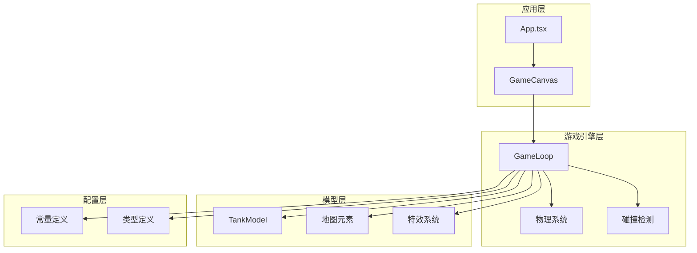

**图表来源**
- [App.tsx](file://App.tsx#L1-L199)
- [GameEngine.tsx](file://components/GameEngine.tsx#L1-L596)
- [constants.ts](file://constants.ts#L1-L39)
- [types.ts](file://types.ts#L1-L50)

**章节来源**
- [App.tsx](file://App.tsx#L1-L199)
- [GameEngine.tsx](file://components/GameEngine.tsx#L1-L596)
- [constants.ts](file://constants.ts#L1-L39)
- [types.ts](file://types.ts#L1-L50)

## 核心组件

### 游戏循环组件

游戏循环是整个AI系统的核心，负责处理所有游戏逻辑更新。它使用 React Three Fiber 的 `useFrame` 钩子以60FPS的频率运行。

### 敌方坦克实体

每个敌方坦克都是一个独立的游戏对象，具有位置、方向、冷却时间和生命值等属性。坦克使用简单的随机策略进行移动和射击。

### 物理系统

实现了基于网格的碰撞检测系统，支持墙体、水体和基地的碰撞判断。

**章节来源**
- [GameEngine.tsx](file://components/GameEngine.tsx#L84-L541)
- [types.ts](file://types.ts#L32-L36)

## 架构概览

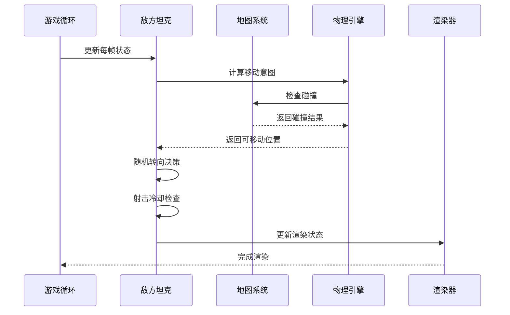

**图表来源**
- [GameEngine.tsx](file://components/GameEngine.tsx#L265-L313)

## 详细组件分析

### 敌方AI控制器

敌方AI控制器位于游戏循环中，负责处理所有敌方坦克的行为逻辑。

#### 移动逻辑实现

敌方坦克采用简单的网格移动系统：

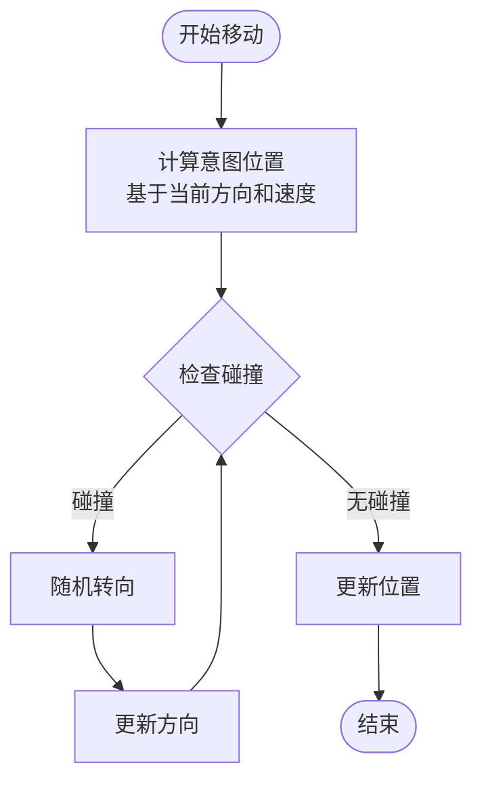

**图表来源**
- [GameEngine.tsx](file://components/GameEngine.tsx#L269-L299)

#### 冷却系统设计

每个敌方坦克都有独立的冷却计时器，用于控制射击频率：

- **基础冷却**: `TANK_COOLDOWN` 帧（默认30帧）
- **射击冷却**: 冷却时间乘以2（60帧）
- **冷却递增**: 根据坦克ID递增，实现错峰射击

**章节来源**
- [GameEngine.tsx](file://components/GameEngine.tsx#L138-L312)
- [constants.ts](file://constants.ts#L7-L7)

### 碰撞检测系统

碰撞检测系统使用四点包围盒方法来确保坦克不会穿过障碍物：

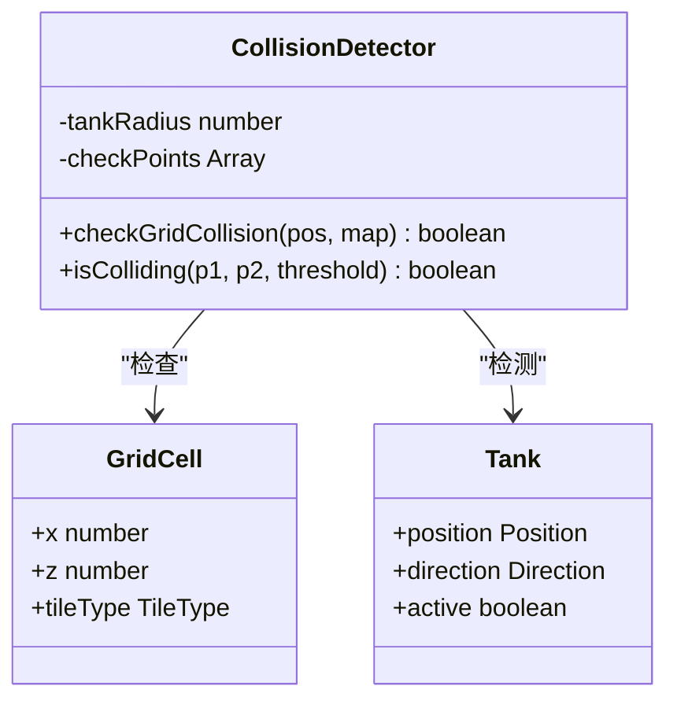

**图表来源**
- [GameEngine.tsx](file://components/GameEngine.tsx#L35-L75)

**章节来源**
- [GameEngine.tsx](file://components/GameEngine.tsx#L35-L75)

## 寻路算法实现

### 网格导航系统

当前实现采用简化的网格导航策略，而非复杂的A*或Dijkstra算法：

#### 移动策略

1. **意图计算**: 基于当前方向计算下一个位置
2. **碰撞检测**: 使用四点包围盒检测可能的碰撞
3. **决策逻辑**: 
   - 如果检测到碰撞或达到随机概率阈值，则随机改变方向
   - 否则保持当前方向继续前进

#### 路径选择逻辑

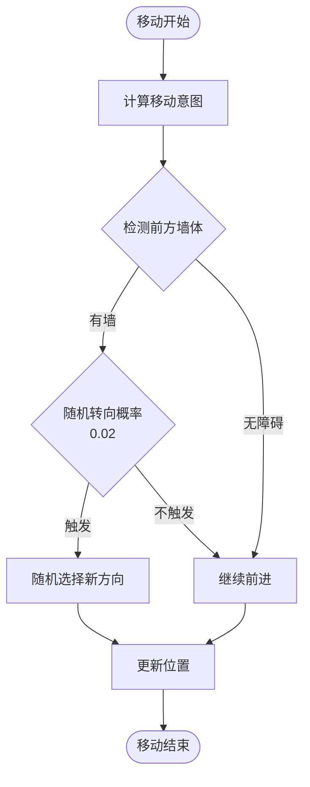

**图表来源**
- [GameEngine.tsx](file://components/GameEngine.tsx#L288-L299)

**章节来源**
- [GameEngine.tsx](file://components/GameEngine.tsx#L269-L313)

## 智能决策机制

### 随机转向机制

敌方AI使用概率驱动的随机转向策略：

- **转向概率**: 2% 的机会在每帧中随机改变方向
- **触发条件**: 碰撞检测失败且随机数小于概率阈值
- **方向选择**: 在四个方向中随机选择一个新方向

### 射击决策系统

射击系统采用独立的概率控制：

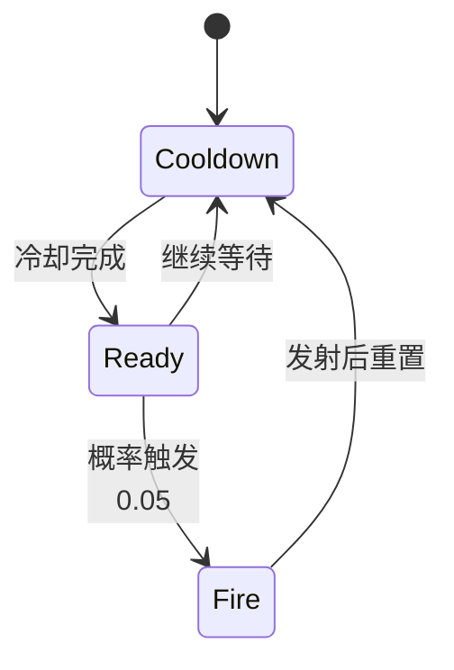

**图表来源**
- [GameEngine.tsx](file://components/GameEngine.tsx#L301-L312)

### 目标锁定机制

当前版本未实现目标锁定功能，所有敌方坦克都采用相同的随机行为模式。

**章节来源**
- [GameEngine.tsx](file://components/GameEngine.tsx#L288-L312)

## 状态机设计

### 当前状态机实现

由于使用简化的AI策略，当前实现采用简单的状态机：

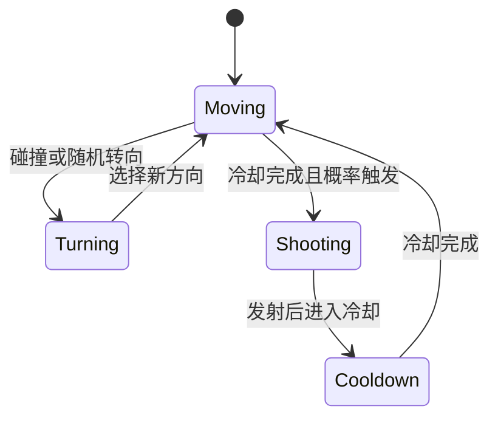

**图表来源**
- [GameEngine.tsx](file://components/GameEngine.tsx#L265-L313)

### 状态转换规则

| 状态 | 触发条件 | 下一状态 |
|------|----------|----------|
| Moving | 正常移动 | - |
| Turning | 碰撞检测或随机概率 | Moving |
| Shooting | 冷却完成且射击概率 | Cooldown |
| Cooldown | 发射后 | Moving |

**章节来源**
- [GameEngine.tsx](file://components/GameEngine.tsx#L265-L313)

## 性能优化策略

### 计算复杂度控制

#### 时间复杂度优化

1. **固定时间步进**: 使用 `useFrame` 实现稳定的60FPS更新
2. **批量操作**: 所有敌方坦克在同一帧内处理，避免重复计算
3. **早期退出**: 非活跃坦克直接跳过处理

#### 空间复杂度优化

1. **引用缓存**: 使用 `useRef` 缓存游戏状态，避免不必要的重新渲染
2. **对象复用**: 复用子弹和爆炸对象，减少垃圾回收压力
3. **内存池模式**: 通过数组过滤实现对象生命周期管理

### 内存管理策略

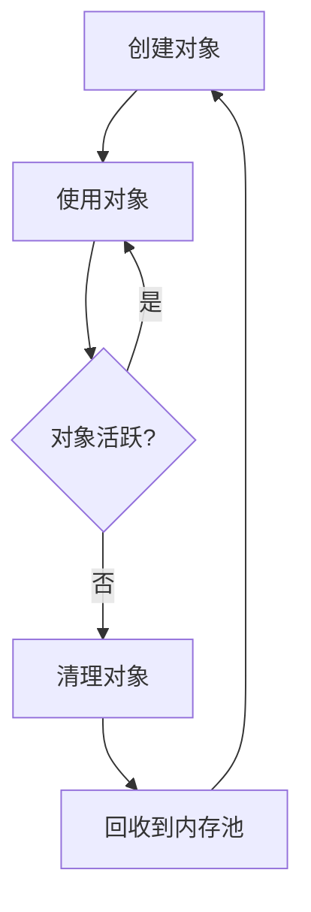

**图表来源**
- [GameEngine.tsx](file://components/GameEngine.tsx#L441-L448)

**章节来源**
- [GameEngine.tsx](file://components/GameEngine.tsx#L441-L448)

## 可视化图表

### AI行为流程图

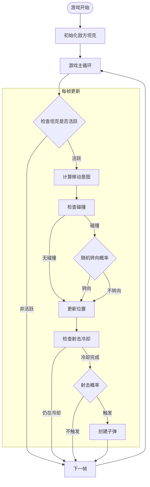

**图表来源**
- [GameEngine.tsx](file://components/GameEngine.tsx#L265-L313)

### 决策树分析

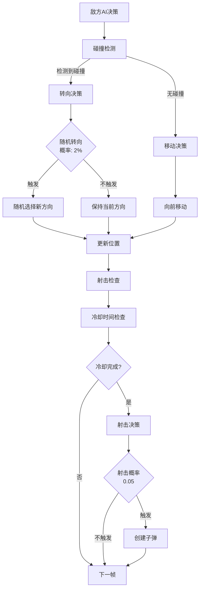

**图表来源**
- [GameEngine.tsx](file://components/GameEngine.tsx#L288-L312)

## 差异化设计

### 敌方坦克差异化

当前实现通过以下方式为不同敌方坦克提供差异化体验：

#### 冷却时间差异化

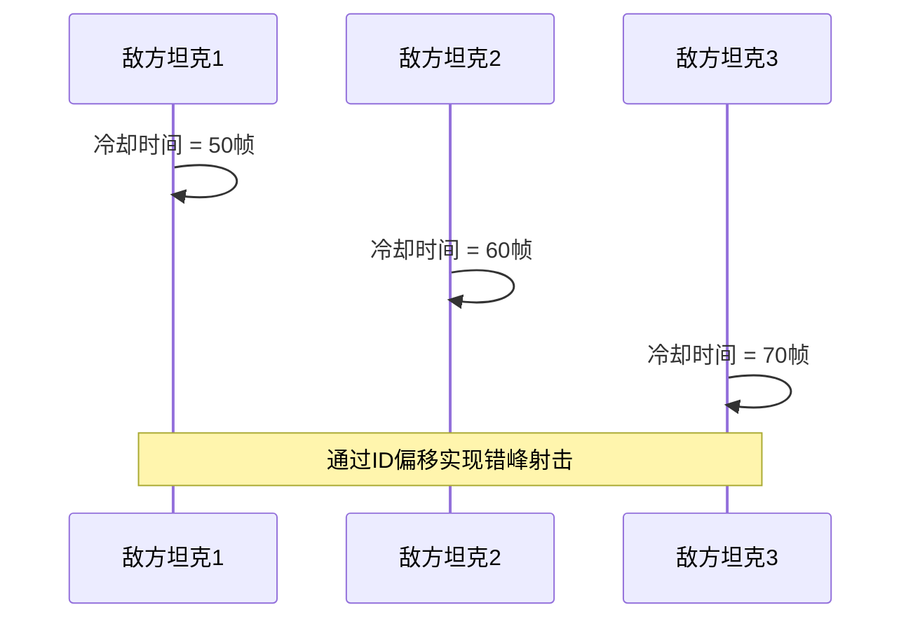

**图表来源**
- [GameEngine.tsx](file://components/GameEngine.tsx#L138-L138)

#### 移动速度差异化

- **敌方坦克速度**: `GAME_SPEED * 0.5`（默认0.04）
- **玩家坦克速度**: `GAME_SPEED`（默认0.08）
- **速度差异**: 敌方坦克比玩家慢50%，增加游戏挑战性

**章节来源**
- [GameEngine.tsx](file://components/GameEngine.tsx#L138-L271)
- [constants.ts](file://constants.ts#L5-L5)

### 视觉差异化

- **颜色区分**: 敌方坦克使用红色系(#c0392b)，与玩家的黄色系形成对比
- **动画效果**: 敌方坦克没有移动动画，保持简洁风格

## 故障排除指南

### 常见问题诊断

#### 敌方坦克卡住问题

**症状**: 敌方坦克在某个位置不动

**可能原因**:
1. 碰撞检测错误导致无法移动
2. 随机转向概率过高导致频繁转向
3. 冷却时间设置不当

**解决方案**:
- 检查碰撞检测函数的边界条件
- 调整随机转向概率参数
- 验证冷却时间计算逻辑

#### 敌方坦克数量异常

**症状**: 敌方坦克数量超过预期或不足

**可能原因**:
1. 生成算法参数错误
2. 坐标分布算法问题
3. 碰撞检测导致的生成失败

**解决方案**:
- 检查 `enemyCount` 参数传递
- 验证坐标生成和分布逻辑
- 确认碰撞检测对生成的影响

**章节来源**
- [GameEngine.tsx](file://components/GameEngine.tsx#L102-L144)

### 性能监控指标

| 指标 | 正常范围 | 监控方法 |
|------|----------|----------|
| 帧率 | 55-60 FPS | 浏览器开发者工具 |
| 对象数量 | < 1000 | 内存分析工具 |
| 渲染时间 | < 16ms | 性能分析器 |
| 冷却时间 | 30-60帧 | 日志输出 |

## 结论

Neon Tank 的敌方AI系统虽然采用了简化的随机策略，但通过精心设计的参数和优化策略，成功实现了流畅的游戏体验。系统的主要特点包括：

### 优势

1. **简单高效**: 基于概率的随机策略易于理解和维护
2. **性能友好**: 使用引用缓存和批量处理优化性能
3. **可扩展性强**: 模块化设计便于后续功能扩展
4. **视觉统一**: 与其他游戏元素保持一致的视觉风格

### 改进建议

1. **增强寻路能力**: 实现A*算法或Dijkstra算法
2. **添加状态机**: 引入巡逻、追击、射击等状态
3. **目标锁定**: 实现基于距离和威胁的目标选择
4. **群体智能**: 添加敌方坦克间的协调和通信机制

### 技术债务

1. **硬编码参数**: 需要将关键参数提取为可配置项
2. **缺乏抽象**: 可以引入更高级的AI框架
3. **测试覆盖**: 需要单元测试和集成测试

该AI系统为后续的功能扩展奠定了良好的基础，特别是在寻路算法和智能决策方面的改进将显著提升游戏体验。