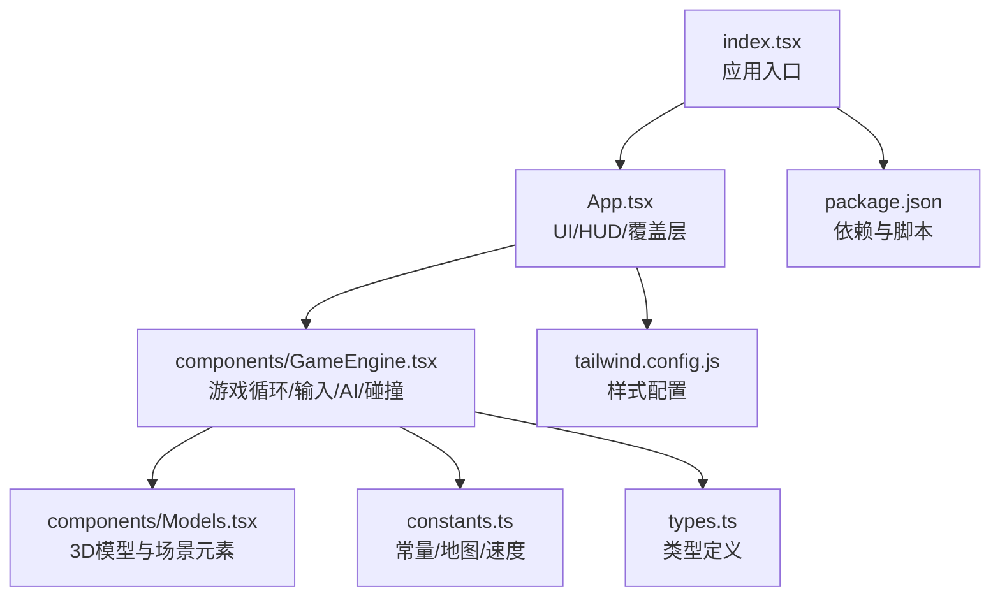
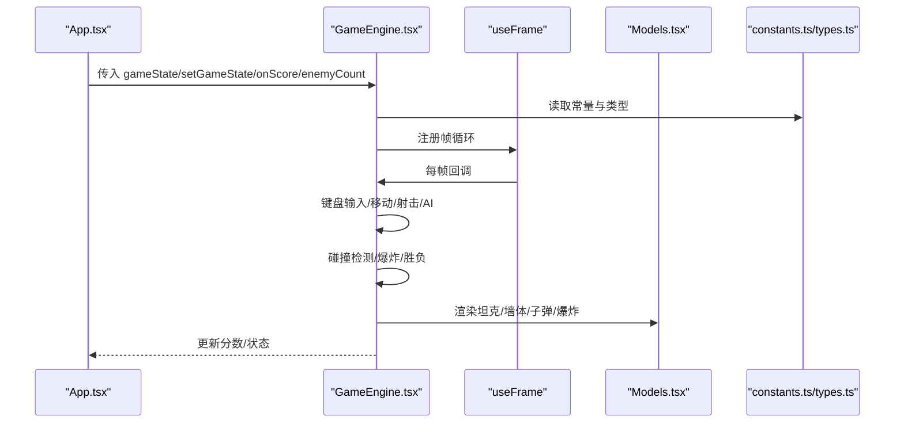
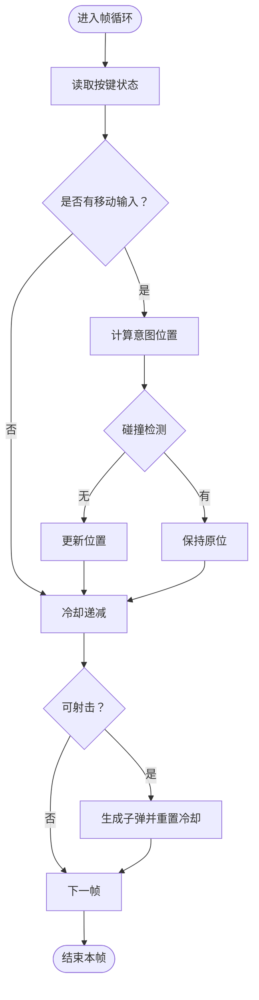
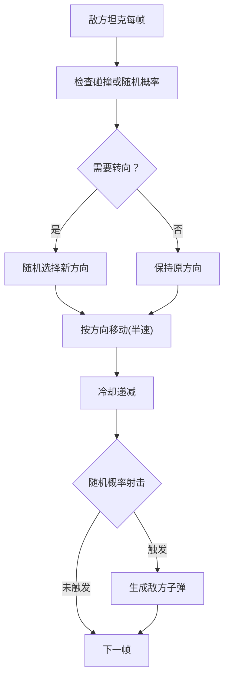
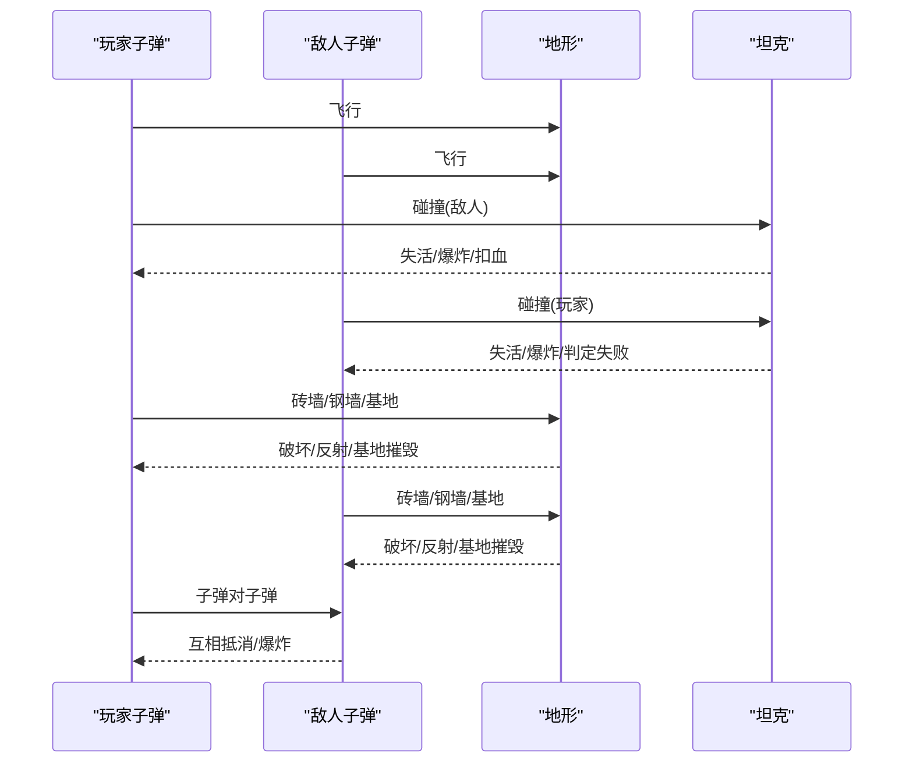
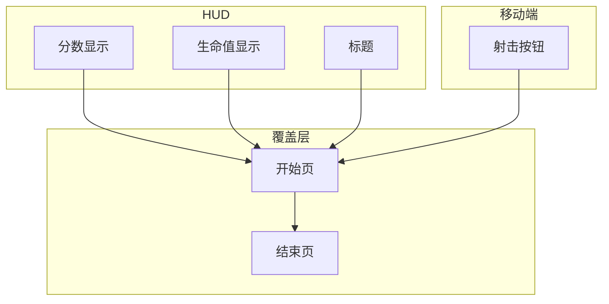
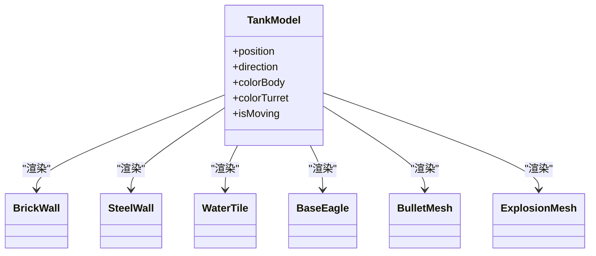
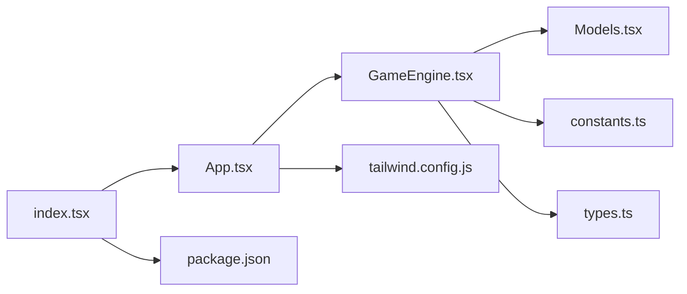

# 游戏功能

<cite>
**本文引用的文件**
- [README.md](file://README.md)
- [App.tsx](file://App.tsx)
- [GameEngine.tsx](file://components/GameEngine.tsx)
- [Models.tsx](file://components/Models.tsx)
- [constants.ts](file://constants.ts)
- [types.ts](file://types.ts)
- [package.json](file://package.json)
- [index.tsx](file://index.tsx)
- [tailwind.config.js](file://tailwind.config.js)
</cite>

## 目录
1. [简介](#简介)
2. [项目结构](#项目结构)
3. [核心组件](#核心组件)
4. [架构总览](#架构总览)
5. [详细组件分析](#详细组件分析)
6. [依赖关系分析](#依赖关系分析)
7. [性能考量](#性能考量)
8. [故障排查指南](#故障排查指南)
9. [结论](#结论)
10. [附录](#附录)

## 简介
本文件为 NeonTank 游戏功能的综合文档，聚焦于以下方面：
- 玩家控制系统：键盘输入处理、坦克移动与射击机制
- 敌方 AI 设计：寻路与智能决策逻辑
- HUD 界面实现：分数、生命值、游戏状态提示
- 游戏规则与玩法机制
- 用户交互模式与响应式设计
- 功能扩展与自定义建议

NeonTank 是一款基于 React + Three.js 的 2.5D 坦克对战游戏，采用网格地图、帧循环驱动的物理与碰撞系统，并通过 Three Fiber/Drei 提供 3D 场景渲染与光照阴影效果。

## 项目结构
项目采用“按功能分层 + 组件化”的组织方式：
- 根目录入口与构建配置：index.tsx、package.json、tailwind.config.js
- 应用主界面与状态管理：App.tsx（包含 HUD、开始/结束覆盖层、移动端控制）
- 游戏引擎与逻辑：components/GameEngine.tsx（帧循环、输入、AI、碰撞、渲染桥接）
- 3D 模型与场景元素：components/Models.tsx（坦克、墙体、水、基地、子弹、爆炸）
- 常量与类型定义：constants.ts、types.ts

图表来源
- [index.tsx](file://index.tsx#L1-L19)
- [App.tsx](file://App.tsx#L1-L199)
- [GameEngine.tsx](file://components/GameEngine.tsx#L1-L596)
- [Models.tsx](file://components/Models.tsx#L1-L152)
- [constants.ts](file://constants.ts#L1-L39)
- [types.ts](file://types.ts#L1-L50)
- [tailwind.config.js](file://tailwind.config.js#L1-L14)
- [package.json](file://package.json#L1-L32)

章节来源
- [index.tsx](file://index.tsx#L1-L19)
- [package.json](file://package.json#L1-L32)
- [tailwind.config.js](file://tailwind.config.js#L1-L14)

## 核心组件
- 应用壳与状态容器：App.tsx 负责管理全局游戏状态（状态机、分数、生命值、关卡），并渲染 HUD 与覆盖层；同时提供敌人数量选择器与开始按钮。
- 游戏引擎：GameEngine.tsx 实现帧循环（useFrame）、键盘输入监听、玩家与敌方坦克的移动与射击、子弹飞行与碰撞检测、爆炸效果与胜负判定。
- 3D 模型与场景：Models.tsx 将网格坐标转换为世界坐标，渲染坦克、墙体、水、基地、子弹与爆炸效果。
- 常量与类型：constants.ts 定义地图尺寸、单位尺寸、移动/射击速度、冷却帧数与颜色；types.ts 定义方向、地形类型、对象接口与游戏状态。

章节来源
- [App.tsx](file://App.tsx#L14-L199)
- [GameEngine.tsx](file://components/GameEngine.tsx#L77-L596)
- [Models.tsx](file://components/Models.tsx#L1-L152)
- [constants.ts](file://constants.ts#L1-L39)
- [types.ts](file://types.ts#L1-L50)

## 架构总览
整体架构由“状态驱动 + 帧循环 + 3D 渲染”构成：
- 状态驱动：App.tsx 维护 GameState，传递给 GameEngine.tsx；GameEngine.tsx 在帧循环中更新状态并通过快照触发渲染。
- 帧循环：GameEngine.tsx 使用 useFrame 每帧执行输入读取、移动、射击、AI、碰撞、清理与胜负判断。
- 3D 渲染：GameEngine.tsx 作为 Canvas 子树，调用 Models.tsx 中的组件进行几何体绘制与材质着色。

图表来源
- [App.tsx](file://App.tsx#L14-L199)
- [GameEngine.tsx](file://components/GameEngine.tsx#L77-L596)
- [Models.tsx](file://components/Models.tsx#L1-L152)
- [constants.ts](file://constants.ts#L1-L39)
- [types.ts](file://types.ts#L1-L50)

## 详细组件分析

### 玩家控制系统
- 输入处理
  - 键盘事件监听：在挂载时注册 keydown/keyup，使用 keys.ref 记录当前按键状态。
  - 支持 WASD 与方向键移动；支持空格或回车射击。
- 移动逻辑
  - 基于 GAME_SPEED 的增量位移，结合 checkGridCollision 判断是否与墙体/边界发生碰撞。
  - 碰撞时保持原位置，避免“弹回”。
- 射击机制
  - 冷却帧 TANK_COOLDOWN 控制射击频率；发射点与炮塔朝向一致。
  - 子弹以 BULLET_SPEED 移动，命中不同地形产生不同效果（破坏砖墙、反射钢墙、摧毁基地）。

图表来源
- [GameEngine.tsx](file://components/GameEngine.tsx#L211-L263)

章节来源
- [GameEngine.tsx](file://components/GameEngine.tsx#L156-L263)
- [constants.ts](file://constants.ts#L5-L7)
- [types.ts](file://types.ts#L16-L36)

### 敌方 AI 系统
- 行为策略
  - 移动：按当前方向以一半速度前进；遇到墙体或随机概率改变方向。
  - 射击：冷却递减，随机概率开火；子弹冷却更长以平衡难度。
- 决策逻辑
  - 方向变更：checkGridCollision 或固定概率触发；从四个方向中随机选择。
  - 开火概率：每帧以小概率触发，形成“试探性射击”。

图表来源
- [GameEngine.tsx](file://components/GameEngine.tsx#L265-L313)

章节来源
- [GameEngine.tsx](file://components/GameEngine.tsx#L265-L313)

### 子弹与碰撞系统
- 子弹生命周期
  - 生成：玩家与敌人分别在冷却结束后生成子弹，方向与朝向一致。
  - 飞行：按方向以 BULLET_SPEED 移动。
- 地形碰撞
  - 砖墙：破坏并产生爆炸；钢墙：反射并产生小爆炸；基地：摧毁并判定失败。
- 坦克碰撞
  - 玩家子弹命中敌人：敌人消失、加分、爆炸；敌人子弹命中玩家：玩家消失、判定失败、爆炸。
- 子弹对子弹
  - 玩家与敌人子弹在近距离相撞则互相抵消，产生小爆炸。

图表来源
- [GameEngine.tsx](file://components/GameEngine.tsx#L315-L439)

章节来源
- [GameEngine.tsx](file://components/GameEngine.tsx#L315-L439)

### HUD 界面与游戏状态
- HUD 显示
  - 分数：顶部左侧，使用等宽字体与黄色高亮。
  - 生命值：顶部右侧，红色心形图标与数量。
  - 标题：顶部中央复古字体“NEON TANK 1990”。
- 覆盖层
  - 开始页：展示操作说明（WASD 移动、空格射击）、敌人数量选择器、开始按钮。
  - 结束页：胜利/失败提示、最终分数、重试按钮。
- 移动端控制
  - 底部右下角火焰按钮用于移动端射击。

图表来源
- [App.tsx](file://App.tsx#L47-L194)

章节来源
- [App.tsx](file://App.tsx#L47-L194)

### 3D 模型与场景
- 坦克模型
  - 车身、履带、炮塔、炮管组成；根据朝向旋转；移动时轻微上下摆动。
- 地图元素
  - 砖墙、钢墙、水、基地；基地被摧毁后显示黑色球体表示死亡。
- 子弹与爆炸
  - 子弹为发光球体；爆炸随时间缩放并透明度衰减。

图表来源
- [Models.tsx](file://components/Models.tsx#L15-L152)

章节来源
- [Models.tsx](file://components/Models.tsx#L15-L152)

### 游戏规则与玩法机制
- 地图与目标
  - 13×13 网格地图，玩家位于底部，目标是消灭所有敌人并保护基地。
- 胜负条件
  - 胜利：清空所有敌人。
  - 失败：基地被摧毁或玩家被击中。
- 得分
  - 击毁敌人得 100 分；可通过 HUD 查看累计分数。
- 难度调节
  - 通过敌人数量选择器动态调整初始敌人数量，影响游戏节奏。

章节来源
- [constants.ts](file://constants.ts#L23-L39)
- [GameEngine.tsx](file://components/GameEngine.tsx#L450-L453)
- [App.tsx](file://App.tsx#L24-L30)

### 用户交互模式与响应式设计
- 键盘交互
  - WASD/方向键移动，空格/回车射击。
- 触控交互
  - 移动端提供射击按钮，适合小屏设备。
- 响应式布局
  - 使用 Tailwind CSS，覆盖层与 HUD 在不同屏幕尺寸下保持可读性与可用性。

章节来源
- [App.tsx](file://App.tsx#L188-L194)
- [tailwind.config.js](file://tailwind.config.js#L1-L14)

## 依赖关系分析
- 运行时依赖
  - React、ReactDOM：应用框架与渲染
  - three、@react-three/fiber、@react-three/drei：3D 渲染管线
  - lucide-react：图标库
  - @fontsource/press-start-2p、@fontsource/inter：复古与现代字体
- 构建工具
  - Vite、Tailwind PostCSS 插件、TypeScript

图表来源
- [App.tsx](file://App.tsx#L1-L199)
- [GameEngine.tsx](file://components/GameEngine.tsx#L1-L596)
- [Models.tsx](file://components/Models.tsx#L1-L152)
- [constants.ts](file://constants.ts#L1-L39)
- [types.ts](file://types.ts#L1-L50)
- [index.tsx](file://index.tsx#L1-L19)
- [package.json](file://package.json#L1-L32)
- [tailwind.config.js](file://tailwind.config.js#L1-L14)

章节来源
- [package.json](file://package.json#L11-L29)

## 性能考量
- 帧循环优化
  - 使用 refs 存储可变状态（玩家、敌人、子弹、爆炸、地图副本），减少每次渲染的 props 变化。
  - 使用 useMemo 缓存地图元素，仅在地图变化时重建。
- 渲染优化
  - 3D 对象使用静态材质与阴影参数，避免过度计算。
  - 爆炸效果使用短生命周期与指数缩放，降低长期占用。
- 输入处理
  - 键盘状态使用单次事件监听，避免重复绑定导致的内存泄漏。

章节来源
- [GameEngine.tsx](file://components/GameEngine.tsx#L90-L165)
- [GameEngine.tsx](file://components/GameEngine.tsx#L467-L508)

## 故障排查指南
- 无法开始游戏
  - 确认已安装依赖并设置环境变量（如存在 API 密钥需求）。
  - 检查浏览器控制台是否存在资源加载错误（HDR 环境贴图）。
- 输入无效
  - 确保焦点在页面上且未被其他元素拦截键盘事件。
  - 检查是否误触全屏/开发者工具导致事件丢失。
- 坦克无法移动或卡住
  - 检查碰撞检测逻辑与地图数据一致性；确认 GRID_SIZE 与地图二维数组匹配。
- 子弹不生效
  - 检查冷却帧与射击触发条件；确认子弹方向与移动方向一致。
- 移动端无法射击
  - 确认按钮层级与点击事件未被遮挡；尝试刷新页面重新初始化。

章节来源
- [README.md](file://README.md#L16-L20)
- [GameEngine.tsx](file://components/GameEngine.tsx#L168-L182)
- [GameEngine.tsx](file://components/GameEngine.tsx#L211-L263)

## 结论
NeonTank 通过简洁的帧循环与 3D 渲染实现了经典的 2.5D 坦克对战体验。其输入处理、AI 决策与碰撞系统清晰易懂，便于扩展与定制。HUD 与覆盖层提供了良好的用户体验，移动端控制进一步提升了可访问性。后续可在 AI 智能度、地形交互、粒子特效与网络对战等方面继续增强。

## 附录
- 快速运行
  - 安装依赖后启动开发服务器，按提示设置必要环境变量即可运行。
- 关键路径参考
  - 玩家输入与射击：[GameEngine.tsx](file://components/GameEngine.tsx#L168-L263)
  - 敌方 AI：[GameEngine.tsx](file://components/GameEngine.tsx#L265-L313)
  - 子弹与碰撞：[GameEngine.tsx](file://components/GameEngine.tsx#L315-L439)
  - HUD 与覆盖层：[App.tsx](file://App.tsx#L47-L194)
  - 3D 模型与场景：[Models.tsx](file://components/Models.tsx#L15-L152)
  - 常量与类型：[constants.ts](file://constants.ts#L1-L39)、[types.ts](file://types.ts#L1-L50)