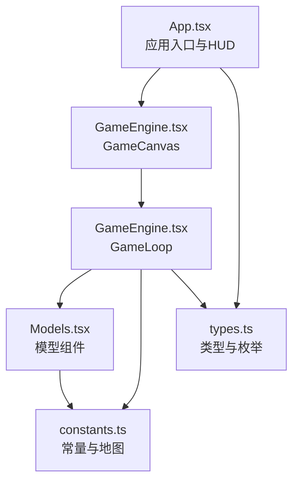
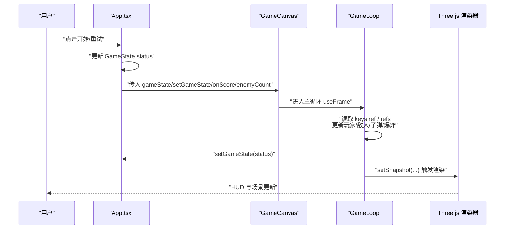
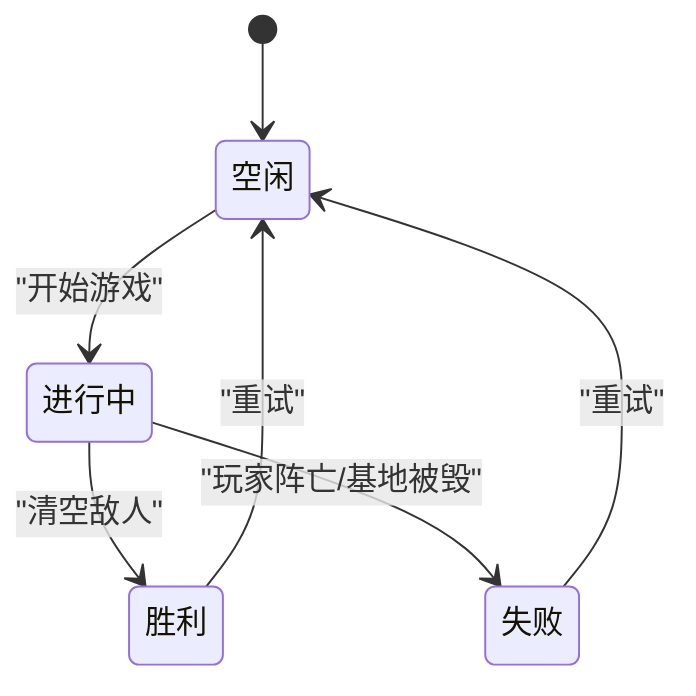
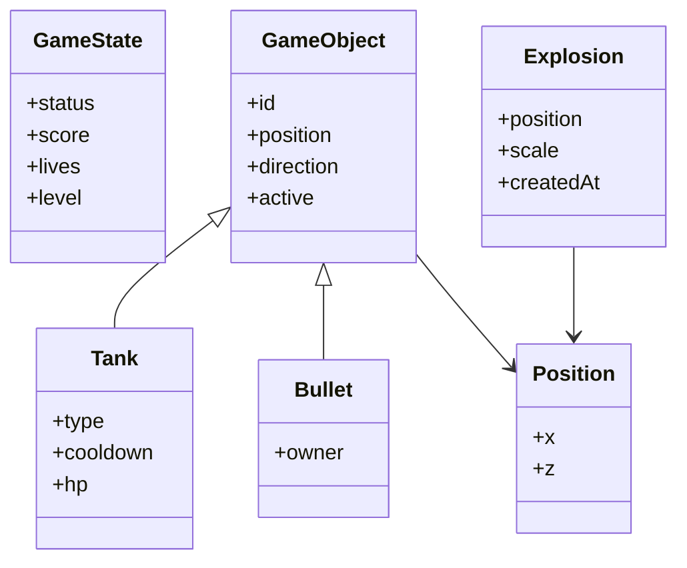
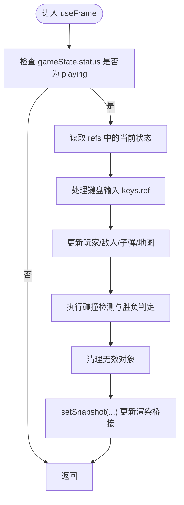
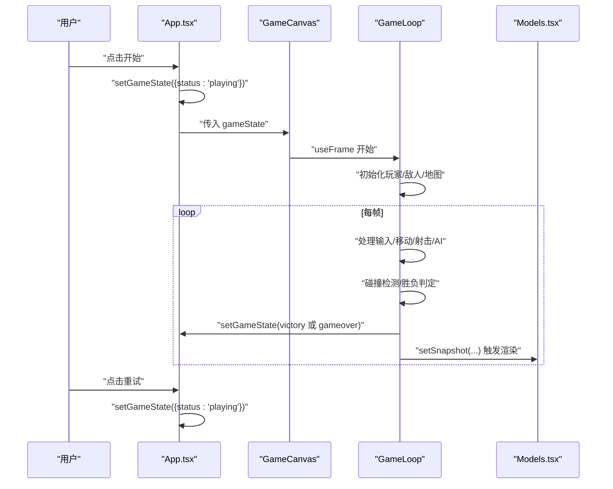
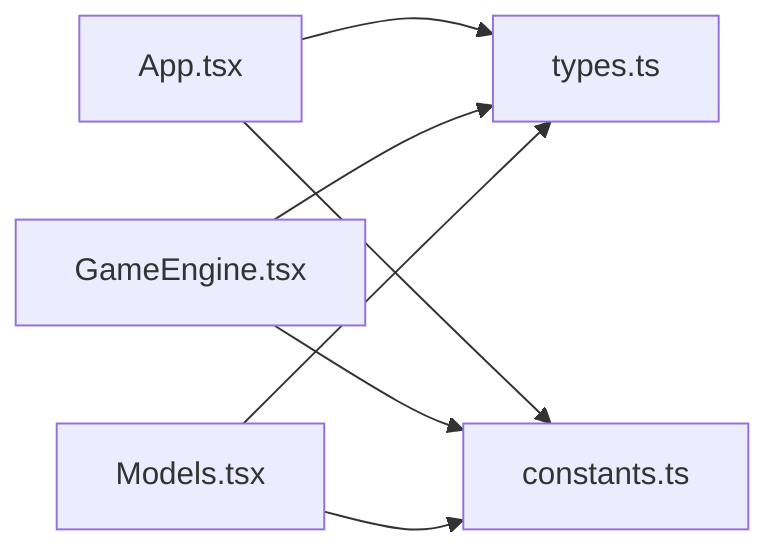

# 游戏状态管理

<cite>
**本文档引用的文件**
- [App.tsx](file://App.tsx)
- [types.ts](file://types.ts)
- [constants.ts](file://constants.ts)
- [components/GameEngine.tsx](file://components/GameEngine.tsx)
- [components/Models.tsx](file://components/Models.tsx)
- [package.json](file://package.json)
- [README.md](file://README.md)
</cite>

## 目录
1. [简介](#简介)
2. [项目结构](#项目结构)
3. [核心组件](#核心组件)
4. [架构总览](#架构总览)
5. [详细组件分析](#详细组件分析)
6. [依赖关系分析](#依赖关系分析)
7. [性能考虑](#性能考虑)
8. [故障排除指南](#故障排除指南)
9. [结论](#结论)
10. [附录](#附录)

## 简介
本文件系统性阐述 NeonTank 项目的“游戏状态管理”实现与最佳实践，覆盖状态生命周期（开始、进行中、胜利、失败）、状态数据结构设计、状态更新机制（useRef 与 useState 的配合）、状态持久化方案、性能优化与内存泄漏防护、HUD 同步与界面响应机制，并提供状态流转时序图与状态机图示，帮助开发者在不直接阅读源码的情况下快速理解与扩展该系统。

## 项目结构
该项目采用 React + Three.js 的 2.5D 坦克射击游戏架构：
- 应用入口负责全局状态与 HUD 展示
- 游戏引擎负责 60fps 主循环、碰撞检测、胜负判定与渲染桥接
- 模型组件负责 Three.js 场景元素的几何与材质表现
- 类型与常量定义了游戏世界的数据契约与物理参数

图表来源
- [App.tsx](file://App.tsx#L1-L199)
- [components/GameEngine.tsx](file://components/GameEngine.tsx#L1-L596)
- [components/Models.tsx](file://components/Models.tsx#L1-L152)
- [types.ts](file://types.ts#L1-L50)
- [constants.ts](file://constants.ts#L1-L39)

章节来源
- [App.tsx](file://App.tsx#L1-L199)
- [components/GameEngine.tsx](file://components/GameEngine.tsx#L1-L596)
- [components/Models.tsx](file://components/Models.tsx#L1-L152)
- [types.ts](file://types.ts#L1-L50)
- [constants.ts](file://constants.ts#L1-L39)

## 核心组件
- 应用层（App.tsx）
  - 维护全局 GameState 与敌人数量等 UI 状态
  - 提供 HUD（分数、生命值）展示与开始/重试按钮
  - 将 GameState 传递给游戏画布并在状态变化时触发重渲染
- 游戏引擎（GameEngine.tsx）
  - 使用 useRef 存储高频更新的“可变游戏对象”（玩家、敌人、子弹、爆炸）
  - 使用 useState 作为渲染桥接，将 ref 中的快照同步到 React 渲染树
  - 在 useFrame 中执行 60fps 主循环，处理输入、AI、碰撞与胜负判定
- 模型组件（Models.tsx）
  - 将网格坐标映射为 Three.js 世界坐标
  - 通过 useFrame 实现平滑动画与位置插值
- 类型与常量（types.ts、constants.ts）
  - 定义 GameState 接口与方向、瓦片类型等枚举
  - 定义地图尺寸、速度、颜色等常量

章节来源
- [App.tsx](file://App.tsx#L14-L90)
- [components/GameEngine.tsx](file://components/GameEngine.tsx#L77-L82)
- [components/Models.tsx](file://components/Models.tsx#L8-L13)
- [types.ts](file://types.ts#L45-L50)
- [constants.ts](file://constants.ts#L1-L39)

## 架构总览
下图展示了从用户交互到渲染更新的端到端流程，以及状态在各层之间的流动。

图表来源
- [App.tsx](file://App.tsx#L32-L43)
- [components/GameEngine.tsx](file://components/GameEngine.tsx#L211-L463)
- [components/Models.tsx](file://components/Models.tsx#L36-L47)

## 详细组件分析

### 状态生命周期与状态机
- 状态枚举：idle（空闲/预览）、playing（进行中）、victory（胜利）、gameover（失败）
- 转换规则：
  - idle → playing：用户点击开始
  - playing → victory：所有敌人被消灭
  - playing → gameover：玩家被击中或基地被摧毁
  - victory/gameover → idle：用户点击重试

图表来源
- [types.ts](file://types.ts#L45-L50)
- [components/GameEngine.tsx](file://components/GameEngine.tsx#L451-L453)
- [components/GameEngine.tsx](file://components/GameEngine.tsx#L397-L397)
- [App.tsx](file://App.tsx#L152-L185)

章节来源
- [types.ts](file://types.ts#L45-L50)
- [components/GameEngine.tsx](file://components/GameEngine.tsx#L451-L453)
- [components/GameEngine.tsx](file://components/GameEngine.tsx#L397-L397)
- [App.tsx](file://App.tsx#L152-L185)

### 状态数据结构设计
- GameState 接口字段
  - status：枚举值（idle/playing/victory/gameover）
  - score：整数，累计得分
  - lives：整数，剩余生命
  - level：整数，关卡编号
- 其他核心对象
  - Position：二维网格坐标
  - GameObject/Bullet/Tank/Explosion：游戏实体与效果
  - Direction/TileType：方向与地图瓦片类型

图表来源
- [types.ts](file://types.ts#L16-L50)

章节来源
- [types.ts](file://types.ts#L16-L50)

### 状态更新机制：useRef 与 useState 配合
- useRef（高性能可变存储）
  - playerRef/enemiesRef/bulletsRef/explosionsRef/mapRef：存放每帧高频变更的游戏对象
  - 优点：避免每次渲染复制大数组，降低渲染压力
- useState（渲染桥接）
  - snapshot：包含 player/enemies/bullets/explosions/mapRev 的快照
  - setSnapshot：在 useFrame 结束时一次性更新，驱动 Three.js 渲染
- 输入状态
  - keys：记录键盘按下状态，用于移动与开火
- 初始化与重置
  - useEffect 监听 gameState.status 变化，重置玩家、敌人、子弹、地图

图表来源
- [components/GameEngine.tsx](file://components/GameEngine.tsx#L211-L463)
- [components/GameEngine.tsx](file://components/GameEngine.tsx#L158-L165)
- [components/GameEngine.tsx](file://components/GameEngine.tsx#L155-L157)

章节来源
- [components/GameEngine.tsx](file://components/GameEngine.tsx#L90-L208)
- [components/GameEngine.tsx](file://components/GameEngine.tsx#L211-L463)
- [components/GameEngine.tsx](file://components/GameEngine.tsx#L158-L165)
- [components/GameEngine.tsx](file://components/GameEngine.tsx#L155-L157)

### HUD 状态同步与界面响应
- 分数与生命值显示
  - App.tsx 的头部 HUD 直接读取 gameState.score 与 gameState.lives 并实时更新
- 开始/重试界面
  - idle 状态显示开始按钮；victory/gameover 显示重试按钮
  - 点击后调用 startGame 将状态切换至 playing
- 敌人数量选择器
  - 通过 App.tsx 的增减按钮控制 enemyCount，影响 GameLoop 的敌人生成策略

章节来源
- [App.tsx](file://App.tsx#L48-L62)
- [App.tsx](file://App.tsx#L90-L186)
- [App.tsx](file://App.tsx#L24-L30)
- [components/GameEngine.tsx](file://components/GameEngine.tsx#L102-L144)

### 状态持久化可能性与实现方案
- 浏览器本地存储
  - localStorage/sessionStorage：保存 GameState（建议仅保存分数、等级、最高分等非运行时状态）
  - 适用场景：跨会话保留最高分、难度偏好
- IndexedDB/WebSQL（如需复杂存档）
  - 适合保存完整关卡进度、解锁内容、成就等
- 后端服务
  - 通过 API 上传/下载存档，支持多设备同步
- 注意事项
  - 避免持久化运行时对象（refs 中的实例），应序列化为可恢复的状态
  - 更新存档格式时需向后兼容
  - 对敏感字段（如分数）进行校验与防作弊处理

[本节为通用指导，不直接分析具体文件，故无章节来源]

### 性能优化与内存泄漏防护
- useRef 与 useState 的职责分离
  - refs 承担高频写入，useState 仅在帧末统一读取，减少渲染抖动
- 清理与卸载
  - GameLoop 中注册的键盘事件监听在组件卸载时移除，防止内存泄漏
- 渲染优化
  - 使用 useMemo 缓存地图元素，仅在 mapRev 变化时重建
  - 通过 snapshot.mapRev 标记地图变更，避免不必要的重渲染
- 主循环节流
  - useFrame 自带 60fps 控制，无需手动节流
- 动画与插值
  - 模型组件使用 useFrame 实现平滑动画，避免频繁 setState

章节来源
- [components/GameEngine.tsx](file://components/GameEngine.tsx#L178-L182)
- [components/GameEngine.tsx](file://components/GameEngine.tsx#L467-L508)
- [components/Models.tsx](file://components/Models.tsx#L36-L47)

### 状态流转时序图（细化）

图表来源
- [App.tsx](file://App.tsx#L32-L39)
- [components/GameEngine.tsx](file://components/GameEngine.tsx#L184-L208)
- [components/GameEngine.tsx](file://components/GameEngine.tsx#L211-L463)
- [components/Models.tsx](file://components/Models.tsx#L36-L47)

## 依赖关系分析
- React 生态
  - @react-three/fiber 与 @react-three/drei 提供 Three.js 的 React 化封装
  - lucide-react 提供图标资源
- 类型与常量
  - types.ts 为全栈共享的类型定义
  - constants.ts 为游戏物理与视觉参数的集中地

图表来源
- [package.json](file://package.json#L11-L20)
- [types.ts](file://types.ts#L1-L50)
- [constants.ts](file://constants.ts#L1-L39)
- [components/GameEngine.tsx](file://components/GameEngine.tsx#L5-L31)
- [components/Models.tsx](file://components/Models.tsx#L1-L6)

章节来源
- [package.json](file://package.json#L11-L30)
- [types.ts](file://types.ts#L1-L50)
- [constants.ts](file://constants.ts#L1-L39)
- [components/GameEngine.tsx](file://components/GameEngine.tsx#L5-L31)
- [components/Models.tsx](file://components/Models.tsx#L1-L6)

## 性能考虑
- 主循环与渲染解耦
  - refs 写入与 useState 读取分离，避免每帧重复深拷贝
- 渲染缓存
  - 地图元素 useMemo 缓存，仅在地图变更时重建
- 对象池化思路
  - 可将子弹与爆炸复用，减少频繁分配与垃圾回收
- 输入处理
  - 键盘状态使用 ref 记录，避免每次渲染产生新对象
- 动画与阴影
  - 合理设置光源与阴影参数，避免过度消耗 GPU

[本节为通用指导，不直接分析具体文件，故无章节来源]

## 故障排除指南
- 状态未更新导致 HUD 不刷新
  - 确认 setGameState 已在 GameLoop 中正确调用
  - 确认 App.tsx 正确接收并传递 gameState
- 游戏逻辑不生效
  - 检查 gameState.status 是否为 playing
  - 确认 useFrame 未被意外中断
- 内存泄漏
  - 确认键盘事件监听在组件卸载时移除
- 性能问题
  - 检查是否在每帧创建大量临时对象
  - 确认 useMemo/useCallback 的使用是否合理

章节来源
- [components/GameEngine.tsx](file://components/GameEngine.tsx#L178-L182)
- [components/GameEngine.tsx](file://components/GameEngine.tsx#L211-L212)
- [App.tsx](file://App.tsx#L66-L86)

## 结论
本项目通过“ref 高频写入 + useState 渲染桥接”的模式，实现了高效稳定的 60fps 游戏主循环与 HUD 同步。GameState 的清晰设计与严格的生命周期管理，使得状态转换直观可控。结合 useMemo 缓存与键盘事件清理，系统在性能与稳定性上具备良好基础。建议后续引入存档与网络同步能力，并持续优化对象池与动画细节以进一步提升体验。

## 附录
- 快速参考
  - 状态字段：status/score/lives/level
  - 关键函数路径：App.tsx 的 startGame/addScore、GameEngine.tsx 的 GameLoop/useFrame
  - 场景组件：Models.tsx 的 TankModel/BrickWall/SteelWall/WaterTile/BaseEagle/BulletMesh/ExplosionMesh

[本节为概览性总结，不直接分析具体文件，故无章节来源]