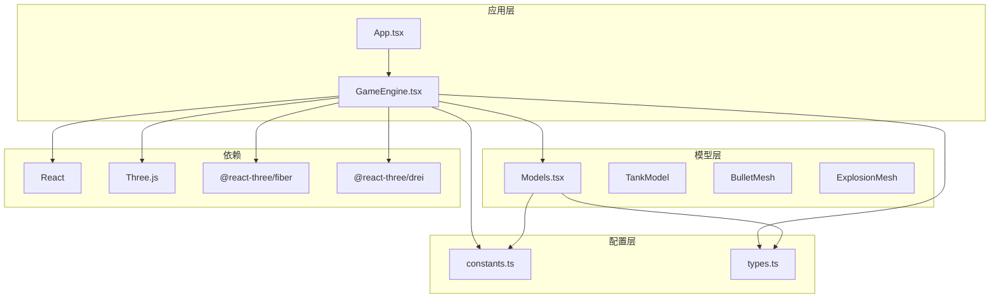
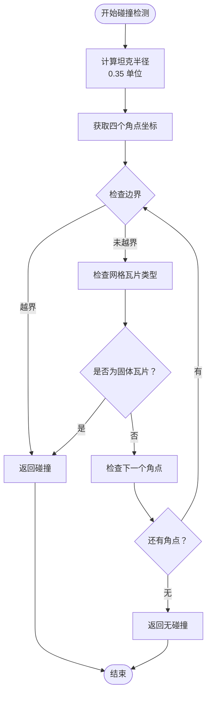
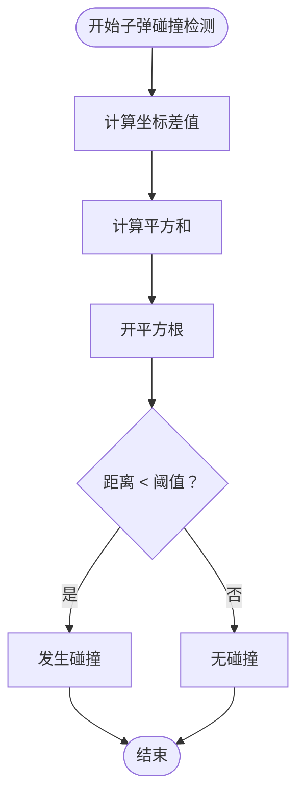
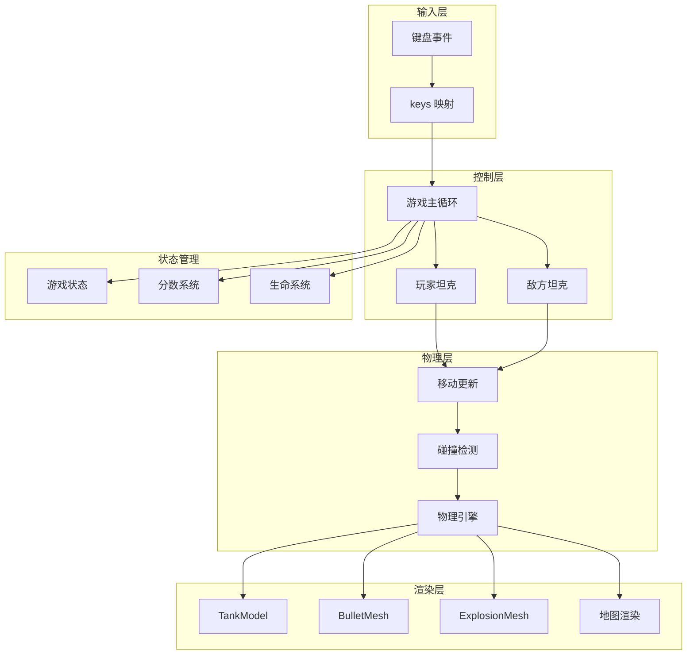
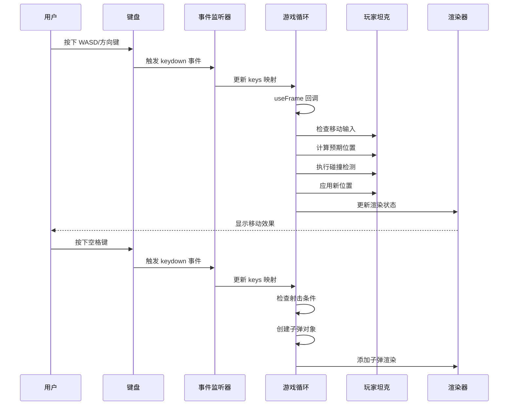
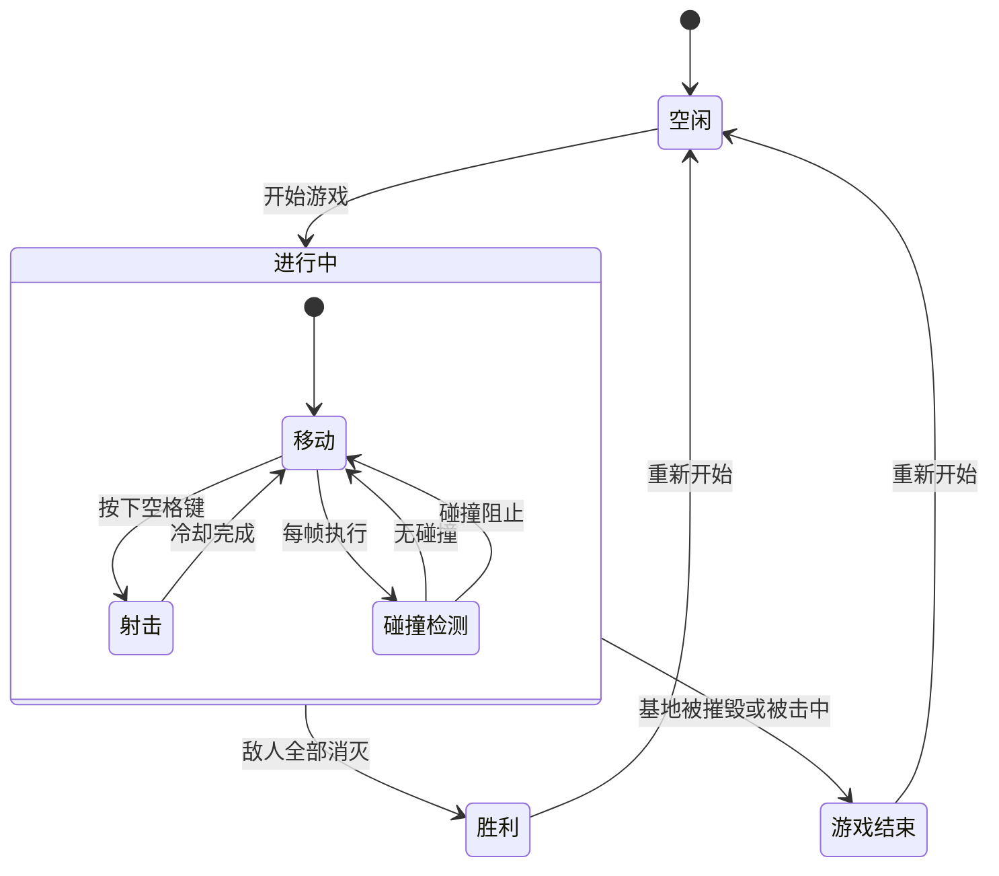
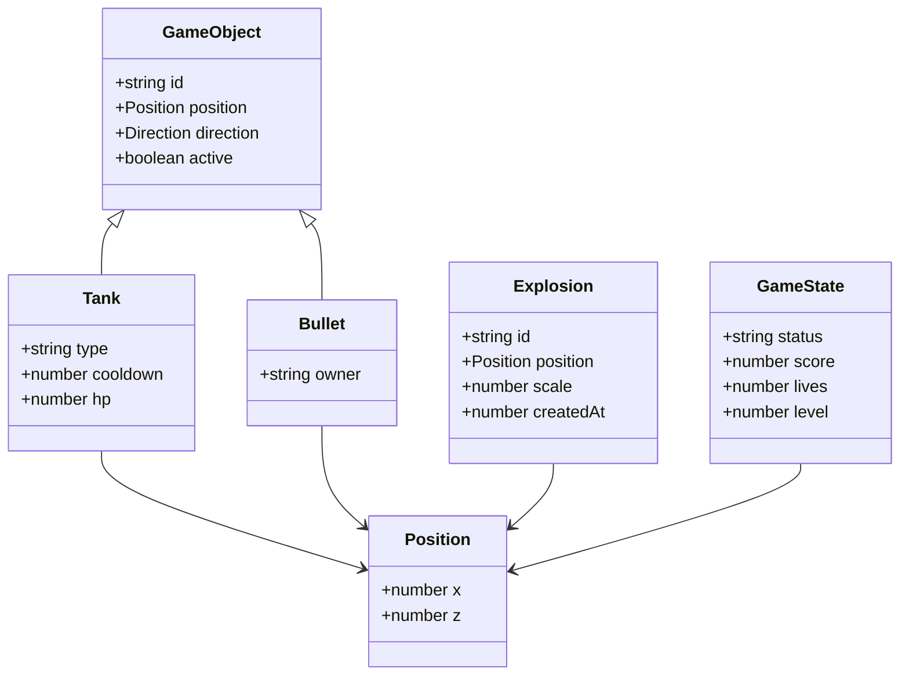
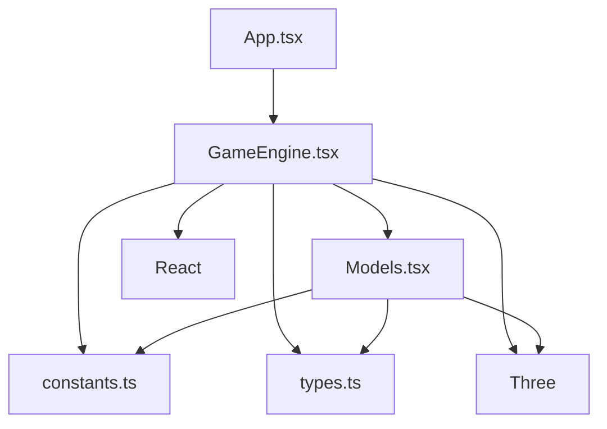

# 玩家控制系统

<cite>
**本文档引用的文件**
- [App.tsx](file://App.tsx)
- [components/GameEngine.tsx](file://components/GameEngine.tsx)
- [components/Models.tsx](file://components/Models.tsx)
- [constants.ts](file://constants.ts)
- [types.ts](file://types.ts)
- [README.md](file://README.md)
- [package.json](file://package.json)
</cite>

## 目录
1. [简介](#简介)
2. [项目结构](#项目结构)
3. [核心组件](#核心组件)
4. [架构概览](#架构概览)
5. [详细组件分析](#详细组件分析)
6. [依赖关系分析](#依赖关系分析)
7. [性能考虑](#性能考虑)
8. [故障排除指南](#故障排除指南)
9. [结论](#结论)

## 简介

NeonTank 是一个基于 React 和 Three.js 的 2.5D 坦克对战游戏。本文件专注于玩家控制系统的详细技术文档，涵盖键盘输入处理、坦克移动物理模型、碰撞检测算法、射击系统实现以及相关的状态管理机制。

## 项目结构

该项目采用模块化架构设计，主要文件组织如下：



**图表来源**
- [App.tsx](file://App.tsx#L1-L199)
- [components/GameEngine.tsx](file://components/GameEngine.tsx#L1-L596)
- [components/Models.tsx](file://components/Models.tsx#L1-L152)

**章节来源**
- [App.tsx](file://App.tsx#L1-L199)
- [components/GameEngine.tsx](file://components/GameEngine.tsx#L1-L50)
- [components/Models.tsx](file://components/Models.tsx#L1-L20)

## 核心组件

### 输入处理系统

玩家控制系统的核心是实时输入处理机制，通过事件监听器捕获键盘输入并转换为游戏状态。

#### 键盘输入绑定逻辑

系统支持多种输入方式：
- WASD 键：面向传统 PC 游戏习惯
- 方向键：兼容各种键盘布局
- 空格键：用于射击功能

输入状态通过 `keys` 引用对象维护，使用 `KeyboardEvent.code` 属性进行精确识别。

#### 移动控制实现

移动逻辑采用帧同步更新机制，每帧执行以下步骤：

1. **输入检测**：检查按键状态映射
2. **方向更新**：根据输入更新坦克朝向
3. **位置计算**：计算预期位置
4. **碰撞检测**：验证新位置的有效性
5. **位置应用**：更新实际位置

**章节来源**
- [components/GameEngine.tsx](file://components/GameEngine.tsx#L168-L182)
- [components/GameEngine.tsx](file://components/GameEngine.tsx#L217-L246)

### 坦克移动物理模型

#### 位置更新机制

坦克位置使用二维坐标系统（x, z），其中：
- x 轴：水平方向（左正右负）
- z 轴：垂直方向（上正下负）

移动速度通过常量 `GAME_SPEED` 控制，确保一致的游戏体验。

#### 方向控制系统

系统支持四个基本方向：
- UP：朝向屏幕上方
- DOWN：朝向屏幕下方  
- LEFT：朝向屏幕左侧
- RIGHT：朝向屏幕右侧

方向变化即时生效，提供流畅的操控体验。

**章节来源**
- [components/GameEngine.tsx](file://components/GameEngine.tsx#L217-L237)
- [types.ts](file://types.ts#L1-L20)

### 碰撞检测算法

#### 网格碰撞检测

系统采用改进的边界框碰撞检测算法：



**图表来源**
- [components/GameEngine.tsx](file://components/GameEngine.tsx#L35-L68)

#### 简单距离碰撞检测

子弹碰撞使用简单的欧几里得距离计算：



**图表来源**
- [components/GameEngine.tsx](file://components/GameEngine.tsx#L71-L75)

**章节来源**
- [components/GameEngine.tsx](file://components/GameEngine.tsx#L35-L75)

### 射击系统实现

#### 冷却机制

射击冷却通过帧计数实现：
- 玩家坦克：`TANK_COOLDOWN` 帧冷却时间
- 敌方坦克：`TANK_COOLDOWN * 2` 帧冷却时间

冷却计数器在每次射击后重置，确保射击节奏的一致性。

#### 子弹生成逻辑

子弹生成遵循以下规则：
1. 检查冷却状态和按键状态
2. 创建新的子弹对象
3. 设置初始位置为坦克当前位置
4. 复制坦克朝向作为子弹方向
5. 添加到子弹数组中

#### 发射逻辑

子弹发射采用简单的时间步进算法：
- 每帧根据方向更新位置
- 使用 `BULLET_SPEED` 常量控制移动速度
- 支持四种方向的直线运动

**章节来源**
- [components/GameEngine.tsx](file://components/GameEngine.tsx#L248-L263)
- [constants.ts](file://constants.ts#L5-L7)

## 架构概览



**图表来源**
- [components/GameEngine.tsx](file://components/GameEngine.tsx#L84-L463)
- [components/Models.tsx](file://components/Models.tsx#L23-L75)

## 详细组件分析

### 输入响应时序图



**图表来源**
- [components/GameEngine.tsx](file://components/GameEngine.tsx#L168-L182)
- [components/GameEngine.tsx](file://components/GameEngine.tsx#L211-L263)

### 状态转换图



**图表来源**
- [types.ts](file://types.ts#L45-L50)
- [components/GameEngine.tsx](file://components/GameEngine.tsx#L450-L453)

### 玩家坦克状态管理

#### 活跃状态管理

玩家坦克使用 `active` 标志控制生命周期：
- 初始状态：`active = true`
- 受到攻击：`active = false`
- 游戏结束：状态重置

#### 死亡处理机制

当玩家坦克被敌方子弹击中时：
1. 设置 `active = false`
2. 创建爆炸效果
3. 触发游戏结束状态
4. 重置所有游戏对象

#### 重生机制

系统当前实现为一次性游戏模式，不包含重生功能。游戏结束后需要重新开始。

**章节来源**
- [components/GameEngine.tsx](file://components/GameEngine.tsx#L394-L404)
- [components/GameEngine.tsx](file://components/GameEngine.tsx#L185-L208)

### 数据模型架构



**图表来源**
- [types.ts](file://types.ts#L21-L50)

**章节来源**
- [types.ts](file://types.ts#L1-L50)

## 依赖关系分析

### 外部依赖

项目依赖以下关键库：

```mermaid
graph LR
subgraph "核心框架"
React[React 19.2.0]
Three[Three.js 0.181.2]
end
subgraph "3D 渲染"
Fiber[@react-three/fiber]
Drei[@react-three/drei]
end
subgraph "UI 组件"
Lucide[lucide-react]
end
subgraph "样式系统"
Tailwind[Tailwind CSS]
PostCSS[PostCSS]
end
App --> React
App --> Lucide
GameEngine --> React
GameEngine --> Three
GameEngine --> Fiber
GameEngine --> Drei
Models --> Three
Models --> Fiber
UI --> Tailwind
UI --> PostCSS
```

**图表来源**
- [package.json](file://package.json#L11-L30)

### 内部模块依赖



**图表来源**
- [App.tsx](file://App.tsx#L1-L3)
- [components/GameEngine.tsx](file://components/GameEngine.tsx#L1-L31)
- [components/Models.tsx](file://components/Models.tsx#L1-L6)

**章节来源**
- [package.json](file://package.json#L11-L30)
- [components/GameEngine.tsx](file://components/GameEngine.tsx#L1-L31)

## 性能考虑

### 渲染优化

1. **引用对象使用**：大量使用 `useRef` 减少不必要的重渲染
2. **内存池模式**：复用对象而非频繁创建销毁
3. **批量更新**：每帧统一更新渲染状态

### 物理计算优化

1. **简化碰撞检测**：使用四角点检测平衡精度与性能
2. **阈值优化**：合理设置碰撞阈值避免过度计算
3. **早期退出**：碰撞检测中及时返回结果

### 内存管理

1. **垃圾回收**：及时清理无效对象
2. **对象复用**：重用子弹和爆炸效果对象
3. **状态压缩**：只传递必要的渲染数据

## 故障排除指南

### 输入响应问题

**症状**：按键无响应或响应延迟
**可能原因**：
- 事件监听器未正确绑定
- 键码识别错误
- 游戏状态不为 "playing"

**解决方案**：
1. 检查 `useEffect` 中的事件监听器注册
2. 验证 `keys.current` 对象的更新逻辑
3. 确认 `gameState.status === "playing"`

### 移动异常

**症状**：坦克可以穿过墙壁或卡在角落
**可能原因**：
- 碰撞检测阈值设置不当
- 坐标更新顺序错误
- 网格尺寸计算错误

**解决方案**：
1. 调整 `tankRadius` 参数
2. 检查 `checkGridCollision` 函数逻辑
3. 验证网格坐标转换函数

### 射击问题

**症状**：无法射击或射击频率异常
**可能原因**：
- 冷却计数器未正确递减
- 键盘事件处理错误
- 子弹生成逻辑异常

**解决方案**：
1. 检查 `player.cooldown` 的递减逻辑
2. 验证空格键和回车键的识别
3. 确认子弹对象的创建和添加

**章节来源**
- [components/GameEngine.tsx](file://components/GameEngine.tsx#L168-L182)
- [components/GameEngine.tsx](file://components/GameEngine.tsx#L248-L263)

## 结论

NeonTank 的玩家控制系统展现了现代 Web 游戏开发的最佳实践。系统通过精心设计的输入处理、精确的物理模拟和高效的渲染架构，实现了流畅的游戏体验。

### 主要优势

1. **响应式输入处理**：支持多种输入方式，提供直观的操控体验
2. **精确的物理模型**：合理的碰撞检测算法确保游戏公平性
3. **高效的渲染架构**：优化的 Three.js 集成提供优秀的视觉效果
4. **清晰的状态管理**：模块化的状态设计便于维护和扩展

### 技术亮点

- 实时帧同步更新机制
- 基于网格的精确碰撞检测
- 帧计数冷却系统
- 3D 渲染与 2D 游戏逻辑的完美结合

该系统为类似 2.5D 坦克游戏提供了良好的技术参考，其架构设计和实现细节值得进一步学习和借鉴。