# 碰撞检测系统

<cite>
**本文档引用的文件**
- [GameEngine.tsx](file://components/GameEngine.tsx)
- [Models.tsx](file://components/Models.tsx)
- [constants.ts](file://constants.ts)
- [types.ts](file://types.ts)
- [package.json](file://package.json)
</cite>

## 目录
1. [简介](#简介)
2. [项目结构](#项目结构)
3. [核心组件](#核心组件)
4. [架构概览](#架构概览)
5. [详细组件分析](#详细组件分析)
6. [依赖关系分析](#依赖关系分析)
7. [性能考虑](#性能考虑)
8. [故障排除指南](#故障排除指南)
9. [结论](#结论)

## 简介

NeonTank项目中的碰撞检测系统是一个基于网格的物理引擎，负责处理坦克、子弹和地图元素之间的相互作用。该系统采用简化的几何碰撞检测算法，通过四角检测点和距离阈值来实现高效的碰撞判定。

系统的核心特点包括：
- 基于网格的坦克碰撞检测（四角检测）
- 基于距离的子弹碰撞检测
- 不同类型物体的特殊碰撞处理
- 实时性能优化策略

## 项目结构

该项目采用React Three Fiber框架构建3D游戏环境，碰撞检测系统主要集中在GameEngine组件中。

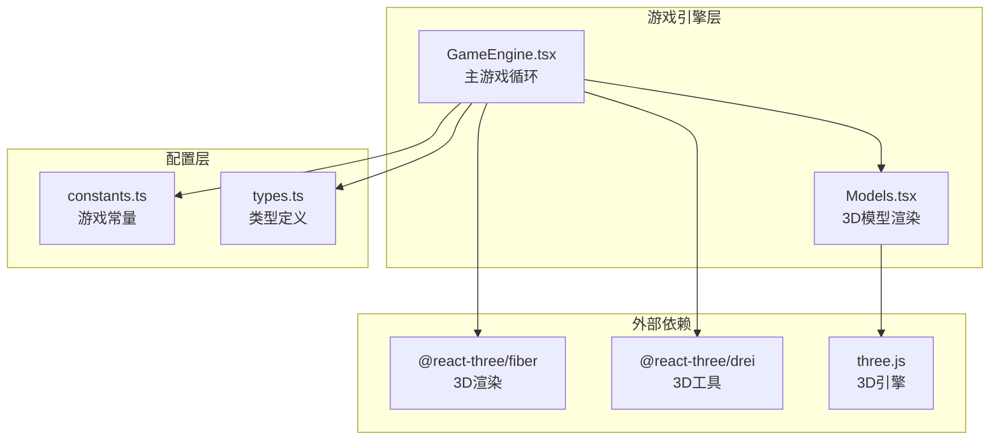

**图表来源**
- [GameEngine.tsx](file://components/GameEngine.tsx#L1-L50)
- [Models.tsx](file://components/Models.tsx#L1-L20)
- [constants.ts](file://constants.ts#L1-L20)
- [types.ts](file://types.ts#L1-L20)

**章节来源**
- [GameEngine.tsx](file://components/GameEngine.tsx#L1-L50)
- [Models.tsx](file://components/Models.tsx#L1-L20)
- [constants.ts](file://constants.ts#L1-L20)
- [types.ts](file://types.ts#L1-L20)

## 核心组件

### 碰撞检测算法

碰撞检测系统包含两个主要的检测函数：

#### 网格碰撞检测（checkGridCollision）

该函数使用四角检测法来判断坦克是否与地图障碍物发生碰撞：

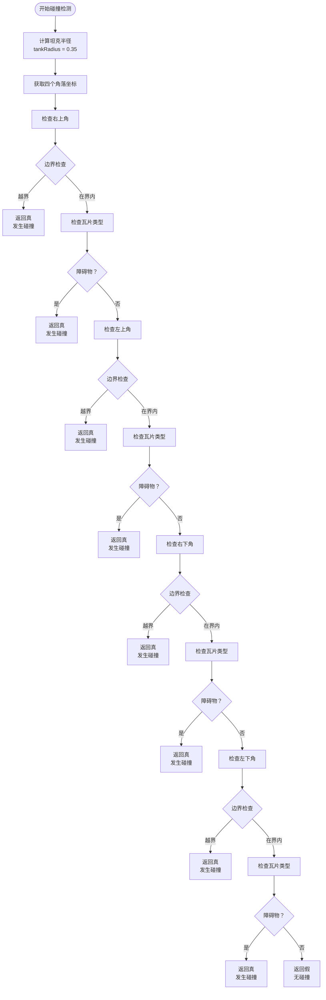

**图表来源**
- [GameEngine.tsx](file://components/GameEngine.tsx#L34-L68)

#### 子弹碰撞检测（isColliding）

该函数使用欧几里得距离计算来判断两个物体是否发生碰撞：

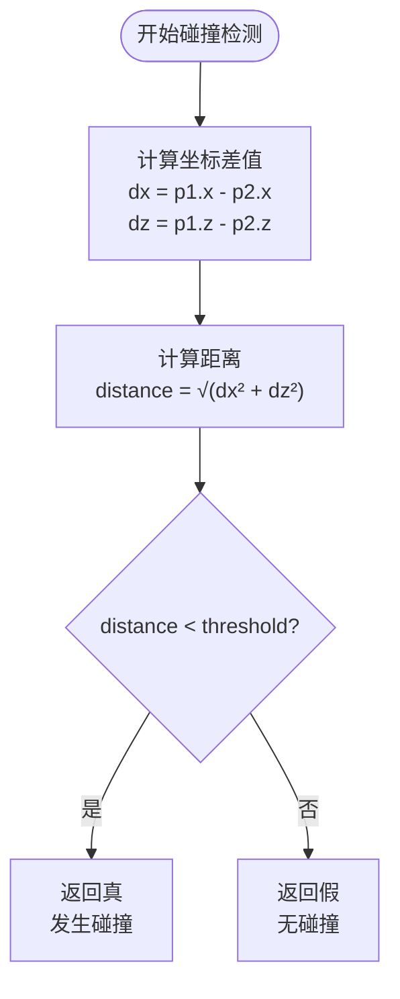

**图表来源**
- [GameEngine.tsx](file://components/GameEngine.tsx#L70-L75)

**章节来源**
- [GameEngine.tsx](file://components/GameEngine.tsx#L34-L75)

## 架构概览

碰撞检测系统在整个游戏架构中的位置如下：

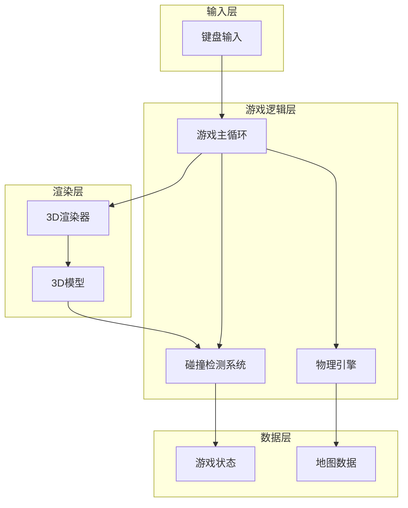

**图表来源**
- [GameEngine.tsx](file://components/GameEngine.tsx#L84-L463)
- [Models.tsx](file://components/Models.tsx#L1-L152)

## 详细组件分析

### 网格碰撞检测组件

#### 数学模型

坦克的碰撞检测基于以下数学原理：

1. **半径计算**：`tankRadius = 0.35`（基于0.8x0.8的坦克尺寸）
2. **四角检测**：计算坦克包围盒的四个角落坐标
3. **网格映射**：将世界坐标转换为网格索引

#### 实现细节

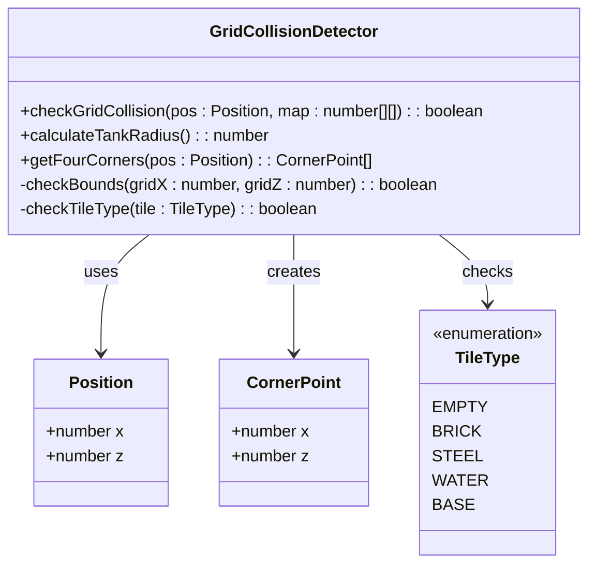

**图表来源**
- [GameEngine.tsx](file://components/GameEngine.tsx#L34-L68)
- [types.ts](file://types.ts#L8-L14)

#### 算法流程

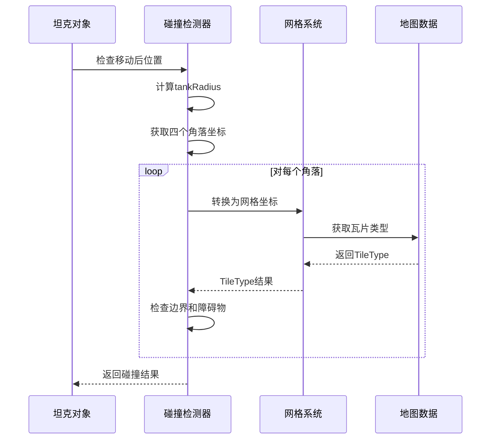

**图表来源**
- [GameEngine.tsx](file://components/GameEngine.tsx#L34-L68)

**章节来源**
- [GameEngine.tsx](file://components/GameEngine.tsx#L34-L68)

### 子弹碰撞检测组件

#### 数学模型

子弹碰撞检测使用欧几里得距离公式：

```
distance = √[(x₂ - x₁)² + (z₂ - z₁)²]
```

默认阈值设置为0.6，但支持自定义阈值参数。

#### 实现细节

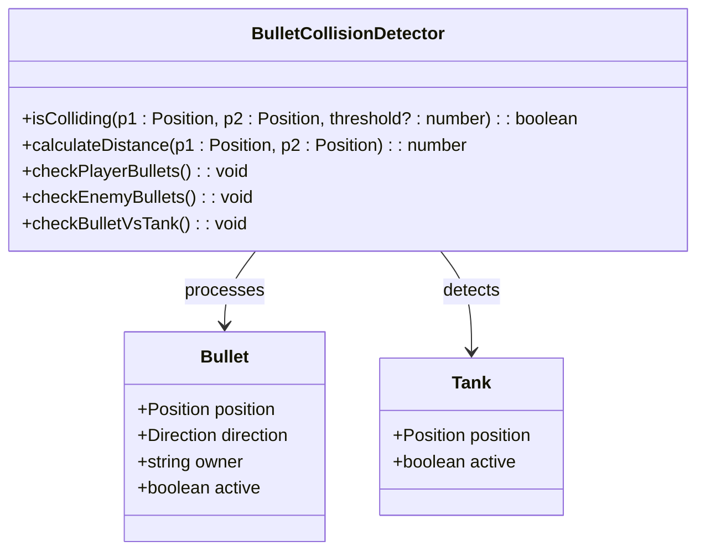

**图表来源**
- [GameEngine.tsx](file://components/GameEngine.tsx#L70-L75)
- [types.ts](file://types.ts#L28-L36)

#### 碰撞判定逻辑

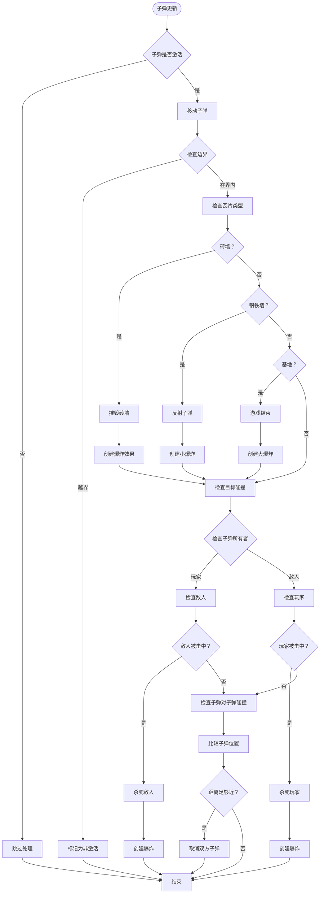

**图表来源**
- [GameEngine.tsx](file://components/GameEngine.tsx#L315-L439)

**章节来源**
- [GameEngine.tsx](file://components/GameEngine.tsx#L70-L75)
- [GameEngine.tsx](file://components/GameEngine.tsx#L315-L439)

### 特殊碰撞处理

#### 墙体碰撞处理

不同类型的墙体具有不同的碰撞响应：

| 墙体类型 | 碰撞响应 | 爆炸效果 | 特殊属性 |
|---------|---------|---------|---------|
| 砖墙 | 摧毁并移除 | 中等规模 | 可穿透 |
| 钢墙 | 反射子弹 | 小规模 | 不可穿透 |
| 水域 | 子弹消失 | 无 | 流动地形 |
| 基地 | 游戏结束 | 大规模 | 保护性 |

#### 坦克碰撞处理

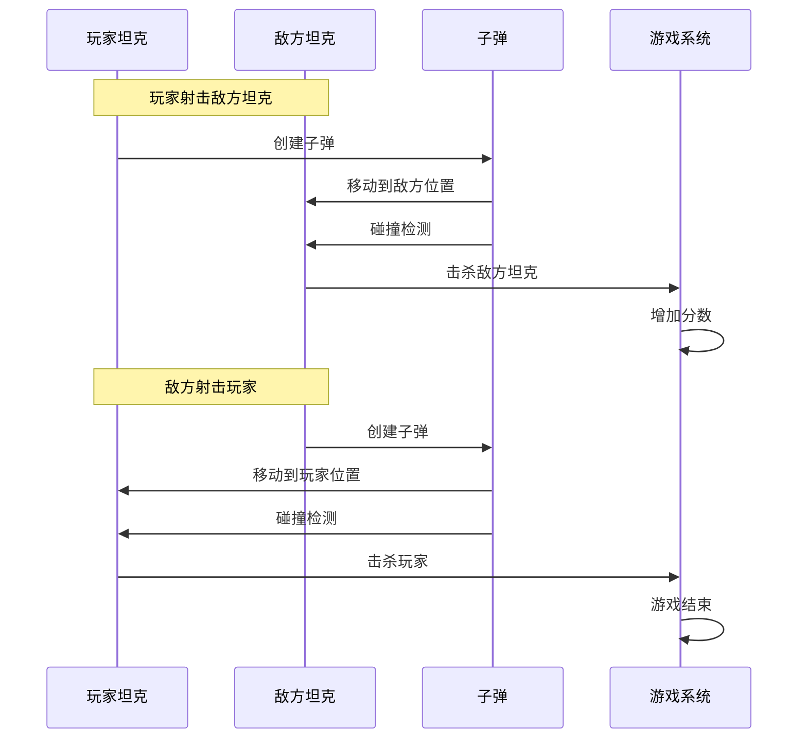

**图表来源**
- [GameEngine.tsx](file://components/GameEngine.tsx#L375-L406)

**章节来源**
- [GameEngine.tsx](file://components/GameEngine.tsx#L336-L373)
- [GameEngine.tsx](file://components/GameEngine.tsx#L375-L406)

## 依赖关系分析

### 外部依赖

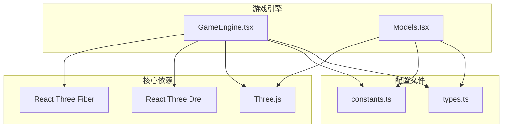

**图表来源**
- [GameEngine.tsx](file://components/GameEngine.tsx#L1-L31)
- [Models.tsx](file://components/Models.tsx#L1-L6)
- [package.json](file://package.json#L11-L19)

### 内部依赖关系

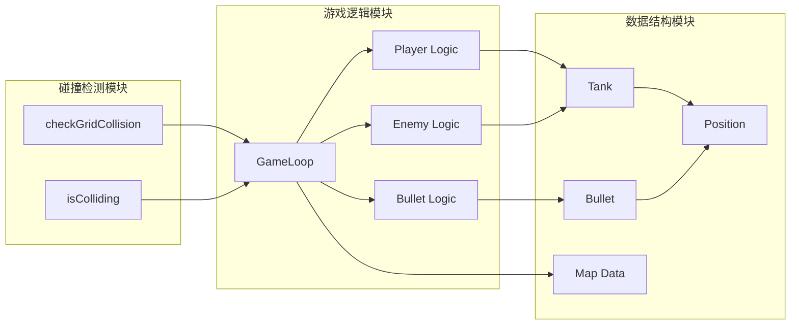

**图表来源**
- [GameEngine.tsx](file://components/GameEngine.tsx#L34-L439)
- [types.ts](file://types.ts#L16-L43)

**章节来源**
- [package.json](file://package.json#L11-L19)
- [GameEngine.tsx](file://components/GameEngine.tsx#L34-L439)
- [types.ts](file://types.ts#L16-L43)

## 性能考虑

### 空间分割优化

当前实现采用简单的网格检查方法，具有以下性能特征：

1. **时间复杂度**：O(1) - 四角检测固定检查4次
2. **空间复杂度**：O(1) - 使用常量内存
3. **早期退出**：一旦检测到碰撞立即返回

### 优化策略

#### 当前优化措施

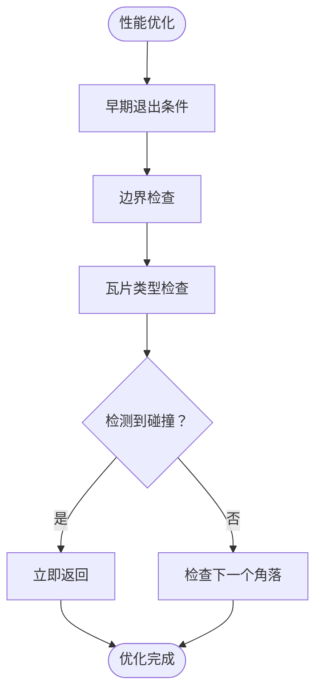

#### 可能的改进方案

1. **空间分区**：实现四叉树或网格分区减少检查范围
2. **批量处理**：优化子弹碰撞检测的双重循环
3. **缓存机制**：缓存最近的碰撞结果避免重复计算

### 内存管理

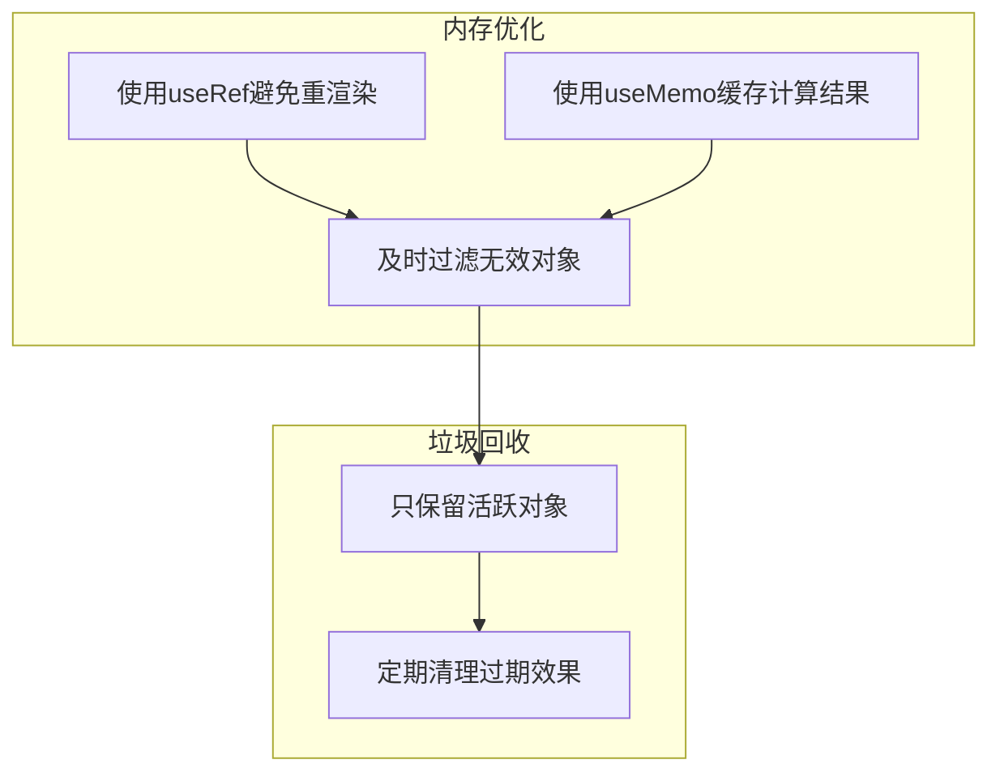

**图表来源**
- [GameEngine.tsx](file://components/GameEngine.tsx#L90-L150)
- [GameEngine.tsx](file://components/GameEngine.tsx#L441-L449)

**章节来源**
- [GameEngine.tsx](file://components/GameEngine.tsx#L90-L150)
- [GameEngine.tsx](file://components/GameEngine.tsx#L441-L449)

## 故障排除指南

### 常见问题诊断

#### 碰撞检测不准确

**症状**：坦克能够穿过墙壁或子弹无法正确击中目标

**可能原因**：
1. 半径计算不正确
2. 四角检测点位置错误
3. 边界检查逻辑问题

**解决方案**：
1. 验证tankRadius值（应为0.35）
2. 检查四角坐标计算
3. 确认边界检查范围

#### 子弹碰撞检测失效

**症状**：子弹穿透目标或无法正确消除

**可能原因**：
1. 距离阈值设置不当
2. 子弹位置更新问题
3. 碰撞检测顺序错误

**解决方案**：
1. 调整碰撞阈值参数
2. 检查子弹移动逻辑
3. 确保正确的碰撞检测顺序

### 调试工具建议

#### 可视化调试

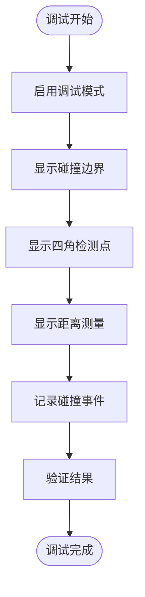

#### 性能监控

1. **帧率监控**：使用React Three Fiber的性能工具
2. **内存使用**：监控数组长度和对象数量
3. **碰撞频率**：统计每帧碰撞检测次数

**章节来源**
- [GameEngine.tsx](file://components/GameEngine.tsx#L34-L75)
- [GameEngine.tsx](file://components/GameEngine.tsx#L315-L439)

## 结论

NeonTank项目的碰撞检测系统采用简洁而高效的算法设计，通过四角检测和距离阈值实现了可靠的物理交互。系统的主要优势包括：

1. **简单可靠**：基于几何原理的碰撞检测易于理解和维护
2. **性能优异**：固定时间复杂度确保了流畅的游戏体验
3. **扩展性强**：模块化设计便于添加新的碰撞类型和效果

未来可以考虑的改进方向：
- 实现更复杂的碰撞形状支持
- 添加物理材质属性
- 优化大规模场景的性能表现

该系统为2.5D坦克游戏提供了坚实的基础，为后续的功能扩展和性能优化奠定了良好的技术基础。