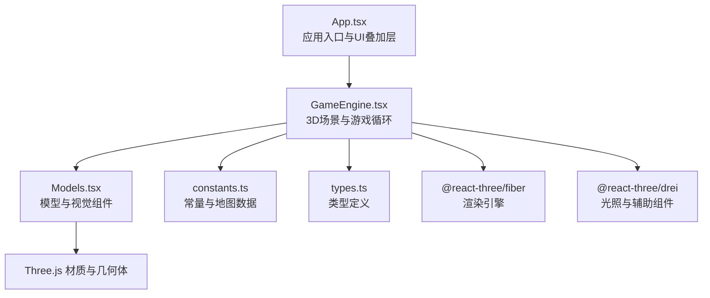
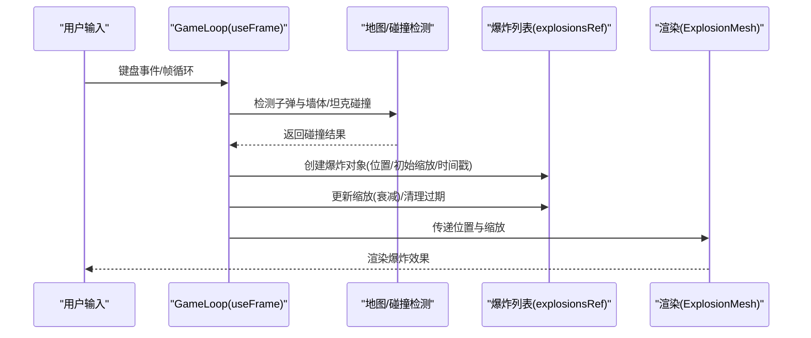
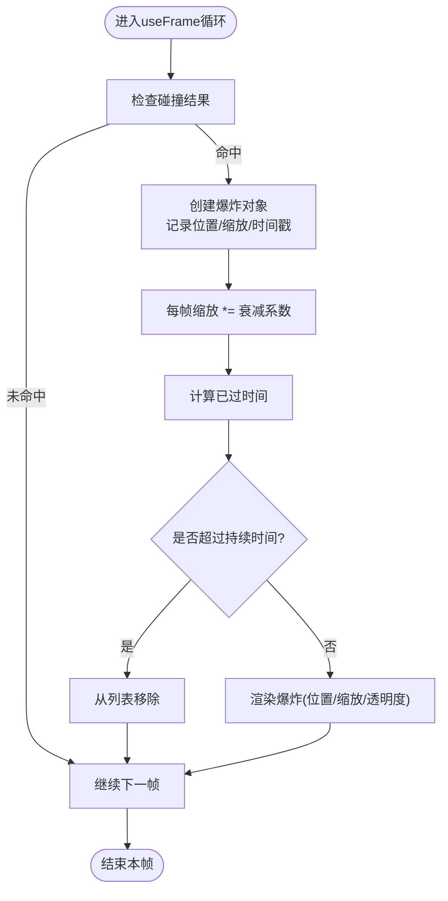
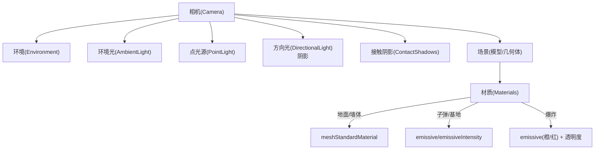
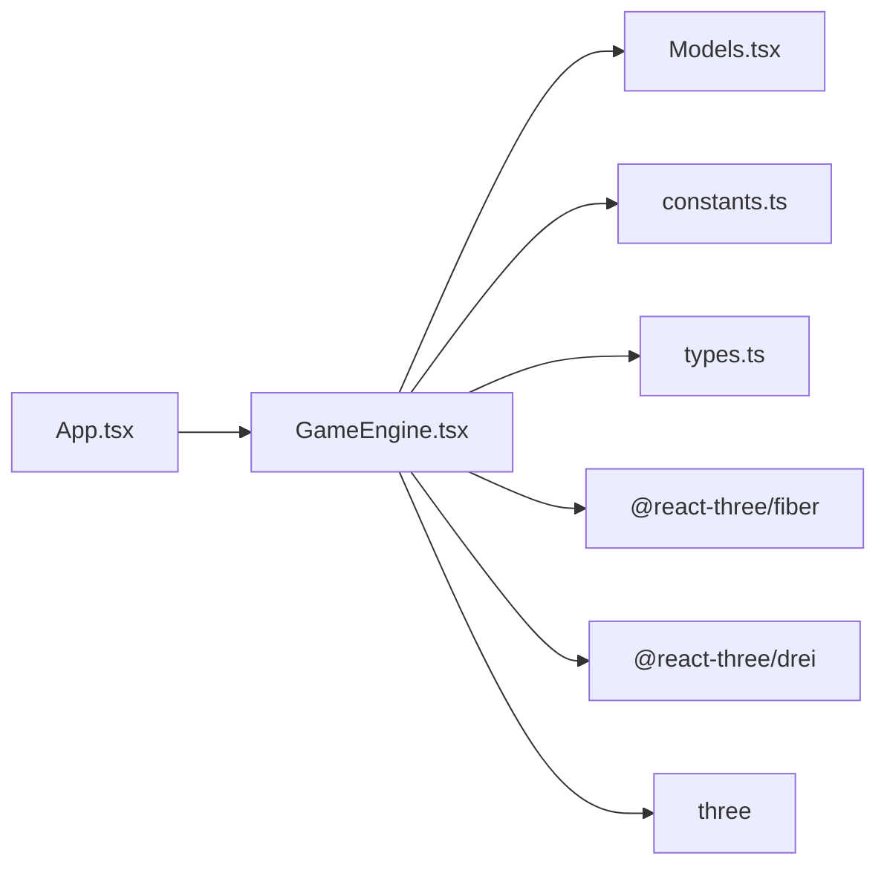

# 视觉效果系统

<cite>
**本文引用的文件**
- [App.tsx](file://App.tsx)
- [GameEngine.tsx](file://components/GameEngine.tsx)
- [Models.tsx](file://components/Models.tsx)
- [constants.ts](file://constants.ts)
- [types.ts](file://types.ts)
- [package.json](file://package.json)
- [README.md](file://README.md)
</cite>

## 目录
1. [简介](#简介)
2. [项目结构](#项目结构)
3. [核心组件](#核心组件)
4. [架构总览](#架构总览)
5. [详细组件分析](#详细组件分析)
6. [依赖关系分析](#依赖关系分析)
7. [性能考量](#性能考量)
8. [故障排查指南](#故障排查指南)
9. [结论](#结论)
10. [附录](#附录)

## 简介
本文件面向“视觉效果系统”的完整技术文档，聚焦于爆炸效果的实现（爆炸粒子系统与缩放动画）、3D 渲染管线（阴影、光照、材质）、特效时间控制机制（持续时间与衰减算法）、性能优化策略（对象池与批量渲染）、特效与游戏逻辑的集成（触发条件与清理机制），以及调试工具与参数调节方法。同时补充霓虹风格着色器与颜色管理的说明，帮助开发者在现有代码基础上进行扩展与优化。

## 项目结构
该项目采用 React + Three.js 的 3D 游戏框架，核心渲染由 @react-three/fiber 驱动，场景与光照通过 @react-three/drei 组件构建。视觉效果主要集中在 GameEngine 的游戏循环中生成与更新爆炸效果，并在 Models 中以 Three.js 几何体与材质呈现。

图表来源
- [App.tsx](file://App.tsx#L45-L87)
- [GameEngine.tsx](file://components/GameEngine.tsx#L542-L593)
- [Models.tsx](file://components/Models.tsx#L1-L152)
- [constants.ts](file://constants.ts#L1-L39)
- [types.ts](file://types.ts#L1-L50)

章节来源
- [App.tsx](file://App.tsx#L1-L199)
- [GameEngine.tsx](file://components/GameEngine.tsx#L1-L596)
- [Models.tsx](file://components/Models.tsx#L1-L152)
- [constants.ts](file://constants.ts#L1-L39)
- [types.ts](file://types.ts#L1-L50)

## 核心组件
- 游戏循环与特效生成：在 GameEngine 的 useFrame 循环中，根据碰撞结果创建爆炸特效，并维护爆炸列表的生命周期与缩放衰减。
- 特效渲染：ExplosionMesh 将爆炸位置、缩放与透明度映射到 Three.js 材质，形成“向外扩散+透明衰减”的视觉效果。
- 光照与阴影：GameCanvas 中配置环境光、点光源与方向光，并开启阴影；ContactShadows 增强地面投影的真实感。
- 材质与霓虹风格：子弹与基地使用自发光（emissive）材质，营造霓虹风格；爆炸使用橙红自发光与透明度衰减。

章节来源
- [GameEngine.tsx](file://components/GameEngine.tsx#L210-L463)
- [Models.tsx](file://components/Models.tsx#L144-L152)
- [GameEngine.tsx](file://components/GameEngine.tsx#L548-L591)
- [Models.tsx](file://components/Models.tsx#L134-L142)
- [Models.tsx](file://components/Models.tsx#L112-L132)

## 架构总览
下图展示从输入到渲染的视觉效果流程，重点标注爆炸特效的生成、更新与销毁路径。

图表来源
- [GameEngine.tsx](file://components/GameEngine.tsx#L315-L449)
- [GameEngine.tsx](file://components/GameEngine.tsx#L535-L537)
- [Models.tsx](file://components/Models.tsx#L144-L152)

## 详细组件分析

### 爆炸效果系统
- 数据结构
  - 爆炸对象包含唯一标识、世界坐标、当前缩放与创建时间戳，用于控制持续时间与衰减。
- 生成逻辑
  - 子弹击中砖墙、钢铁墙或基地时分别创建不同规模的爆炸；敌我子弹相撞也会产生小规模爆炸。
- 衰减与清理
  - 每帧对爆炸缩放进行乘法衰减；超过设定持续时间后从列表移除。
- 渲染表现
  - 使用球形几何体与自发光材质，透明度随缩放变化，形成向外扩散且逐渐消散的效果。

图表来源
- [GameEngine.tsx](file://components/GameEngine.tsx#L346-L370)
- [GameEngine.tsx](file://components/GameEngine.tsx#L445-L448)
- [GameEngine.tsx](file://components/GameEngine.tsx#L535-L537)
- [Models.tsx](file://components/Models.tsx#L144-L152)

章节来源
- [types.ts](file://types.ts#L38-L43)
- [GameEngine.tsx](file://components/GameEngine.tsx#L346-L370)
- [GameEngine.tsx](file://components/GameEngine.tsx#L445-L448)
- [Models.tsx](file://components/Models.tsx#L144-L152)

### 3D 渲染管线
- 光源与阴影
  - 环境光提供基础照明；点光源与方向光源投射阴影；方向光阴影贴图尺寸与相机范围可调。
  - 接触阴影（ContactShadows）增强地面投影真实感。
- 材质配置
  - 地面与墙体使用标准材质；子弹与基地使用自发光材质；爆炸使用自发光与透明度组合。
- 阴影系统
  - 开启阴影并在多个几何体上启用投射与接收阴影，确保视觉层次清晰。

图表来源
- [GameEngine.tsx](file://components/GameEngine.tsx#L548-L591)
- [Models.tsx](file://components/Models.tsx#L104-L152)

章节来源
- [GameEngine.tsx](file://components/GameEngine.tsx#L548-L591)
- [Models.tsx](file://components/Models.tsx#L104-L152)

### 时间控制机制
- 持续时间
  - 爆炸持续时间由创建时间与当前时间差决定，超过阈值即销毁。
- 衰减算法
  - 缩放按固定系数衰减，透明度与缩放成线性关系，形成自然扩散与消失。
- 帧循环
  - 使用 useFrame 获取精确的时间步长，保证动画与物理更新的一致性。

章节来源
- [GameEngine.tsx](file://components/GameEngine.tsx#L445-L448)

### 性能优化策略
- 对象池（建议）
  - 可将爆炸对象复用为池化对象，避免频繁创建/销毁；在爆炸结束后重置属性并放回池中。
- 批量渲染（建议）
  - 将相同材质的爆炸合并为 InstancedMesh，减少 draw call；或使用批处理几何体。
- 动态剔除（建议）
  - 对超出屏幕范围或过远的爆炸进行剔除，降低渲染压力。
- 粒子系统（建议）
  - 大规模爆炸可考虑使用粒子系统（如 InstancedMesh + 着色器）替代逐个 mesh，显著提升性能。
- 材质与几何体优化（建议）
  - 降低爆炸几何体细分度；统一材质以减少状态切换；合理设置阴影贴图分辨率。

章节来源
- [GameEngine.tsx](file://components/GameEngine.tsx#L535-L537)
- [Models.tsx](file://components/Models.tsx#L144-L152)

### 特效与游戏逻辑集成
- 触发条件
  - 子弹与墙体/坦克碰撞、子弹与子弹相撞、基地被摧毁等事件触发爆炸。
- 清理机制
  - 每帧过滤 active 状态的子弹与敌人；爆炸超过持续时间自动清理。
- 分数与状态联动
  - 击毁敌人增加分数；基地被摧毁触发游戏结束状态。

章节来源
- [GameEngine.tsx](file://components/GameEngine.tsx#L315-L407)
- [GameEngine.tsx](file://components/GameEngine.tsx#L441-L453)

### 调试工具与参数调节
- 调试建议
  - 在爆炸对象上添加临时可视化（如 wireframe 或额外几何体）以观察生命周期。
  - 使用帧率监控工具观察 useFrame 的执行耗时。
  - 通过修改常量（如爆炸持续时间、衰减系数、发射速度）快速验证视觉反馈。
- 参数调节入口
  - 爆炸持续时间：在爆炸清理处调整时间阈值。
  - 衰减系数：在爆炸缩放更新处调整衰减倍率。
  - 发射速度与冷却：通过常量文件中的速度与冷却帧数进行调节。
  - 光照强度与阴影：在 GameCanvas 中调整光源强度与阴影参数。

章节来源
- [GameEngine.tsx](file://components/GameEngine.tsx#L445-L448)
- [constants.ts](file://constants.ts#L5-L7)
- [GameEngine.tsx](file://components/GameEngine.tsx#L548-L591)

### 霓虹风格着色器与颜色管理
- 自发光材质
  - 子弹与基地使用 emissive 与 emissiveIntensity 实现自发光效果；爆炸使用橙红色自发光与透明度组合。
- 颜色管理
  - 颜色集中定义在常量文件中，便于统一调整与主题化。
- 着色器层面（建议）
  - 可引入自定义着色器实现脉冲、扫描线、霓虹边框等效果；结合顶点/片段着色器实现更丰富的霓虹表现。

章节来源
- [Models.tsx](file://components/Models.tsx#L134-L142)
- [Models.tsx](file://components/Models.tsx#L112-L132)
- [Models.tsx](file://components/Models.tsx#L144-L152)
- [constants.ts](file://constants.ts#L9-L21)

## 依赖关系分析
- 运行时依赖
  - @react-three/fiber：驱动 Three.js 渲染与帧循环。
  - @react-three/drei：提供光照、阴影、环境贴图与控制器等辅助组件。
  - three：底层图形库。
- 应用内依赖
  - GameEngine 依赖 Models 提供的几何体与材质；依赖 constants/types 提供常量与类型；依赖 App 提供游戏状态与回调。

图表来源
- [package.json](file://package.json#L11-L29)
- [App.tsx](file://App.tsx#L1-L199)
- [GameEngine.tsx](file://components/GameEngine.tsx#L1-L31)
- [Models.tsx](file://components/Models.tsx#L1-L6)
- [constants.ts](file://constants.ts#L1-L39)
- [types.ts](file://types.ts#L1-L50)

章节来源
- [package.json](file://package.json#L1-L32)
- [GameEngine.tsx](file://components/GameEngine.tsx#L1-L31)

## 性能考量
- 当前实现
  - 使用逐个 mesh 渲染爆炸，简单直观但存在较多独立绘制调用。
- 优化建议
  - 对象池：复用爆炸 mesh，减少分配与垃圾回收。
  - 批量渲染：InstancedMesh 合并相同材质的爆炸。
  - 动态剔除：基于视锥与距离剔除不可见爆炸。
  - 粒子系统：大规模爆炸采用粒子系统，显著降低 CPU/GPU 压力。
  - 材质与几何体：降低爆炸几何体复杂度，统一材质以减少状态切换。

章节来源
- [GameEngine.tsx](file://components/GameEngine.tsx#L535-L537)
- [Models.tsx](file://components/Models.tsx#L144-L152)

## 故障排查指南
- 爆炸不显示或闪烁
  - 检查爆炸缩放是否被过度衰减或透明度过高；确认位置转换函数与网格坐标一致。
- 爆炸消失过快或过慢
  - 调整爆炸持续时间阈值与衰减系数；核对 useFrame 的时间步长。
- 性能下降
  - 检查爆炸数量与渲染开销；考虑对象池与批量渲染；降低阴影贴图分辨率或关闭部分阴影。
- 光影异常
  - 校验光源位置与阴影相机范围；确保投射/接收阴影的几何体正确配置。

章节来源
- [GameEngine.tsx](file://components/GameEngine.tsx#L445-L448)
- [GameEngine.tsx](file://components/GameEngine.tsx#L548-L591)
- [Models.tsx](file://components/Models.tsx#L144-L152)

## 结论
本视觉效果系统以简洁高效的实现完成了爆炸特效的生成、衰减与渲染，并通过自发光材质与阴影系统营造出具有霓虹风格的视觉氛围。建议在保持现有架构稳定的基础上，逐步引入对象池、批量渲染与粒子系统等优化手段，以支撑更大规模的特效需求与更高帧率表现。

## 附录
- 快速定位
  - 爆炸生成与清理：[GameEngine.tsx](file://components/GameEngine.tsx#L346-L370), [GameEngine.tsx](file://components/GameEngine.tsx#L445-L448)
  - 爆炸渲染：[Models.tsx](file://components/Models.tsx#L144-L152)
  - 光照与阴影：[GameEngine.tsx](file://components/GameEngine.tsx#L548-L591)
  - 材质与颜色：[Models.tsx](file://components/Models.tsx#L104-L152), [constants.ts](file://constants.ts#L9-L21)
  - 类型定义：[types.ts](file://types.ts#L38-L43)