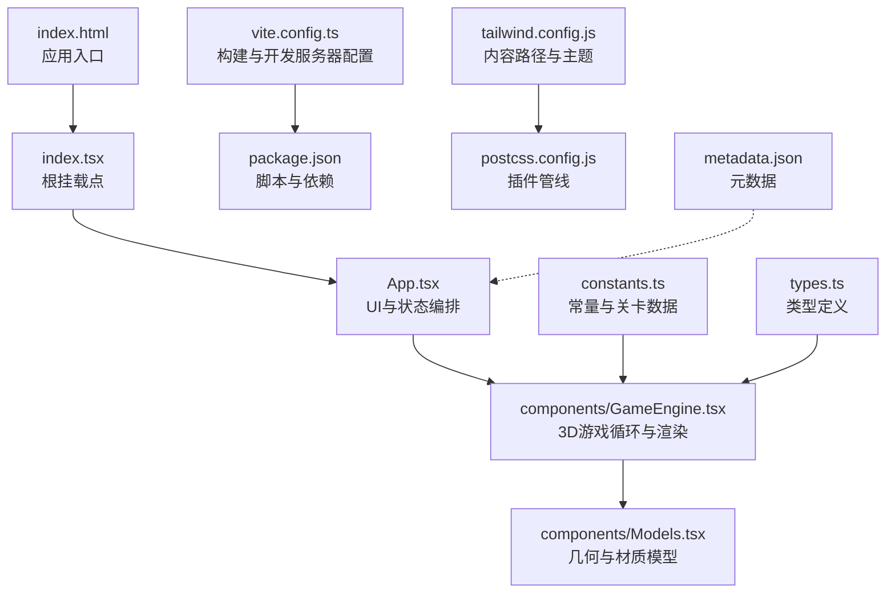
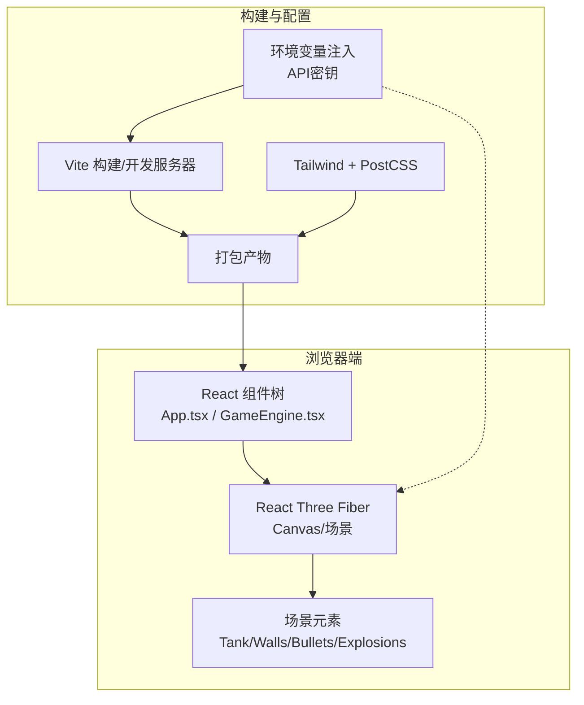
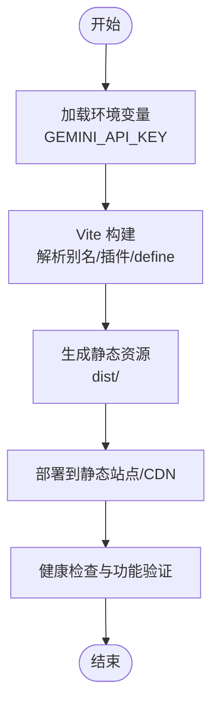
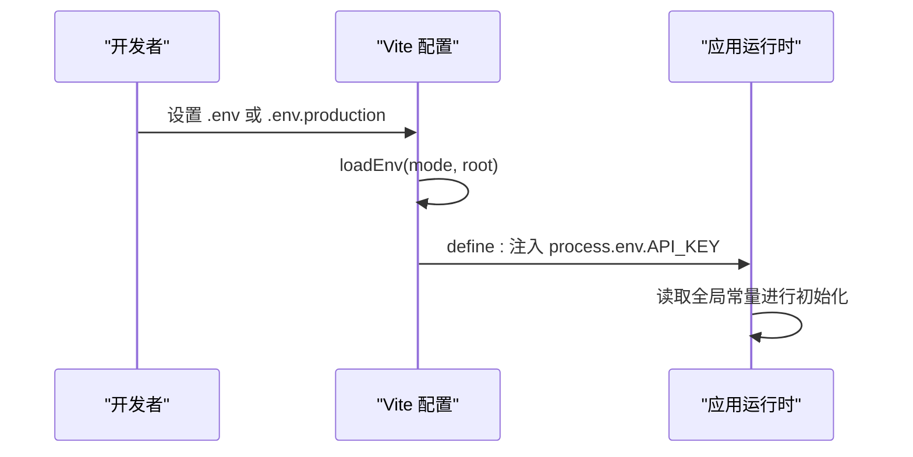
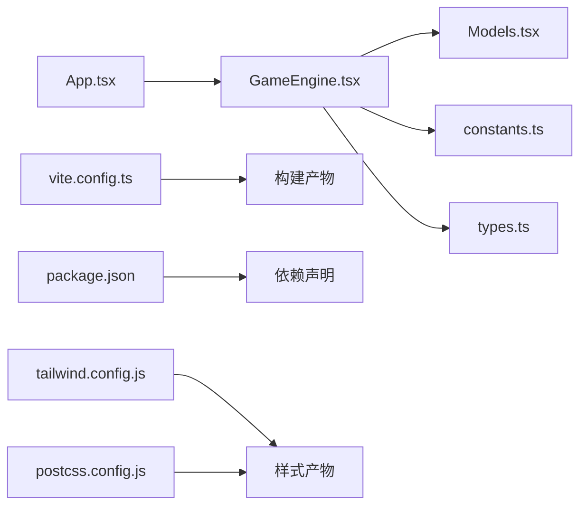

# 部署与维护

<cite>
**本文引用的文件**
- [package.json](file://package.json)
- [vite.config.ts](file://vite.config.ts)
- [README.md](file://README.md)
- [index.html](file://index.html)
- [index.tsx](file://index.tsx)
- [App.tsx](file://App.tsx)
- [components/GameEngine.tsx](file://components/GameEngine.tsx)
- [components/Models.tsx](file://components/Models.tsx)
- [constants.ts](file://constants.ts)
- [types.ts](file://types.ts)
- [tailwind.config.js](file://tailwind.config.js)
- [postcss.config.js](file://postcss.config.js)
- [metadata.json](file://metadata.json)
</cite>

## 目录
1. [简介](#简介)
2. [项目结构](#项目结构)
3. [核心组件](#核心组件)
4. [架构总览](#架构总览)
5. [详细组件分析](#详细组件分析)
6. [依赖关系分析](#依赖关系分析)
7. [性能考量](#性能考量)
8. [故障排查指南](#故障排查指南)
9. [结论](#结论)
10. [附录](#附录)

## 简介
本文件面向NeonTank项目的运维与开发团队，提供从本地开发到生产部署、运行期监控与维护、版本更新与热修复、性能优化与资源压缩、以及备份与灾备的完整实践指南。NeonTank是一个基于React Three Fiber的2.5D坦克射击游戏，使用Vite作为构建工具，TailwindCSS进行样式管理，并通过环境变量注入外部API密钥。

## 项目结构
项目采用前端单页应用（SPA）结构，核心入口为HTML模板与React根节点挂载逻辑；游戏主逻辑位于组件层，渲染与物理/碰撞在Three.js生态中实现；构建与开发服务器由Vite提供；样式通过TailwindCSS与PostCSS管线处理。

图表来源
- [index.html](file://index.html#L1-L16)
- [index.tsx](file://index.tsx#L1-L19)
- [App.tsx](file://App.tsx#L1-L199)
- [components/GameEngine.tsx](file://components/GameEngine.tsx#L1-L596)
- [components/Models.tsx](file://components/Models.tsx#L1-L152)
- [vite.config.ts](file://vite.config.ts#L1-L25)
- [package.json](file://package.json#L1-L32)
- [tailwind.config.js](file://tailwind.config.js#L1-L14)
- [postcss.config.js](file://postcss.config.js#L1-L7)
- [constants.ts](file://constants.ts#L1-L39)
- [types.ts](file://types.ts#L1-L50)
- [metadata.json](file://metadata.json#L1-L5)

章节来源
- [package.json](file://package.json#L1-L32)
- [vite.config.ts](file://vite.config.ts#L1-L25)
- [README.md](file://README.md#L1-L21)
- [index.html](file://index.html#L1-L16)
- [index.tsx](file://index.tsx#L1-L19)
- [App.tsx](file://App.tsx#L1-L199)
- [components/GameEngine.tsx](file://components/GameEngine.tsx#L1-L596)
- [components/Models.tsx](file://components/Models.tsx#L1-L152)
- [constants.ts](file://constants.ts#L1-L39)
- [types.ts](file://types.ts#L1-L50)
- [tailwind.config.js](file://tailwind.config.js#L1-L14)
- [postcss.config.js](file://postcss.config.js#L1-L7)
- [metadata.json](file://metadata.json#L1-L5)

## 核心组件
- 应用入口与挂载：HTML模板定义根容器，TS入口负责创建根实例并渲染顶层组件。
- 游戏引擎：集中管理输入、帧循环、碰撞检测、子弹与爆炸效果、胜负判定等。
- 模型与渲染：基于React Three Fiber/Drei的几何体与材质封装，统一网格坐标转换与动画。
- 构建与开发：Vite提供开发服务器与打包能力；环境变量注入API密钥；Tailwind与PostCSS负责样式管线。
- 类型与常量：集中定义枚举、接口与游戏参数，保证类型安全与可维护性。

章节来源
- [index.html](file://index.html#L1-L16)
- [index.tsx](file://index.tsx#L1-L19)
- [App.tsx](file://App.tsx#L1-L199)
- [components/GameEngine.tsx](file://components/GameEngine.tsx#L1-L596)
- [components/Models.tsx](file://components/Models.tsx#L1-L152)
- [vite.config.ts](file://vite.config.ts#L1-L25)
- [constants.ts](file://constants.ts#L1-L39)
- [types.ts](file://types.ts#L1-L50)

## 架构总览
NeonTank采用“前端渲染+3D引擎”的架构模式。浏览器端通过Vite构建产物加载，React负责UI与状态，Three.js负责场景与渲染，物理/碰撞在单线程帧循环中计算，最终输出到Canvas。

图表来源
- [vite.config.ts](file://vite.config.ts#L1-L25)
- [tailwind.config.js](file://tailwind.config.js#L1-L14)
- [postcss.config.js](file://postcss.config.js#L1-L7)
- [components/GameEngine.tsx](file://components/GameEngine.tsx#L542-L596)
- [components/Models.tsx](file://components/Models.tsx#L1-L152)

## 详细组件分析

### 构建与部署流水线
- 开发模式：启动Vite开发服务器，默认监听指定端口并允许外网访问，便于局域网联调。
- 生产构建：使用Vite生成静态资源，基础路径设置为相对路径，适配子目录部署。
- 环境变量：通过Vite加载.env*文件中的密钥，注入到全局常量，供运行时使用。
- 样式管线：Tailwind内容扫描路径覆盖源码与组件目录，PostCSS启用自动前缀与框架插件。

图表来源
- [vite.config.ts](file://vite.config.ts#L5-L24)
- [package.json](file://package.json#L6-L10)
- [tailwind.config.js](file://tailwind.config.js#L3-L8)
- [postcss.config.js](file://postcss.config.js#L1-L7)

章节来源
- [vite.config.ts](file://vite.config.ts#L1-L25)
- [package.json](file://package.json#L1-L32)
- [tailwind.config.js](file://tailwind.config.js#L1-L14)
- [postcss.config.js](file://postcss.config.js#L1-L7)

### API密钥与环境变量管理
- 密钥注入：通过Vite的loadEnv加载指定模式下的环境变量，并将其注入到全局常量，供运行时读取。
- 安全建议：在CI/CD中使用受控的密钥管理服务，避免将敏感信息提交至仓库；生产环境仅暴露必要变量。
- 变量来源：开发与生产模式分别对应不同的.env文件，确保本地与线上行为一致。

图表来源
- [vite.config.ts](file://vite.config.ts#L6-L17)
- [README.md](file://README.md#L16-L20)

章节来源
- [vite.config.ts](file://vite.config.ts#L1-L25)
- [README.md](file://README.md#L1-L21)

### 性能监控与错误追踪
- 帧率与渲染指标：利用Three.js的clock与useFrame回调统计每帧耗时，结合浏览器性能面板观察主线程占用。
- 错误边界：在React侧使用错误边界捕获渲染异常，记录堆栈并上报；对网络请求失败进行降级提示。
- 日志与遥测：在开发阶段开启详细日志，生产环境收敛到关键事件与错误；结合浏览器控制台与服务端日志定位问题。
- 资源监控：关注首屏时间、交互延迟、内存占用与GPU负载，定期评估模型复杂度与阴影贴图尺寸。

（本节为通用实践指导，不直接分析具体文件）

### 版本更新与热修复流程
- 小版本发布：修复非关键缺陷或UI微调，走常规CI/CD流水线，灰度发布后全量。
- 紧急热修复：针对严重问题快速回滚到上一稳定版本，同时并行修复并尽快合并。
- 回归测试：自动化测试覆盖关键路径，人工回归验证核心交互与渲染稳定性。
- 发布记录：记录变更摘要、影响范围与回滚预案，确保可追溯。

（本节为通用实践指导，不直接分析具体文件）

### 代码优化与资源压缩
- Tree-shaking：保持ES模块导入导出风格，避免副作用模块污染；移除未使用依赖。
- 图形优化：降低阴影分辨率与视锥范围，减少高多边形模型面数；按需加载纹理与HDR环境贴图。
- 打包优化：启用Vite的代码分割与懒加载；对第三方库进行外部化（CDN）以减小包体。
- 样式优化：Tailwind按需生成，避免无用类；关闭未使用的插件与主题扩展。
- 资源压缩：启用Gzip/Brotli；图片使用现代格式（WebP）并按需裁剪尺寸。

章节来源
- [vite.config.ts](file://vite.config.ts#L1-L25)
- [tailwind.config.js](file://tailwind.config.js#L1-L14)
- [postcss.config.js](file://postcss.config.js#L1-L7)

### 维护检查清单
- 构建与预览
  - 在本地执行构建并预览，确认静态资源可访问且无404。
  - 检查基础路径与路由是否正确。
- 运行时校验
  - 验证API密钥注入是否生效，相关功能可用。
  - 测试不同设备与浏览器的兼容性。
- 性能与稳定性
  - 观察帧率与内存曲线，识别异常峰值。
  - 检查阴影与抗锯齿设置对性能的影响。
- 安全与合规
  - 确认敏感信息未被硬编码进仓库。
  - 审核第三方依赖的安全通告与许可证。

章节来源
- [package.json](file://package.json#L6-L10)
- [vite.config.ts](file://vite.config.ts#L8-L17)
- [README.md](file://README.md#L16-L20)

### 备份策略与灾难恢复
- 数据备份
  - 对托管的静态资源与构建产物进行版本化存储与快照。
  - 记录关键配置文件与环境变量清单，便于快速重建。
- 灾难恢复
  - 准备回滚分支与镜像站点，确保在部署失败时可秒级切换。
  - 建立故障演练机制，验证恢复流程的有效性。
- 监控告警
  - 对站点可用性、响应时间与错误率建立阈值告警。
  - 结合日志聚合平台进行趋势分析与根因定位。

（本节为通用实践指导，不直接分析具体文件）

## 依赖关系分析
- 组件耦合
  - GameEngine依赖常量与类型定义，渲染层依赖模型封装，形成清晰分层。
  - App作为状态中枢，向下传递给GameEngine与GameCanvas。
- 外部依赖
  - React Three Fiber与Drei提供3D渲染与交互；Three.js提供几何与材质。
  - Tailwind与PostCSS负责样式体系；Vite提供构建与开发体验。
- 环境变量
  - 通过define注入API密钥，避免硬编码与泄露风险。

图表来源
- [App.tsx](file://App.tsx#L1-L199)
- [components/GameEngine.tsx](file://components/GameEngine.tsx#L1-L596)
- [components/Models.tsx](file://components/Models.tsx#L1-L152)
- [constants.ts](file://constants.ts#L1-L39)
- [types.ts](file://types.ts#L1-L50)
- [vite.config.ts](file://vite.config.ts#L1-L25)
- [package.json](file://package.json#L11-L30)
- [tailwind.config.js](file://tailwind.config.js#L1-L14)
- [postcss.config.js](file://postcss.config.js#L1-L7)

章节来源
- [App.tsx](file://App.tsx#L1-L199)
- [components/GameEngine.tsx](file://components/GameEngine.tsx#L1-L596)
- [components/Models.tsx](file://components/Models.tsx#L1-L152)
- [constants.ts](file://constants.ts#L1-L39)
- [types.ts](file://types.ts#L1-L50)
- [vite.config.ts](file://vite.config.ts#L1-L25)
- [package.json](file://package.json#L1-L32)
- [tailwind.config.js](file://tailwind.config.js#L1-L14)
- [postcss.config.js](file://postcss.config.js#L1-L7)

## 性能考量
- 渲染性能
  - 控制场景复杂度，合理使用阴影与材质细节；避免每帧创建大量临时对象。
  - 使用useMemo/useCallback缓存计算结果与组件渲染，减少重绘。
- 3D引擎优化
  - 合理设置相机参数与视锥范围；降低阴影贴图分辨率与采样次数。
  - 对高频动画使用lerp插值，避免每帧大位移。
- 资源与网络
  - 启用缓存与CDN；对纹理与HDR贴图进行压缩与格式优化。
  - 分包加载与懒加载关键模块，缩短首屏时间。
- 内存与GC
  - 及时释放未使用的几何与纹理；避免闭包持有长生命周期引用。

（本节为通用实践指导，不直接分析具体文件）

## 故障排查指南
- 构建失败
  - 检查Node版本与依赖安装；确认Vite与Tailwind配置语法正确。
  - 查看define注入的环境变量是否存在拼写错误。
- 运行时错误
  - 在浏览器控制台查看报错堆栈；确认全局常量是否正确注入。
  - 核对API密钥是否有效与权限是否满足。
- 渲染异常
  - 检查Canvas尺寸与相机参数；确认阴影设置与硬件兼容性。
  - 排查模型与材质属性是否越界或缺失。
- 性能退化
  - 使用性能面板观察主线程与GPU占用；逐步禁用可疑特性定位瓶颈。

章节来源
- [vite.config.ts](file://vite.config.ts#L1-L25)
- [README.md](file://README.md#L16-L20)
- [components/GameEngine.tsx](file://components/GameEngine.tsx#L210-L463)

## 结论
NeonTank的部署与维护围绕“明确的构建流程、严格的密钥管理、持续的性能监控与优化、规范的版本发布与回滚”展开。通过合理的工程化实践与运维流程，可在保证质量的前提下高效交付与迭代。

## 附录
- 快速参考
  - 本地开发：安装依赖后设置密钥并启动开发服务器。
  - 生产构建：执行构建命令生成静态资源，部署至目标环境。
  - 元数据：应用名称、描述与权限声明见元数据文件。

章节来源
- [README.md](file://README.md#L16-L20)
- [package.json](file://package.json#L6-L10)
- [metadata.json](file://metadata.json#L1-L5)