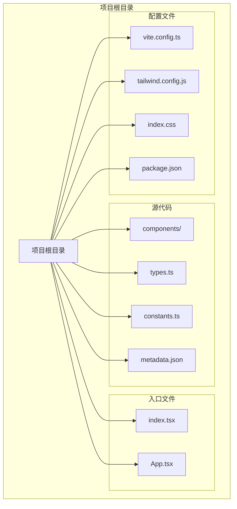
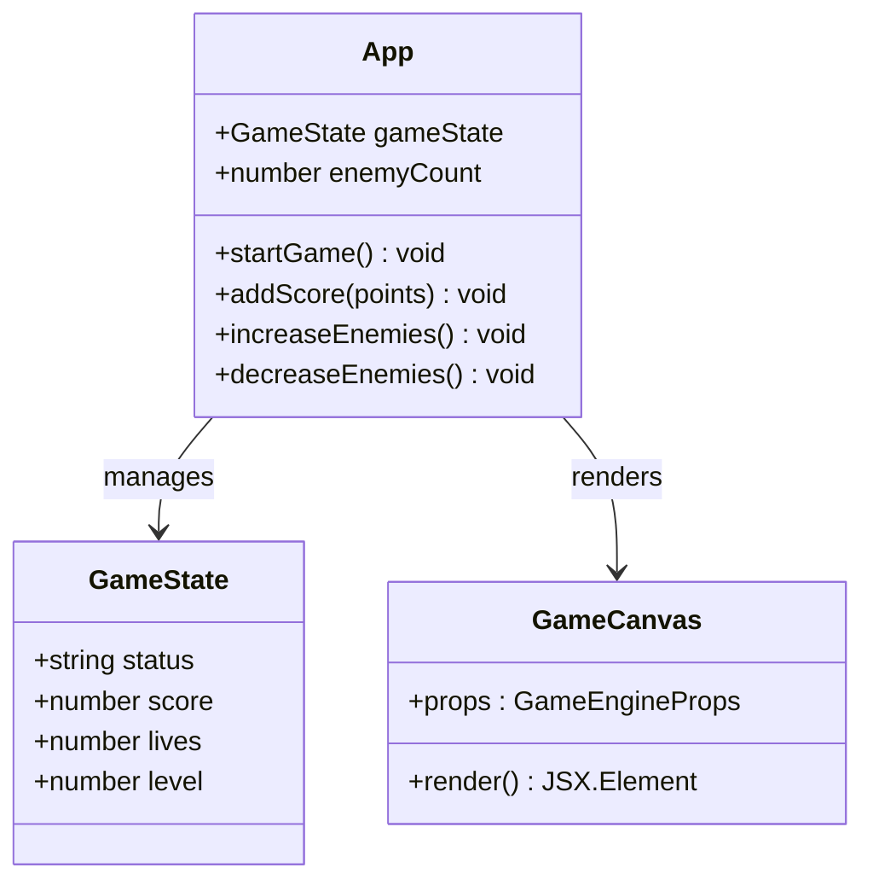
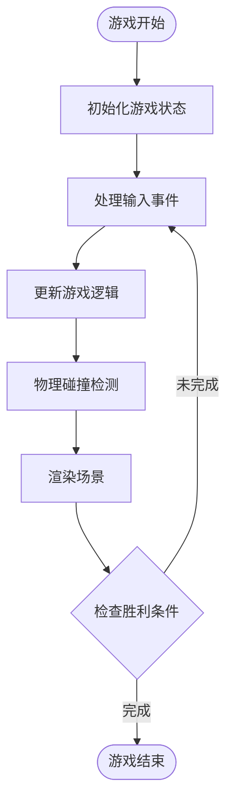
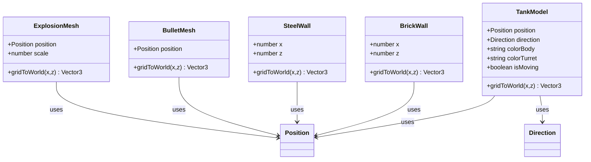
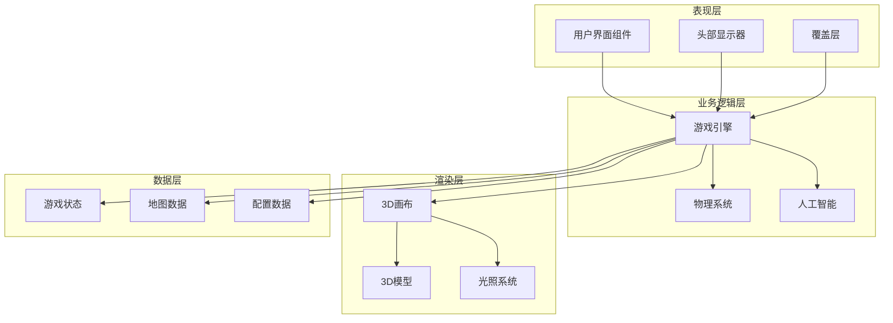
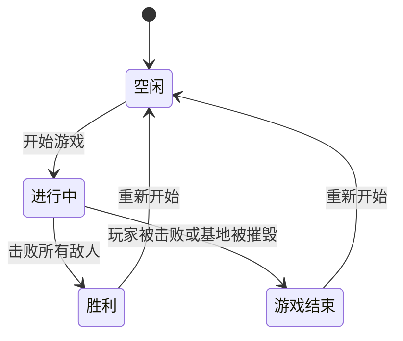
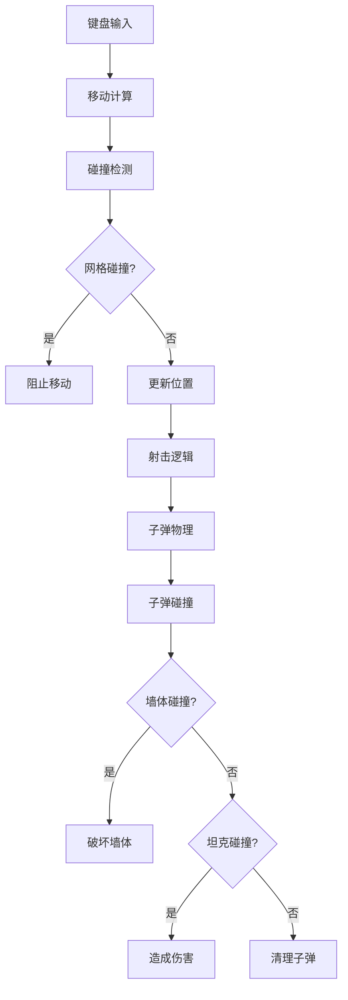
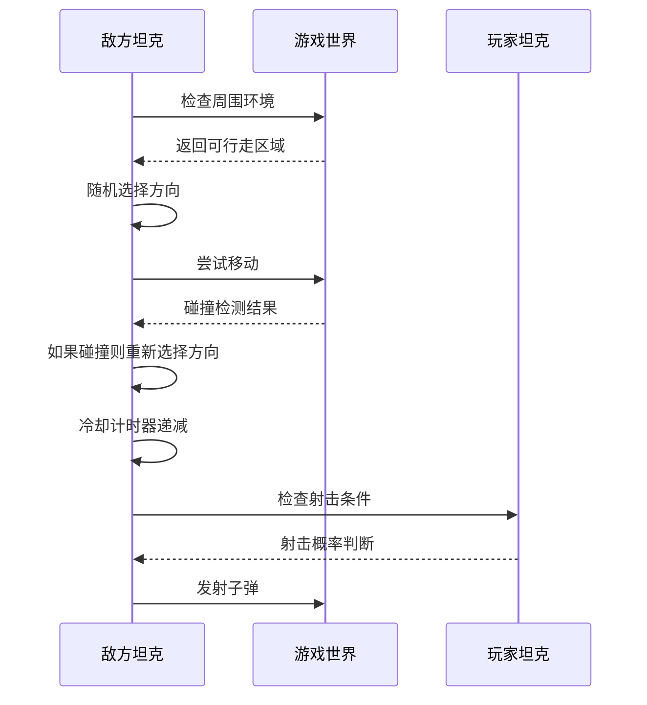
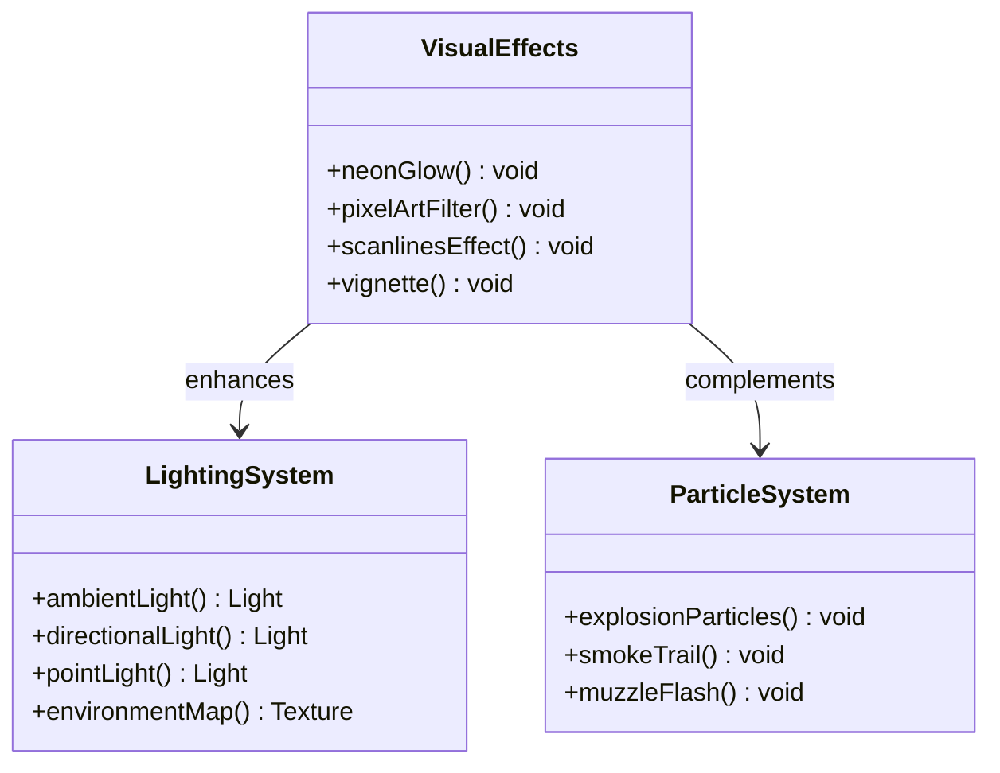

# 项目概述

<cite>
**本文档引用的文件**
- [README.md](file://README.md)
- [package.json](file://package.json)
- [App.tsx](file://App.tsx)
- [index.tsx](file://index.tsx)
- [components/GameEngine.tsx](file://components/GameEngine.tsx)
- [components/Models.tsx](file://components/Models.tsx)
- [constants.ts](file://constants.ts)
- [types.ts](file://types.ts)
- [metadata.json](file://metadata.json)
- [vite.config.ts](file://vite.config.ts)
- [tailwind.config.js](file://tailwind.config.js)
- [index.css](file://index.css)
</cite>

## 目录
1. [项目简介](#项目简介)
2. [项目结构](#项目结构)
3. [核心组件](#核心组件)
4. [架构概览](#架构概览)
5. [详细组件分析](#详细组件分析)
6. [依赖关系分析](#依赖关系分析)
7. [性能考虑](#性能考虑)
8. [故障排除指南](#故障排除指南)
9. [结论](#结论)

## 项目简介

NeonTank 是一个基于 React 和 Three.js 的 2.5D 坦克射击游戏项目，灵感来源于经典的 Battle City 游戏。该项目采用现代 Web 技术栈，结合了 React 的组件化架构和 Three.js 的 3D 渲染能力，为玩家提供了沉浸式的经典坦克对战体验。

### 项目核心目标

- **经典游戏现代化**：将经典的街机游戏体验带入现代 Web 平台
- **技术展示**：演示 React Three Fiber 在游戏开发中的应用
- **视觉创新**：通过霓虹风格的视觉效果和像素艺术元素创造独特的游戏美学
- **跨平台兼容**：支持桌面和移动设备的统一游戏体验

### 技术特色

- **React + Three.js 架构**：利用 React 的声明式 UI 和 Three.js 的 3D 渲染能力
- **2.5D 游戏引擎**：结合 2D 网格系统和 3D 透视渲染的混合技术
- **实时物理系统**：包含碰撞检测、弹道物理和爆炸效果
- **响应式设计**：支持不同屏幕尺寸的自适应布局
- **高性能渲染**：优化的帧率管理和内存使用策略

### 游戏玩法

NeonTank 采用经典的坦克对战玩法：
- **玩家控制**：使用 WASD 或方向键控制坦克移动，空格键开火
- **敌人 AI**：随机移动的敌方坦克，具备基础的路径规划能力
- **战斗机制**：子弹碰撞检测、墙体破坏、基地保护
- **升级系统**：通过得分解锁新的游戏体验

## 项目结构

项目采用模块化的文件组织方式，主要分为以下几个核心部分：



**图表来源**
- [package.json](file://package.json#L1-L32)
- [index.tsx](file://index.tsx#L1-L19)
- [App.tsx](file://App.tsx#L1-L199)

### 核心目录结构说明

- **components/**：包含所有游戏组件，包括游戏引擎和模型定义
- **根目录文件**：应用入口、类型定义、常量配置和元数据
- **配置文件**：构建工具、样式框架和环境配置

**章节来源**
- [package.json](file://package.json#L1-L32)
- [index.tsx](file://index.tsx#L1-L19)

## 核心组件

### 应用主组件 (App.tsx)

App.tsx 作为整个应用的根组件，负责管理游戏状态和用户界面：



**图表来源**
- [App.tsx](file://App.tsx#L14-L199)
- [types.ts](file://types.ts#L45-L50)

### 游戏引擎组件 (GameEngine.tsx)

游戏引擎是项目的核心逻辑处理模块，实现了完整的 2.5D 游戏循环：



**图表来源**
- [components/GameEngine.tsx](file://components/GameEngine.tsx#L210-L463)

### 模型组件 (Models.tsx)

模型组件负责定义游戏中的各种 3D 对象：



**图表来源**
- [components/Models.tsx](file://components/Models.tsx#L15-L152)

**章节来源**
- [App.tsx](file://App.tsx#L1-L199)
- [components/GameEngine.tsx](file://components/GameEngine.tsx#L1-L596)
- [components/Models.tsx](file://components/Models.tsx#L1-L152)

## 架构概览

NeonTank 采用了分层架构设计，将关注点清晰分离：



**图表来源**
- [App.tsx](file://App.tsx#L45-L195)
- [components/GameEngine.tsx](file://components/GameEngine.tsx#L542-L596)
- [components/Models.tsx](file://components/Models.tsx#L1-L152)

### 技术选型原因

#### React + Three.js 的优势

1. **组件化开发**：React 的组件化架构使得游戏逻辑可以模块化管理
2. **声明式渲染**：自动化的渲染更新减少了手动 DOM 操作
3. **生态系统丰富**：React 生态系统提供了大量的工具和库支持
4. **性能优化**：React 的虚拟 DOM 和 Three.js 的高效渲染相结合

#### 2.5D 技术选择

- **网格系统**：简化了碰撞检测和路径规划
- **透视渲染**：提供了立体感但保持了 2D 游戏的简单性
- **性能平衡**：在视觉效果和性能之间找到了最佳平衡点

**章节来源**
- [package.json](file://package.json#L11-L20)
- [components/GameEngine.tsx](file://components/GameEngine.tsx#L1-L596)

## 详细组件分析

### 游戏状态管理系统

游戏状态通过 React 的 useState Hook 进行管理，实现了完整的生命周期控制：



**图表来源**
- [types.ts](file://types.ts#L45-L50)
- [App.tsx](file://App.tsx#L32-L43)

### 物理引擎实现

游戏的物理系统基于网格碰撞检测和简单的向量运动：



**图表来源**
- [components/GameEngine.tsx](file://components/GameEngine.tsx#L33-L75)
- [components/GameEngine.tsx](file://components/GameEngine.tsx#L315-L407)

### AI 系统设计

敌方坦克采用简单的随机 AI 策略：



**图表来源**
- [components/GameEngine.tsx](file://components/GameEngine.tsx#L265-L313)

### 视觉效果系统

项目实现了多种视觉效果来增强游戏体验：



**图表来源**
- [components/Models.tsx](file://components/Models.tsx#L134-L152)
- [components/GameEngine.tsx](file://components/GameEngine.tsx#L548-L591)

**章节来源**
- [components/GameEngine.tsx](file://components/GameEngine.tsx#L1-L596)
- [components/Models.tsx](file://components/Models.tsx#L1-L152)
- [constants.ts](file://constants.ts#L9-L21)

## 依赖关系分析

项目依赖关系清晰明确，遵循了模块化设计原则：

```mermaid
graph TB
subgraph "应用层"
App[App.tsx]
GameEngine[GameEngine.tsx]
Models[Models.tsx]
end
subgraph "类型定义"
Types[types.ts]
Constants[constants.ts]
end
subgraph "外部依赖"
React[react]
ThreeJS[three]
ReactThreeFiber[@react-three/fiber]
Drei[@react-three/drei]
Tailwind[tailwindcss]
end
subgraph "构建工具"
Vite[vite]
PostCSS[postcss]
TypeScript[typescript]
end
App --> GameEngine
App --> Models
GameEngine --> Types
GameEngine --> Constants
Models --> Types
Models --> Constants
App --> React
GameEngine --> ThreeJS
GameEngine --> ReactThreeFiber
GameEngine --> Drei
App --> Tailwind
Vite --> TypeScript
PostCSS --> Tailwind
```

**图表来源**
- [package.json](file://package.json#L11-L30)
- [index.tsx](file://index.tsx#L1-L7)

### 关键依赖说明

- **React 19.2.0**：提供组件化 UI 构建和状态管理
- **Three.js 0.181.2**：3D 图形渲染引擎
- **@react-three/fiber 9.4.0**：React 的 Three.js 渲染器
- **@react-three/drei 10.7.7**：Three.js 的实用工具集合
- **Tailwind CSS 4.1.17**：原子化 CSS 框架

**章节来源**
- [package.json](file://package.json#L1-L32)
- [vite.config.ts](file://vite.config.ts#L1-L25)

## 性能考虑

### 渲染优化策略

1. **帧率管理**：使用 useFrame hook 实现 60fps 的稳定渲染
2. **对象池模式**：复用子弹和爆炸效果对象减少垃圾回收
3. **批量更新**：合并多个状态更新到单个渲染周期
4. **懒加载**：按需加载 3D 模型和纹理资源

### 内存管理

- **引用优化**：使用 useRef 存储频繁更新的状态避免不必要的重渲染
- **计算缓存**：useMemo 缓存昂贵的计算结果
- **事件监听器**：正确清理键盘事件监听器防止内存泄漏

### 渲染性能

- **几何体优化**：使用简化的几何体形状减少顶点数量
- **材质复用**：共享材质实例提高渲染效率
- **阴影优化**：合理配置阴影参数平衡视觉效果和性能

## 故障排除指南

### 常见问题及解决方案

#### 游戏无法启动

**症状**：页面空白或报错
**可能原因**：
- 缺少必要的依赖包
- 环境变量配置错误
- 浏览器兼容性问题

**解决步骤**：
1. 检查控制台错误信息
2. 确认所有依赖已正确安装
3. 验证环境变量设置
4. 更新浏览器到最新版本

#### 游戏卡顿或帧率低

**症状**：游戏运行不流畅
**可能原因**：
- 复杂度过高导致性能下降
- 内存泄漏
- 渲染优化不足

**解决方法**：
1. 检查是否有过多的 3D 对象同时渲染
2. 使用浏览器开发者工具监控性能
3. 优化复杂度高的计算逻辑
4. 实施更有效的对象池管理

#### 输入响应延迟

**症状**：按键响应不及时
**可能原因**：
- 事件监听器冲突
- 渲染阻塞
- 浏览器性能问题

**调试步骤**：
1. 检查键盘事件绑定是否正确
2. 验证渲染循环没有过度阻塞
3. 测试不同浏览器的兼容性
4. 调整游戏循环频率

**章节来源**
- [README.md](file://README.md#L11-L21)
- [vite.config.ts](file://vite.config.ts#L8-L12)

## 结论

NeonTank 项目成功地将经典的游戏玩法与现代的 Web 技术相结合，创造了一个既熟悉又新颖的游戏体验。通过 React + Three.js 的技术组合，项目不仅实现了高质量的 3D 渲染效果，还保持了良好的性能表现和可维护性。

### 项目优势

1. **技术先进性**：采用最新的前端技术和 3D 渲染方案
2. **游戏体验**：完美还原经典游戏的玩法同时加入现代元素
3. **学习价值**：为开发者提供了 React Three Fiber 的实践案例
4. **扩展潜力**：模块化的设计便于功能扩展和定制

### 技术亮点

- **架构清晰**：分层设计使得代码结构易于理解和维护
- **性能优化**：合理的优化策略确保了流畅的游戏体验
- **视觉创新**：霓虹风格的视觉效果创造了独特的游戏氛围
- **跨平台兼容**：支持多种设备和浏览器环境

### 未来发展建议

1. **网络功能**：添加多人在线对战功能
2. **AI 改进**：实现更智能的敌人行为
3. **音效系统**：集成完整的音频体验
4. **关卡编辑器**：允许玩家创建自定义关卡

这个项目为 Web 游戏开发提供了一个优秀的参考范例，展示了如何将传统游戏玩法与现代技术完美融合。